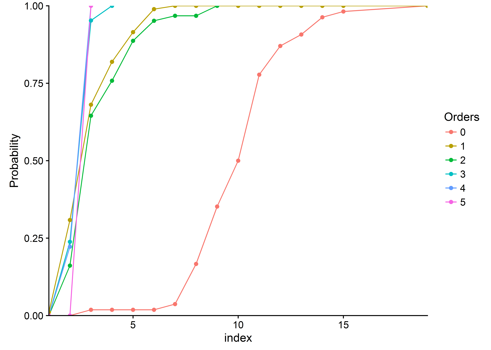

#Requierements

##Packages install 


```r
install.packages("plyr")
install.packages("ggplot2")
install.packages("gtable")
install.packages("grid")
install.packages("cowplot")
install.packages("reshape2")
install.packages("scales")
install.packages("knitr")
install.packages("tinytex")
install.packages("dplyr")
#install.packages("RCurl")
```

##Packages loading

```r
library(plyr)
library(ggplot2)
library(gtable)
library(grid)
library(cowplot)
library(reshape2)
library(scales)
library(knitr)
library(tinytex)
library(dplyr)
#library(RCurl)
library(rmarkdown)
```

## Functions importing

```r
source(file = "c:/Users/mlabadie/Documents/GitHub/strawberry/Rscript/Functions.R")
```

#Import and transformation of dataset 

##Import dataset

**INDEX_PARAMETER :** TIME   # vertex_id

**15 VARIABLES:**

- VARIABLE 1 : INT  # nb_visible_leaves. No. elongated leaves (F)
- VARIABLE 2 : INT  # nb_foliar_primordia No. primordia (f)
- VARIABLE 3 : INT  # nb_total_leaves. Total no. leaves (F+f)
- VARIABLE 4 : INT  # nb_open_flowers. No. open flowers
- VARIABLE 5 : INT  # nb_aborted_flowers No. aborted flowers
- VARIABLE 6 : INT  # nb_total_flowers Total no. flowers 
- VARIABLE 7 : INT  # vegetative_bud. No. vegetative buds (axillary vegetative bud)
- VARIABLE 8 : INT  # Initiated_bud. No. initiated bud (axillary initiated bud)
- VARIABLE 9 : INT  # floral_bud. No. floral buds (axillary floral bud)
- VARIABLE 10 : INT  # stolons No. stolons
- VARIABLE 11 : INT  # type_of_crown. Type of crown (1: primary crown, 2: extention crowns, 3: branch crown)
- VARIABLE 12 : INT  # Crown_status (1: Terminal Vegetative bud (bt, stage 17, 18, 19, None), 2:Terminal bud initiated (bt, stage A), 3: Terminal floral bud(ht), 4: Inflorescence(HT), -1: rotten or aborded)
- VARIABLE 13 : INT  # genotype (1: Gariguette, 2: Ciflorette, 3: Clery, 4: Capriss, 5:Darselect, 6: Cir107)
- VARIABLE 14 : INT  # date (1: mid December, 2: early Junuary, 3: mid February, 4: early March, 5: early April, 6: end May/early June)
- VARIABLE 15 : INT  # plant. plant index


```r
DataSet <- read.csv(
  "c:/Users/mlabadie/Documents/GitHub/strawberry/Rscript/Dataset.csv", 
  sep=";",na.strings = "-1")

colstart<-1
colend<-dim(DataSet)[2]-2

data<-DataSet[,c(colstart:colend)]
```

## Dataset Class Object


```r
str(object = data)
```

```
## 'data.frame':	1796 obs. of  16 variables:
##  $ Index              : Factor w/ 17 levels "0","0-1","0-1-2",..: 1 1 1 1 1 1 1 1 1 1 ...
##  $ nb_visible_leaves  : int  8 8 11 8 6 7 7 6 7 11 ...
##  $ nb_foliar_primordia: int  4 4 3 3 4 4 4 3 3 8 ...
##  $ nb_total_leaves    : int  12 12 14 11 10 11 11 9 10 19 ...
##  $ nb_open_flowers    : int  0 0 0 0 0 0 0 0 0 0 ...
##  $ nb_aborted_flowers : int  0 0 0 0 0 0 0 0 0 0 ...
##  $ nb_total_flowers   : int  0 0 0 0 0 0 0 0 0 0 ...
##  $ vegetative_bud     : int  1 4 3 6 5 3 7 1 4 3 ...
##  $ Initiated_bud      : int  3 3 1 0 2 2 1 3 0 2 ...
##  $ floral_bud         : int  7 4 8 5 2 5 2 4 5 10 ...
##  $ stolons            : int  1 1 2 0 1 1 1 1 1 1 ...
##  $ type_of_crown      : int  1 1 1 1 1 1 1 1 1 1 ...
##  $ Crown_status       : int  3 3 3 3 3 3 3 3 3 3 ...
##  $ genotype           : int  1 1 1 1 1 1 1 1 1 1 ...
##  $ date               : int  1 1 1 1 1 1 1 1 1 2 ...
##  $ plant              : int  1 2 3 4 5 6 7 8 9 1 ...
```

## Transformation of Class object

```r
data$genotype<- as.factor(data$genotype)
data$date<- as.factor(DataSet$date)
data$Crown_status<- as.factor(DataSet$Crown_status)
data$type_of_crown<- as.factor(DataSet$type_of_crown)
```

## Conversion of dataset

```r
# Convert numerical categorical ordered value in factor values with their properties 

data$genotype<- factor(x = data$genotype,
                       levels = levels(x = data$genotype),
                       labels = c("Gariguette","Ciflorette","Clery","Capriss","Darselect","Cir107")
                       )

data$date<- factor(x = data$date,
                   levels = levels(x = data$date),
                   labels = c("Mid-December","Early-Junuary","Mid-February","Early-March","Early-April","Early-June")
                   )

data$type_of_crown<- factor(x = DataSet$type_of_crown,
                            levels = levels(x = data$type_of_crown),
                            labels = c("Primary_Crown","Extention_Crown","Branch_Crown")
                            )
data$Crown_status<- factor(x = data$Crown_status,
                              levels = levels(x = data$Crown_status),
                              labels = c("Terminal_Vegetative_bud","Terminal_initiated_bud","Terminal_Floral_bud","Terminal_Inflorescence"))
```


```r
#convert index sequence analysis in index for R analysis
dat<-data[2:colend]
for (i in 1:nrow(data)){ 
  if (data[i,'Index']=="0"){ 
    dat[i,"Index"]<- 0
  }else if (data[i,'Index']=="0-1"){
    dat[i,"Index"]<- 1
  }else if (data[i,'Index']=="0-1-2"){
    dat[i,"Index"]<- 2
  }else if (data[i,'Index']=="0-1-2-3"){
    dat[i,"Index"]<- 3
  }else if (data[i,'Index']=="0-1-2-3-4"){
    dat[i,"Index"]<- 4
  }else if (data[i,'Index']=="0-1-2-3-4-5"){
    dat[i,"Index"]<- 5
  }else if (data[i,'Index']=="1"){
    dat[i,"Index"]<- 1
  }else if (data[i,'Index']=="1-2"){
    dat[i,"Index"]<- 2
  }else if (data[i,'Index']=="1-2-3"){
    dat[i,"Index"]<- 3
  }else if (data[i,'Index']=="1-2-3-4"){
    dat[i,"Index"]<- 4
  }else if (data[i,'Index']=="1-2-3-4-5"){
    dat[i,"Index"]<- 5
  }else if (data[i,'Index']=="2"){
    dat[i,"Index"]<- 2
  }else if (data[i,'Index']=="2-3"){
    dat[i,"Index"]<- 3
  }else if (data[i,'Index']=="2-3-4"){
    dat[i,"Index"]<- 4
  }else if (data[i,'Index']=="3"){
    dat[i,"Index"]<- 3
  }else if (data[i,'Index']=="3-4"){
    dat[i,"Index"]<- 4
  }else if (data[i,'Index']=="4"){
    dat[i,"Index"]<- 4
  }
}

dat$Index<-as.factor(x = dat$Index)
```

# Exploratory analysis

## At plant scale


## At module scale

** Extraction of data at module scale **


```r
data_at_module_scale<-ddply(.data = dat,
                            .variables = c("genotype","Index"),
                            summarise,
                            MeanTotalLeave= round(x = mean(x = nb_total_leaves,
                                                           na.rm = T),
                                                  digits = 0),
                            SdTotalLeave= sd(x = nb_total_leaves,
                                  na.rm = T),
                            MeanTotalFlower= round(mean(x = nb_total_flowers,
                                                        na.rm = T),
                                                   digits = 0),
                            SdTotalFlower= sd(x = nb_total_flowers,
                                              na.rm = T),
                            MeanStolon= round(mean(x = stolons,
                                                   na.rm = T),
                                              digits = 0),
                            SdStolon= sd(x = stolons,
                                         na.rm = T),
                            N=length(nb_total_leaves))

kable(x = data_at_module_scale,caption = " Data at module scale")
```


Table:  Data at module scale

genotype     Index    MeanTotalLeave   SdTotalLeave   MeanTotalFlower   SdTotalFlower   MeanStolon    SdStolon     N
-----------  ------  ---------------  -------------  ----------------  --------------  -----------  ----------  ----
Gariguette   0                    10      2.3520513                14        8.690441            1   0.7523548    54
Gariguette   1                     3      1.2818355                 7        4.365022            0   0.0000000    94
Gariguette   2                     4      1.5464772                 4        3.869534            0   0.6455314    62
Gariguette   3                     3      0.5117663                 4        3.269629            0   0.5606119    21
Gariguette   4                     3      0.4409586                 5        1.166667            1   0.7817360     9
Gariguette   5                     3             NA                 7              NA            2          NA     1
Ciflorette   0                     8      2.5719554                 8        5.392751            1   0.9569708    54
Ciflorette   1                     3      0.8956203                 6        3.076745            0   0.0000000   115
Ciflorette   2                     4      1.0108469                 3        3.215120            0   0.0000000    78
Ciflorette   3                     3      0.6290460                 5        2.495157            1   0.8462441    31
Ciflorette   4                     4      1.5434873                 5        3.041381            2   0.7812132    17
Ciflorette   5                     5      2.3094011                 3        5.196152            1   0.5773503     3
Clery        0                     8      2.9652070                10        6.909543            2   1.2462382    54
Clery        1                     3      1.0363172                 4        3.430427            0   0.1010153    98
Clery        2                     3      0.7792759                 2        2.378862            0   0.3461440    63
Clery        3                     3      0.6485965                 3        2.321718            0   0.6969503    34
Clery        4                     3      0.7703289                 2        2.139375            1   0.6992932    14
Capriss      0                    10      1.8239229                 9        5.912624            2   0.9705661    54
Capriss      1                     3      1.0404784                 3        2.321914            0   0.0000000   190
Capriss      2                     4      0.9443864                 1        1.983821            0   0.0990148   102
Capriss      3                     3      0.7063460                 2        1.709556            0   0.4016097    31
Capriss      4                     2      1.0000000                 1        1.154700            0   0.5000000     4
Darselect    0                     6      2.2875105                 7        6.271880            1   1.1060156    54
Darselect    1                     3      1.0764669                 5        4.455098            0   0.1072113    87
Darselect    2                     3      0.9597149                 4        2.263362            0   0.3422980    57
Darselect    3                     3      0.6803587                 3        2.593462            0   0.4845800    39
Darselect    4                     3      2.0701967                 3        2.121320            1   1.0606602     8
Darselect    5                     2             NA                 5              NA            1          NA     1
Cir107       0                    10      3.2868882                10        8.522261            2   1.3282134    54
Cir107       1                     4      1.6110796                 6        5.063588            0   0.2543235   154
Cir107       2                     3      0.9382965                 3        3.698939            0   0.0000000   110
Cir107       3                     3      0.7079686                 4        2.880760            0   0.5587442    41
Cir107       4                     4      2.1001701                 4        2.531939            1   0.7559289     8

### Number of Module for successive orders


```r
tab1<- fc_dist_module_by_order(data = dat)
kable(x = tab1,
      caption = "No. Module by varieties for successive orders "
      )
```


Table: No. Module by varieties for successive orders 

                0     1     2     3    4    5   Frequency
-----------  ----  ----  ----  ----  ---  ---  ----------
Gariguette     54    94    62    21    9    1         241
Ciflorette     54   115    78    31   17    3         298
Clery          54    98    63    34   14    0         263
Capriss        54   190   102    31    4    0         381
Darselect      54    87    57    39    8    1         246
Cir107         54   154   110    41    8    0         367
Frequency     324   738   472   197   60    5        1796

### Occurence of the higher order along time

- Table of distribution of higher order along time


```r
tab2<- fc_dist_order_by_date(data = dat,
                             genotype = "Gariguette",
                             prob = "cumulative")
kable(x = tab2, 
      caption = "Module order frequency distribution for successive date",digits = 2)
```


Table: Module order frequency distribution for successive date

      Mid-December   Early-Junuary   Mid-February   Early-March   Early-April   Early-June
---  -------------  --------------  -------------  ------------  ------------  -----------
0                1            0.56           0.27          0.24          0.14         0.11
1               NA            1.00           1.00          0.68          0.53         0.37
2               NA              NA             NA          0.97          0.95         0.66
3               NA              NA             NA          1.00          1.00         0.87
4               NA              NA             NA            NA            NA         0.99
5               NA              NA             NA            NA            NA         1.00

- Plot visualization of distribution of higher order along time


```r
fc_dist_order_by_date.plot(data=tab2)+
  geom_hline(yintercept = 0.9,linetype="dashed")
```


### Cumulative distribution of one varname for each module order

- Table of distribution of one varname according to module orders 


```r
tab3<-fc_dist_variable_by_order(data = dat,genotype = "Gariguette",varname = "nb_total_leaves",prob = "cumulative")

kable(x = tab3, 
      caption = "Cumulative distribution of total no. leaves by orders",digits = 2)
```


Table: Cumulative distribution of total no. leaves by orders

         0      1      2      3      4    5
---  -----  -----  -----  -----  -----  ---
1     0.00   0.01   0.00   0.00   0.00    0
2     0.00   0.31   0.16   0.24   0.22    0
3     0.02   0.68   0.65   0.95   1.00    1
4     0.02   0.82   0.76   1.00     NA   NA
5     0.02   0.91   0.89     NA     NA   NA
6     0.02   0.99   0.95     NA     NA   NA
7     0.04   1.00   0.97     NA     NA   NA
8     0.17   1.00   0.97     NA     NA   NA
9     0.35   1.00   1.00     NA     NA   NA
10    0.50   1.00     NA     NA     NA   NA
11    0.78   1.00     NA     NA     NA   NA
12    0.87   1.00     NA     NA     NA   NA
13    0.91   1.00     NA     NA     NA   NA
14    0.96   1.00     NA     NA     NA   NA
15    0.98   1.00     NA     NA     NA   NA
19    1.00   1.00     NA     NA     NA   NA

- Visualization of distribution of varname according to module orders


```r
fc_dist_variable_by_order.plot(data = tab3)
```

<!-- -->


