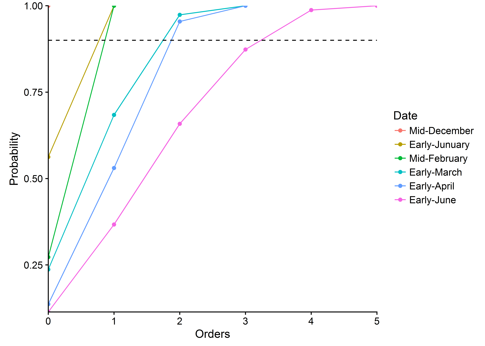

#Requierements

##Packages install 


```r
install.packages("plyr")
install.packages("ggplot2")
install.packages("gtable")
install.packages("grid")
install.packages("cowplot")
install.packages("reshape2")
install.packages("scales")
install.packages("knitr")
install.packages("tinytex")
install.packages("dplyr")
install.packages("lmtest")
#install.packages("RCurl")
```

##Packages loading

```r
library(plyr)
library(ggplot2)
library(gtable)
library(grid)
library(cowplot)
library(reshape2)
library(scales)
library(knitr)
library(tinytex)
library(dplyr)
#library(RCurl)
library(rmarkdown)
library(lmtest)
```

## Functions importing

```r
source(file = "c:/Users/mlabadie/Documents/GitHub/strawberry/Rscript/Functions.R")
```

#Import and transformation of dataset 

##Import dataset

**INDEX_PARAMETER :** TIME   # vertex_id

**15 VARIABLES:**

- VARIABLE 1 : INT  # nb_visible_leaves. No. elongated leaves (F)
- VARIABLE 2 : INT  # nb_foliar_primordia No. primordia (f)
- VARIABLE 3 : INT  # nb_total_leaves. Total no. leaves (F+f)
- VARIABLE 4 : INT  # nb_open_flowers. No. open flowers
- VARIABLE 5 : INT  # nb_aborted_flowers No. aborted flowers
- VARIABLE 6 : INT  # nb_total_flowers Total no. flowers 
- VARIABLE 7 : INT  # vegetative_bud. No. vegetative buds (axillary vegetative bud)
- VARIABLE 8 : INT  # Initiated_bud. No. initiated bud (axillary initiated bud)
- VARIABLE 9 : INT  # floral_bud. No. floral buds (axillary floral bud)
- VARIABLE 10 : INT  # stolons No. stolons
- VARIABLE 11 : INT  # type_of_crown. Type of crown (1: primary crown, 2: extention crowns, 3: branch crown)
- VARIABLE 12 : INT  # Crown_status (1: Terminal Vegetative bud (bt, stage 17, 18, 19, None), 2:Terminal bud initiated (bt, stage A), 3: Terminal floral bud(ht), 4: Inflorescence(HT), -1: rotten or aborded)
- VARIABLE 13 : INT  # genotype (1: Gariguette, 2: Ciflorette, 3: Clery, 4: Capriss, 5:Darselect, 6: Cir107)
- VARIABLE 14 : INT  # date (1: mid December, 2: early Junuary, 3: mid February, 4: early March, 5: early April, 6: end May/early June)
- VARIABLE 15 : INT  # plant. plant index


```r
DataSet <- read.csv(
  "c:/Users/mlabadie/Documents/GitHub/strawberry/Rscript/Dataset.csv", 
  sep=";",na.strings = "-1")

colstart<-1
colend<-dim(DataSet)[2]-2

data<-DataSet[,c(colstart:colend)]
```

## Dataset Class Object


```r
str(object = data)
```

```
## 'data.frame':	1796 obs. of  16 variables:
##  $ Index              : Factor w/ 17 levels "0","0-1","0-1-2",..: 1 1 1 1 1 1 1 1 1 1 ...
##  $ nb_visible_leaves  : int  8 8 11 8 6 7 7 6 7 11 ...
##  $ nb_foliar_primordia: int  4 4 3 3 4 4 4 3 3 8 ...
##  $ nb_total_leaves    : int  12 12 14 11 10 11 11 9 10 19 ...
##  $ nb_open_flowers    : int  0 0 0 0 0 0 0 0 0 0 ...
##  $ nb_aborted_flowers : int  0 0 0 0 0 0 0 0 0 0 ...
##  $ nb_total_flowers   : int  0 0 0 0 0 0 0 0 0 0 ...
##  $ vegetative_bud     : int  1 4 3 6 5 3 7 1 4 3 ...
##  $ Initiated_bud      : int  3 3 1 0 2 2 1 3 0 2 ...
##  $ floral_bud         : int  7 4 8 5 2 5 2 4 5 10 ...
##  $ stolons            : int  1 1 2 0 1 1 1 1 1 1 ...
##  $ type_of_crown      : int  1 1 1 1 1 1 1 1 1 1 ...
##  $ Crown_status       : int  3 3 3 3 3 3 3 3 3 3 ...
##  $ genotype           : int  1 1 1 1 1 1 1 1 1 1 ...
##  $ date               : int  1 1 1 1 1 1 1 1 1 2 ...
##  $ plant              : int  1 2 3 4 5 6 7 8 9 1 ...
```

## Transformation of Class object

```r
data$genotype<- as.factor(data$genotype)
data$date<- as.factor(DataSet$date)
data$Crown_status<- as.factor(DataSet$Crown_status)
data$type_of_crown<- as.factor(DataSet$type_of_crown)
```

## Conversion of dataset

```r
# Convert numerical categorical ordered value in factor values with their properties 

data$genotype<- factor(x = data$genotype,
                       levels = levels(x = data$genotype),
                       labels = c("Gariguette","Ciflorette","Clery","Capriss","Darselect","Cir107")
                       )

data$date<- factor(x = data$date,
                   levels = levels(x = data$date),
                   labels = c("Mid-December","Early-Junuary","Mid-February","Early-March","Early-April","Early-June")
                   )

data$type_of_crown<- factor(x = DataSet$type_of_crown,
                            levels = levels(x = data$type_of_crown),
                            labels = c("Primary_Crown","Extention_Crown","Branch_Crown")
                            )
data$Crown_status<- factor(x = data$Crown_status,
                              levels = levels(x = data$Crown_status),
                              labels = c("Terminal_Vegetative_bud","Terminal_initiated_bud","Terminal_Floral_bud","Terminal_Inflorescence"))
```


```r
#convert index sequence analysis in index for R analysis
dat<-data[2:colend]
for (i in 1:nrow(data)){ 
  if (data[i,'Index']=="0"){ 
    dat[i,"Index"]<- 0
  }else if (data[i,'Index']=="0-1"){
    dat[i,"Index"]<- 1
  }else if (data[i,'Index']=="0-1-2"){
    dat[i,"Index"]<- 2
  }else if (data[i,'Index']=="0-1-2-3"){
    dat[i,"Index"]<- 3
  }else if (data[i,'Index']=="0-1-2-3-4"){
    dat[i,"Index"]<- 4
  }else if (data[i,'Index']=="0-1-2-3-4-5"){
    dat[i,"Index"]<- 5
  }else if (data[i,'Index']=="1"){
    dat[i,"Index"]<- 1
  }else if (data[i,'Index']=="1-2"){
    dat[i,"Index"]<- 2
  }else if (data[i,'Index']=="1-2-3"){
    dat[i,"Index"]<- 3
  }else if (data[i,'Index']=="1-2-3-4"){
    dat[i,"Index"]<- 4
  }else if (data[i,'Index']=="1-2-3-4-5"){
    dat[i,"Index"]<- 5
  }else if (data[i,'Index']=="2"){
    dat[i,"Index"]<- 2
  }else if (data[i,'Index']=="2-3"){
    dat[i,"Index"]<- 3
  }else if (data[i,'Index']=="2-3-4"){
    dat[i,"Index"]<- 4
  }else if (data[i,'Index']=="3"){
    dat[i,"Index"]<- 3
  }else if (data[i,'Index']=="3-4"){
    dat[i,"Index"]<- 4
  }else if (data[i,'Index']=="4"){
    dat[i,"Index"]<- 4
  }
}

dat$Index<-as.factor(x = dat$Index)

#Remplacer les valeurs 0 dans la colone total flowers par NA
dat$nb_total_flowers[dat$nb_total_flowers==0]<-NA

kable(x = dat,digits = 2,caption = "Data extract from MTG")
```


Table: Data extract from MTG

 nb_visible_leaves   nb_foliar_primordia   nb_total_leaves   nb_open_flowers   nb_aborted_flowers   nb_total_flowers   vegetative_bud   Initiated_bud   floral_bud   stolons  type_of_crown     Crown_status              genotype     date             plant  Index 
------------------  --------------------  ----------------  ----------------  -------------------  -----------------  ---------------  --------------  -----------  --------  ----------------  ------------------------  -----------  --------------  ------  ------
                 8                     4                12                 0                    0                 NA                1               3            7         1  Primary_Crown     Terminal_Floral_bud       Gariguette   Mid-December         1  0     
                 8                     4                12                 0                    0                 NA                4               3            4         1  Primary_Crown     Terminal_Floral_bud       Gariguette   Mid-December         2  0     
                11                     3                14                 0                    0                 NA                3               1            8         2  Primary_Crown     Terminal_Floral_bud       Gariguette   Mid-December         3  0     
                 8                     3                11                 0                    0                 NA                6               0            5         0  Primary_Crown     Terminal_Floral_bud       Gariguette   Mid-December         4  0     
                 6                     4                10                 0                    0                 NA                5               2            2         1  Primary_Crown     Terminal_Floral_bud       Gariguette   Mid-December         5  0     
                 7                     4                11                 0                    0                 NA                3               2            5         1  Primary_Crown     Terminal_Floral_bud       Gariguette   Mid-December         6  0     
                 7                     4                11                 0                    0                 NA                7               1            2         1  Primary_Crown     Terminal_Floral_bud       Gariguette   Mid-December         7  0     
                 6                     3                 9                 0                    0                 NA                1               3            4         1  Primary_Crown     Terminal_Floral_bud       Gariguette   Mid-December         8  0     
                 7                     3                10                 0                    0                 NA                4               0            5         1  Primary_Crown     Terminal_Floral_bud       Gariguette   Mid-December         9  0     
                11                     8                19                 0                    0                 NA                3               2           10         1  Primary_Crown     Terminal_Floral_bud       Gariguette   Early-Junuary        1  0     
                 2                     3                 5                 0                    0                 NA                5               0            0         0  Branch_Crown      Terminal_Floral_bud       Gariguette   Early-Junuary        1  1     
                 1                     4                 5                 0                    0                 NA                3               0            2         0  Branch_Crown      Terminal_Floral_bud       Gariguette   Early-Junuary        1  1     
                 1                     4                 5                 0                    0                 NA                3               1            1         0  Branch_Crown      Terminal_Floral_bud       Gariguette   Early-Junuary        1  1     
                11                     4                15                 0                    0                 14                2               2            9         2  Primary_Crown     Terminal_Floral_bud       Gariguette   Early-Junuary        2  0     
                 7                     0                 7                 0                    0                 NA                1               0            3         0  Primary_Crown     Terminal_Inflorescence    Gariguette   Early-Junuary        3  0     
                 5                     1                 6                 0                    0                 NA                2               0            4         0  Extention_Crown   Terminal_Floral_bud       Gariguette   Early-Junuary        3  1     
                 3                     1                 4                 0                    0                 NA                2               0            2         0  Branch_Crown      Terminal_Floral_bud       Gariguette   Early-Junuary        3  1     
                 2                     4                 6                 0                    0                 NA                5               0            1         0  Branch_Crown      Terminal_Floral_bud       Gariguette   Early-Junuary        3  1     
                11                     0                11                 0                    0                 22                0               0           10         0  Primary_Crown     Terminal_Inflorescence    Gariguette   Early-Junuary        4  0     
                 3                     3                 6                 0                    0                 NA                5               1            0         0  Branch_Crown      Terminal_Floral_bud       Gariguette   Early-Junuary        4  1     
                13                     0                13                 0                    0                 20                0               0            9         3  Primary_Crown     Terminal_Inflorescence    Gariguette   Early-Junuary        5  0     
                11                     0                11                 0                    0                 18                1               0            9         1  Primary_Crown     Terminal_Inflorescence    Gariguette   Early-Junuary        6  0     
                12                     0                12                 0                    0                 17                0               0           12         0  Primary_Crown     Terminal_Inflorescence    Gariguette   Early-Junuary        7  0     
                11                     0                11                 0                    0                 19                1               0            9         1  Primary_Crown     Terminal_Inflorescence    Gariguette   Early-Junuary        8  0     
                 9                     0                 9                 0                    0                 24                0               1            7         1  Primary_Crown     Terminal_Inflorescence    Gariguette   Early-Junuary        9  0     
                14                     0                14                 2                    0                 19                0               0            8         0  Primary_Crown     Terminal_Inflorescence    Gariguette   Mid-February         1  0     
                 3                     0                 3                 0                    0                 11                2               0            1         0  Extention_Crown   Terminal_Inflorescence    Gariguette   Mid-February         1  1     
                 1                     3                 4                 0                    0                 NA                3               1            0         0  Branch_Crown      Terminal_Floral_bud       Gariguette   Mid-February         1  1     
                 5                     0                 5                 0                    0                 NA                2               0            3         0  Branch_Crown      Terminal_Inflorescence    Gariguette   Mid-February         1  1     
                 5                     0                 5                 0                    0                 11                1               0            4         0  Branch_Crown      Terminal_Inflorescence    Gariguette   Mid-February         1  1     
                 2                     2                 4                 0                    0                 NA                2               0            2         0  Branch_Crown      Terminal_Inflorescence    Gariguette   Mid-February         1  1     
                 3                     0                 3                 0                    0                 NA                2               0            1         0  Branch_Crown      Terminal_Inflorescence    Gariguette   Mid-February         1  1     
                11                     0                11                 0                    0                 22                1               0            7         0  Primary_Crown     Terminal_Inflorescence    Gariguette   Mid-February         2  0     
                 3                     0                 3                 0                    0                  8                1               1            1         0  Extention_Crown   Terminal_Inflorescence    Gariguette   Mid-February         2  1     
                 1                     3                 4                 0                    0                 NA                1               1            0         0  Branch_Crown      Terminal_Floral_bud       Gariguette   Mid-February         2  1     
                 3                     0                 3                 0                    0                 NA                1               0            1         0  Branch_Crown      Terminal_Inflorescence    Gariguette   Mid-February         2  1     
                 9                     0                 9                 3                    0                 22                0               0            6         1  Primary_Crown     Terminal_Inflorescence    Gariguette   Mid-February         3  0     
                 3                     0                 3                 0                    0                 11                1               0            2         0  Extention_Crown   Terminal_Inflorescence    Gariguette   Mid-February         3  1     
                 3                     0                 3                 0                    0                  9                2               0            1         0  Branch_Crown      Terminal_Inflorescence    Gariguette   Mid-February         3  1     
                 8                     0                 8                 0                    0                 24                0               0            7         0  Primary_Crown     Terminal_Inflorescence    Gariguette   Mid-February         4  0     
                 2                     0                 2                 0                    0                  8                1               0            1         0  Extention_Crown   Terminal_Inflorescence    Gariguette   Mid-February         4  1     
                13                     0                13                 2                    0                 19                0               0            9         0  Primary_Crown     Terminal_Inflorescence    Gariguette   Mid-February         5  0     
                 3                     0                 3                 0                    0                  7                0               2            1         0  Extention_Crown   Terminal_Inflorescence    Gariguette   Mid-February         5  1     
                 4                     2                 6                 0                    0                 NA                2               0            2         0  Branch_Crown      Terminal_Floral_bud       Gariguette   Mid-February         5  1     
                 5                     0                 5                 0                    0                  7                2               1            2         0  Branch_Crown      Terminal_Inflorescence    Gariguette   Mid-February         5  1     
                 2                     2                 4                 0                    0                 NA                2               0            2         0  Branch_Crown      Terminal_Floral_bud       Gariguette   Mid-February         5  1     
                14                     0                14                 4                    0                 17                0               0            9         2  Primary_Crown     Terminal_Inflorescence    Gariguette   Mid-February         6  0     
                 3                     0                 3                 0                    0                 12                1               1            1         0  Extention_Crown   Terminal_Inflorescence    Gariguette   Mid-February         6  1     
                 4                     0                 4                 0                    0                 NA                1               0            3         0  Branch_Crown      Terminal_Inflorescence    Gariguette   Mid-February         6  1     
                 3                     0                 3                 0                    0                 14                2               0            1         0  Branch_Crown      Terminal_Inflorescence    Gariguette   Mid-February         6  1     
                 8                     0                 8                 0                    0                 15                0               0            7         0  Primary_Crown     Terminal_Inflorescence    Gariguette   Mid-February         7  0     
                 2                     0                 2                 0                    0                  6                0               1            1         0  Extention_Crown   Terminal_Inflorescence    Gariguette   Mid-February         7  1     
                11                     0                11                 0                    0                 18                0               0            8         0  Primary_Crown     Terminal_Inflorescence    Gariguette   Mid-February         8  0     
                 3                     0                 3                 0                    0                  7                1               0            2         0  Extention_Crown   Terminal_Inflorescence    Gariguette   Mid-February         8  1     
                 3                     0                 3                 0                    0                  6                1               1            1         0  Branch_Crown      Terminal_Inflorescence    Gariguette   Mid-February         8  1     
                 9                     0                 9                 1                    0                 18                0               0            7         0  Primary_Crown     Terminal_Inflorescence    Gariguette   Mid-February         9  0     
                 3                     0                 3                 0                    0                  6                0               0            3         0  Extention_Crown   Terminal_Inflorescence    Gariguette   Mid-February         9  1     
                 3                     0                 3                 0                    0                  6                1               1            1         0  Branch_Crown      Terminal_Inflorescence    Gariguette   Mid-February         9  1     
                 9                     0                 9                12                    0                 17                0               0            6         0  Primary_Crown     Terminal_Inflorescence    Gariguette   Early-March          1  0     
                 3                     0                 3                 2                    0                  6                0               0            3         0  Extention_Crown   Terminal_Inflorescence    Gariguette   Early-March          1  1     
                 3                     0                 3                 0                    0                  6                0               0            2         0  Branch_Crown      Terminal_Inflorescence    Gariguette   Early-March          1  1     
                10                     0                10                15                    0                 17                1               1            3         1  Primary_Crown     Terminal_Inflorescence    Gariguette   Early-March          2  0     
                 2                     0                 2                 3                    0                  7                0               0            1         0  Extention_Crown   Terminal_Inflorescence    Gariguette   Early-March          2  1     
                 2                     0                 2                 0                    0                  7                1               0            1         0  Extention_Crown   Terminal_Inflorescence    Gariguette   Early-March          2  2     
                 3                     0                 3                 0                    0                  7                1               0            2         0  Branch_Crown      Terminal_Inflorescence    Gariguette   Early-March          2  1     
                10                     0                10                17                    0                 19                0               0            8         0  Primary_Crown     Terminal_Inflorescence    Gariguette   Early-March          3  0     
                 3                     0                 3                 4                    0                  8                1               1            0         0  Extention_Crown   Terminal_Inflorescence    Gariguette   Early-March          3  1     
                 2                     0                 2                 0                    0                  7                0               0            2         0  Extention_Crown   Terminal_Inflorescence    Gariguette   Early-March          3  2     
                 2                     0                 2                 2                    0                  8                1               0            0         0  Branch_Crown      Terminal_Inflorescence    Gariguette   Early-March          3  1     
                 1                     2                 3                 0                    0                 NA                2               0            1         0  Extention_Crown   Terminal_Floral_bud       Gariguette   Early-March          3  2     
                12                     0                12                15                    0                 15                3               0            7         0  Primary_Crown     Terminal_Inflorescence    Gariguette   Early-March          4  0     
                 2                     0                 2                 4                    0                  6                0               0            1         0  Extention_Crown   Terminal_Inflorescence    Gariguette   Early-March          4  1     
                 1                     2                 3                 0                    0                 NA                1               0            2         0  Extention_Crown   Terminal_Floral_bud       Gariguette   Early-March          4  2     
                 2                     0                 2                 4                    0                  6                1               0            0         0  Branch_Crown      Terminal_Inflorescence    Gariguette   Early-March          4  1     
                 1                     3                 4                 0                    0                 NA                2               0            2         0  Extention_Crown   Terminal_Floral_bud       Gariguette   Early-March          4  2     
                10                     0                10                16                    0                 21                0               0            6         2  Primary_Crown     Terminal_Inflorescence    Gariguette   Early-March          5  0     
                 2                     0                 2                 7                    0                 10                0               0            1         0  Extention_Crown   Terminal_Inflorescence    Gariguette   Early-March          5  1     
                 2                     1                 3                 0                    0                 NA                2               0            1         0  Extention_Crown   Terminal_Floral_bud       Gariguette   Early-March          5  2     
                 3                     0                 3                 3                    0                  8                1               0            1         0  Branch_Crown      Terminal_Inflorescence    Gariguette   Early-March          5  1     
                 1                     4                 5                 0                    0                 NA                3               2            0         0  Extention_Crown   Terminal_Floral_bud       Gariguette   Early-March          5  2     
                11                     0                11                18                    0                 22                1               1            5         2  Primary_Crown     Terminal_Inflorescence    Gariguette   Early-March          6  0     
                 3                     0                 3                 3                    0                  8                1               1            1         0  Extention_Crown   Terminal_Inflorescence    Gariguette   Early-March          6  1     
                 4                     0                 4                 1                    0                  6                1               1            2         0  Branch_Crown      Terminal_Inflorescence    Gariguette   Early-March          6  1     
                 3                     0                 3                 0                    0                 NA                0               0            2         0  Primary_Crown     Terminal_Inflorescence    Gariguette   Early-March          7  0     
                 5                     0                 5                20                    0                 23                0               1            3         0  Extention_Crown   Terminal_Inflorescence    Gariguette   Early-March          7  1     
                 3                     0                 3                 2                    0                  8                0               1            0         0  Extention_Crown   Terminal_Inflorescence    Gariguette   Early-March          7  2     
                 1                     2                 3                 0                    0                 NA                1               1            1         0  Extention_Crown   Terminal_Floral_bud       Gariguette   Early-March          7  3     
                11                     0                11                18                    0                 25                0               0            7         1  Primary_Crown     Terminal_Inflorescence    Gariguette   Early-March          8  0     
                 2                     0                 2                 6                    0                 12                0               0            1         0  Extention_Crown   Terminal_Inflorescence    Gariguette   Early-March          8  1     
                 3                     0                 3                 0                    0                  5                1               0            2         0  Extention_Crown   Terminal_Inflorescence    Gariguette   Early-March          8  2     
                12                     0                12                13                    0                 14                0               0            9         0  Primary_Crown     Terminal_Inflorescence    Gariguette   Early-March          9  0     
                 2                     0                 2                 5                    0                  6                0               1            0         0  Extention_Crown   Terminal_Inflorescence    Gariguette   Early-March          9  1     
                 1                     2                 3                 0                    0                 NA                2               0            1         0  Extention_Crown   Terminal_Floral_bud       Gariguette   Early-March          9  2     
                 4                     0                 4                 3                    0                  5                2               0            1         0  Branch_Crown      Terminal_Inflorescence    Gariguette   Early-March          9  1     
                 1                     3                 4                 0                    0                 NA                3               1            0         0  Extention_Crown   Terminal_Floral_bud       Gariguette   Early-March          9  2     
                 3                     0                 3                 0                    0                 11                2               0            1         0  Branch_Crown      Terminal_Inflorescence    Gariguette   Early-March          9  1     
                11                     0                11                24                    0                 24                0               0            5         1  Primary_Crown     Terminal_Inflorescence    Gariguette   Early-April          1  0     
                 3                     0                 3                 9                    0                  9                1               0            0         0  Extention_Crown   Terminal_Inflorescence    Gariguette   Early-April          1  1     
                 3                     0                 3                 2                    0                  9                0               0            3         0  Extention_Crown   Terminal_Inflorescence    Gariguette   Early-April          1  2     
                 1                     3                 4                 0                    0                 NA                3               0            0         0  Branch_Crown      Terminal_Floral_bud       Gariguette   Early-April          1  1     
                 5                     0                 5                 9                    0                  9                3               0            0         0  Branch_Crown      Terminal_Inflorescence    Gariguette   Early-April          1  1     
                 2                     2                 4                 0                    0                  5                3               0            1         0  Extention_Crown   Terminal_Inflorescence    Gariguette   Early-April          1  2     
                 2                     1                 3                 0                    0                 NA                1               0            1         0  Branch_Crown      Terminal_Floral_bud       Gariguette   Early-April          1  2     
                 4                     0                 4                 9                    0                  9                1               0            2         0  Branch_Crown      Terminal_Inflorescence    Gariguette   Early-April          1  1     
                 2                     0                 2                 0                    0                  5                1               0            1         0  Extention_Crown   Terminal_Inflorescence    Gariguette   Early-April          1  2     
                 3                     0                 3                 8                    0                  8                1               0            1         0  Branch_Crown      Terminal_Inflorescence    Gariguette   Early-April          1  1     
                 5                     0                 5                 0                    0                 NA                3               1            1         0  Extention_Crown   Terminal_Inflorescence    Gariguette   Early-April          1  2     
                 1                     2                 3                 0                    0                 NA                1               0            0         0  Branch_Crown      Terminal_Floral_bud       Gariguette   Early-April          1  2     
                 9                     0                 9                21                    0                 21                0               0            7         0  Primary_Crown     Terminal_Inflorescence    Gariguette   Early-April          2  0     
                 2                     0                 2                 0                    0                 11                1               0            0         0  Extention_Crown   Terminal_Inflorescence    Gariguette   Early-April          2  1     
                 3                     0                 3                 3                    0                  9                2               0            0         0  Extention_Crown   Terminal_Inflorescence    Gariguette   Early-April          2  2     
                 2                     1                 3                 0                    0                 NA                1               0            1         0  Extention_Crown   Terminal_Floral_bud       Gariguette   Early-April          2  3     
                 3                     0                 3                 6                    0                  6                0               1            0         0  Branch_Crown      Terminal_Inflorescence    Gariguette   Early-April          2  1     
                 3                     0                 3                 0                    0                  8                2               0            1         0  Extention_Crown   Terminal_Inflorescence    Gariguette   Early-April          2  2     
                 9                     0                 9                16                    0                 17                1               0            5         0  Primary_Crown     Terminal_Inflorescence    Gariguette   Early-April          3  0     
                 2                     0                 2                10                    0                 10                0               0            2         0  Extention_Crown   Terminal_Inflorescence    Gariguette   Early-April          3  1     
                 3                     0                 3                 6                    0                  7                2               0            1         0  Branch_Crown      Terminal_Inflorescence    Gariguette   Early-April          3  1     
                10                     0                10                18                    0                 18                0               0            6         1  Primary_Crown     Terminal_Inflorescence    Gariguette   Early-April          4  0     
                 2                     0                 2                 5                    0                  5                0               0            1         0  Extention_Crown   Terminal_Inflorescence    Gariguette   Early-April          4  1     
                 3                     0                 3                 0                    0                 10                1               0            2         0  Extention_Crown   Terminal_Inflorescence    Gariguette   Early-April          4  2     
                 2                     0                 2                 7                    0                  7                1               1            0         0  Branch_Crown      Terminal_Inflorescence    Gariguette   Early-April          4  1     
                 4                     5                 9                 0                    0                 NA                1               0            0         5  Extention_Crown   Terminal_initiated_bud    Gariguette   Early-April          4  2     
                 4                     5                 9                 0                    0                 NA                2               0            1         0  Branch_Crown      Terminal_Vegetative_bud   Gariguette   Early-April          4  2     
                 3                     0                 3                 6                    0                  6                0               0            1         0  Branch_Crown      Terminal_Inflorescence    Gariguette   Early-April          4  1     
                 4                     0                 4                 0                    0                  9                2               0            1         0  Extention_Crown   Terminal_Inflorescence    Gariguette   Early-April          4  2     
                 8                     0                 8                20                    0                 20                0               1            3         0  Primary_Crown     Terminal_Inflorescence    Gariguette   Early-April          5  0     
                 2                     0                 2                10                    0                 10                1               0            0         0  Extention_Crown   Terminal_Inflorescence    Gariguette   Early-April          5  1     
                 3                     0                 3                 2                    0                  5                2               0            1         0  Extention_Crown   Terminal_Inflorescence    Gariguette   Early-April          5  2     
                 2                     0                 2                 8                    0                  8                1               0            1         0  Branch_Crown      Terminal_Inflorescence    Gariguette   Early-April          5  1     
                10                     0                10                21                    0                 21                0               2            0         1  Primary_Crown     Terminal_Inflorescence    Gariguette   Early-April          6  0     
                 2                     0                 2                 7                    0                  7                0               0            0         0  Extention_Crown   Terminal_Inflorescence    Gariguette   Early-April          6  1     
                 3                     0                 3                 1                    0                  7                1               1            1         0  Extention_Crown   Terminal_Inflorescence    Gariguette   Early-April          6  2     
                 2                     0                 2                 8                    0                  8                0               0            0         0  Branch_Crown      Terminal_Inflorescence    Gariguette   Early-April          6  1     
                 2                     0                 2                 1                    0                  6                1               0            1         0  Extention_Crown   Terminal_Inflorescence    Gariguette   Early-April          6  2     
                 2                     3                 5                 0                    0                 NA                3               0            1         0  Branch_Crown      Terminal_Floral_bud       Gariguette   Early-April          6  2     
                11                     0                11                23                    0                 23                0               0            4         2  Primary_Crown     Terminal_Inflorescence    Gariguette   Early-April          7  0     
                 3                     0                 3                 9                    0                 10                1               0            1         0  Extention_Crown   Terminal_Inflorescence    Gariguette   Early-April          7  1     
                 2                     0                 2                 1                    0                  5                1               0            1         0  Extention_Crown   Terminal_Inflorescence    Gariguette   Early-April          7  2     
                 4                     0                 4                 2                    0                  4                2               0            0         0  Branch_Crown      Terminal_Inflorescence    Gariguette   Early-April          7  1     
                 1                     2                 3                 0                    0                 NA                2               0            0         0  Extention_Crown   Terminal_Floral_bud       Gariguette   Early-April          7  2     
                 3                     0                 3                 0                    0                  8                1               0            1         0  Branch_Crown      Terminal_Inflorescence    Gariguette   Early-April          7  1     
                 1                     1                 2                 0                    0                 NA                1               0            1         0  Extention_Crown   Terminal_Floral_bud       Gariguette   Early-April          7  2     
                 8                     0                 8                 0                    0                 NA                0               0            2         1  Primary_Crown     Terminal_Inflorescence    Gariguette   Early-April          8  0     
                 5                     0                 5                23                    0                 23                0               0            3         0  Extention_Crown   Terminal_Inflorescence    Gariguette   Early-April          8  1     
                 2                     0                 2                10                    0                 11                1               0            0         0  Extention_Crown   Terminal_Inflorescence    Gariguette   Early-April          8  2     
                 2                     1                 3                 0                    0                 NA                1               0            1         0  Extention_Crown   Terminal_Floral_bud       Gariguette   Early-April          8  3     
                 4                     0                 4                 8                    0                  8                2               0            1         0  Branch_Crown      Terminal_Inflorescence    Gariguette   Early-April          8  1     
                 3                     2                 5                 0                    0                 NA                2               1            2         0  Extention_Crown   Terminal_Floral_bud       Gariguette   Early-April          8  2     
                 7                     0                 7                 8                    0                  8                3               1            1         0  Branch_Crown      Terminal_Inflorescence    Gariguette   Early-April          8  1     
                 3                     4                 7                 0                    0                 NA                4               3            0         0  Extention_Crown   Terminal_Floral_bud       Gariguette   Early-April          8  2     
                 3                     3                 6                 0                    0                 NA                5               0            0         0  Branch_Crown      Terminal_Floral_bud       Gariguette   Early-April          8  2     
                 6                     0                 6                 8                    0                  8                2               2            0         0  Branch_Crown      Terminal_Inflorescence    Gariguette   Early-April          8  1     
                 3                     0                 3                 0                    0                  7                2               0            1         0  Extention_Crown   Terminal_Inflorescence    Gariguette   Early-April          8  2     
                 2                     1                 3                 0                    0                 NA                1               0            1         0  Branch_Crown      Terminal_Floral_bud       Gariguette   Early-April          8  2     
                 5                     1                 6                 2                    0                  2                0               0            1         0  Branch_Crown      Terminal_Inflorescence    Gariguette   Early-April          8  1     
                 3                     0                 3                 6                    0                  8                1               0            0         0  Branch_Crown      Terminal_Inflorescence    Gariguette   Early-April          8  2     
                 1                     2                 3                 0                    0                 NA                1               0            1         0  Extention_Crown   Terminal_Floral_bud       Gariguette   Early-April          8  3     
                11                     0                11                18                    0                 18                1               0            4         1  Primary_Crown     Terminal_Inflorescence    Gariguette   Early-April          9  0     
                 2                     0                 2                 7                    0                  7                0               0            1         0  Extention_Crown   Terminal_Inflorescence    Gariguette   Early-April          9  1     
                 3                     2                 5                 0                    0                 NA                4               0            1         0  Extention_Crown   Terminal_Floral_bud       Gariguette   Early-April          9  2     
                 2                     0                 2                 6                    0                  6                1               0            0         0  Branch_Crown      Terminal_Inflorescence    Gariguette   Early-April          9  1     
                 2                     2                 4                 0                    0                 NA                2               0            1         0  Extention_Crown   Terminal_Floral_bud       Gariguette   Early-April          9  2     
                10                     0                10                13                    0                 14                1               0            1         0  Primary_Crown     Terminal_Inflorescence    Gariguette   Early-June           1  0     
                 2                     0                 2                 8                    0                  9                1               0            0         0  Extention_Crown   Terminal_Inflorescence    Gariguette   Early-June           1  1     
                 3                     0                 3                 5                    0                  8                0               0            2         0  Extention_Crown   Terminal_Inflorescence    Gariguette   Early-June           1  2     
                 3                     0                 3                 0                    0                 NA                1               0            0         0  Extention_Crown   Terminal_Inflorescence    Gariguette   Early-June           1  3     
                 3                     0                 3                 0                    0                  3                2               0            0         1  Extention_Crown   Terminal_Inflorescence    Gariguette   Early-June           1  4     
                 1                     2                 3                 0                    0                 NA                3               0            0         0  Branch_Crown      Terminal_Floral_bud       Gariguette   Early-June           1  1     
                 3                     0                 3                 7                    0                  7                0               0            2         0  Branch_Crown      Terminal_Inflorescence    Gariguette   Early-June           1  1     
                 2                     0                 2                 7                    0                  7                0               0            1         0  Extention_Crown   Terminal_Inflorescence    Gariguette   Early-June           1  2     
                 3                     0                 3                 0                    0                 NA                1               0            1         0  Extention_Crown   Terminal_Inflorescence    Gariguette   Early-June           1  3     
                 3                     0                 3                 0                    0                  4                1               0            0         2  Extention_Crown   Terminal_Inflorescence    Gariguette   Early-June           1  4     
                11                     0                11                20                    0                 23                0               0            1         0  Primary_Crown     Terminal_Inflorescence    Gariguette   Early-June           2  0     
                 3                     0                 3                 0                    0                  9                0               1            1         0  Extention_Crown   Terminal_Inflorescence    Gariguette   Early-June           2  1     
                 3                     0                 3                 2                    0                  5                0               1            1         0  Extention_Crown   Terminal_Inflorescence    Gariguette   Early-June           2  2     
                 1                     3                 4                 0                    0                 NA                0               0            2         0  Extention_Crown   Terminal_Floral_bud       Gariguette   Early-June           2  3     
                 4                     0                 4                 6                    0                 10                1               0            2         0  Branch_Crown      Terminal_Inflorescence    Gariguette   Early-June           2  1     
                 2                     1                 3                 0                    0                 NA                2               0            1         0  Extention_Crown   Terminal_Inflorescence    Gariguette   Early-June           2  2     
                 6                     0                 6                 7                    0                  9                0               0            1         0  Branch_Crown      Terminal_Inflorescence    Gariguette   Early-June           2  1     
                 2                     0                 2                 4                    0                  7                0               0            2         0  Extention_Crown   Terminal_Inflorescence    Gariguette   Early-June           2  2     
                 2                     0                 2                 0                    0                  4                0               0            2         0  Branch_Crown      Terminal_Inflorescence    Gariguette   Early-June           2  2     
                 8                     0                 8                17                    0                 18                0               0            6         0  Primary_Crown     Terminal_Inflorescence    Gariguette   Early-June           3  0     
                 2                     0                 2                 6                    0                  8                0               0            0         0  Extention_Crown   Terminal_Inflorescence    Gariguette   Early-June           3  1     
                 4                     0                 4                14                    0                 14                1               0            2         0  Extention_Crown   Terminal_Inflorescence    Gariguette   Early-June           3  2     
                 2                     0                 2                 5                    0                  5                1               0            0         0  Branch_Crown      Terminal_Inflorescence    Gariguette   Early-June           3  1     
                 5                     0                 5                 0                    0                 NA                2               0            2         0  Extention_Crown   Terminal_Inflorescence    Gariguette   Early-June           3  2     
                 1                     1                 2                 0                    0                  4                1               0            0         1  Extention_Crown   Terminal_Inflorescence    Gariguette   Early-June           3  3     
                 1                     5                 6                 0                    0                 NA                0               0            0         0  Branch_Crown      Terminal_Vegetative_bud   Gariguette   Early-June           3  2     
                 4                     0                 4                 0                    0                  2                3               0            0         0  Branch_Crown      Terminal_Inflorescence    Gariguette   Early-June           3  2     
                 9                     0                 9                19                    0                 21                0               0            3         0  Primary_Crown     Terminal_Inflorescence    Gariguette   Early-June           4  0     
                 2                     0                 2                 6                    0                  6                1               0            0         0  Extention_Crown   Terminal_Inflorescence    Gariguette   Early-June           4  1     
                 3                     0                 3                 0                    0                 NA                1               0            1         0  Extention_Crown   Terminal_Inflorescence    Gariguette   Early-June           4  2     
                 3                     0                 3                 0                    0                  6                1               0            1         0  Extention_Crown   Terminal_Inflorescence    Gariguette   Early-June           4  3     
                 8                     0                 8                 9                    0                 11                0               1            4         0  Primary_Crown     Terminal_Inflorescence    Gariguette   Early-June           5  0     
                 3                     0                 3                 7                    0                  8                0               0            2         0  Extention_Crown   Terminal_Inflorescence    Gariguette   Early-June           5  1     
                 3                     0                 3                 8                    0                  8                2               0            0         0  Extention_Crown   Terminal_Inflorescence    Gariguette   Early-June           5  2     
                 3                     0                 3                 6                    0                  7                2               0            0         0  Extention_Crown   Terminal_Inflorescence    Gariguette   Early-June           5  3     
                 3                     0                 3                 0                    0                  6                1               0            0         2  Extention_Crown   Terminal_Inflorescence    Gariguette   Early-June           5  4     
                 3                     0                 3                 4                    0                  4                1               0            1         0  Branch_Crown      Terminal_Inflorescence    Gariguette   Early-June           5  1     
                 3                     0                 3                 6                    0                  6                1               1            0         0  Extention_Crown   Terminal_Inflorescence    Gariguette   Early-June           5  2     
                 2                     0                 2                 7                    0                  7                1               0            0         0  Extention_Crown   Terminal_Inflorescence    Gariguette   Early-June           5  3     
                 3                     0                 3                 0                    0                  5                1               0            0         2  Extention_Crown   Terminal_Inflorescence    Gariguette   Early-June           5  4     
                 9                     0                 9                10                    0                 10                0               0            5         1  Primary_Crown     Terminal_Inflorescence    Gariguette   Early-June           6  0     
                 3                     0                 3                 9                    0                  9                0               0            2         0  Extention_Crown   Terminal_Inflorescence    Gariguette   Early-June           6  1     
                 3                     0                 3                 3                    0                  4                0               0            2         0  Extention_Crown   Terminal_Inflorescence    Gariguette   Early-June           6  2     
                 2                     0                 2                 0                    0                 NA                0               0            1         0  Extention_Crown   Terminal_Inflorescence    Gariguette   Early-June           6  3     
                 2                     0                 2                 0                    0                  5                1               0            0         1  Extention_Crown   Terminal_Inflorescence    Gariguette   Early-June           6  4     
                 2                     0                 2                11                    0                 11                0               0            0         0  Branch_Crown      Terminal_Inflorescence    Gariguette   Early-June           6  1     
                 3                     0                 3                 7                    0                  8                0               0            1         0  Extention_Crown   Terminal_Inflorescence    Gariguette   Early-June           6  2     
                 3                     0                 3                 9                    0                 10                1               0            1         0  Extention_Crown   Terminal_Inflorescence    Gariguette   Early-June           6  3     
                 3                     0                 3                 6                    0                  7                2               0            0         0  Extention_Crown   Terminal_Inflorescence    Gariguette   Early-June           6  4     
                 3                     0                 3                 4                    0                  7                1               0            0         2  Extention_Crown   Terminal_Inflorescence    Gariguette   Early-June           6  5     
                 6                     0                 6                 0                    0                 NA                2               0            2         0  Branch_Crown      Terminal_Inflorescence    Gariguette   Early-June           6  2     
                 2                     0                 2                 5                    0                  5                2               0            0         0  Extention_Crown   Terminal_Inflorescence    Gariguette   Early-June           6  3     
                 8                     0                 8                13                    0                 13                0               0            2         0  Primary_Crown     Terminal_Inflorescence    Gariguette   Early-June           7  0     
                 2                     0                 2                 8                    0                  9                0               0            1         0  Extention_Crown   Terminal_Inflorescence    Gariguette   Early-June           7  1     
                 3                     0                 3                 5                    0                  5                0               2            0         0  Extention_Crown   Terminal_Inflorescence    Gariguette   Early-June           7  2     
                 3                     0                 3                 4                    0                  5                1               0            1         0  Extention_Crown   Terminal_Inflorescence    Gariguette   Early-June           7  3     
                 3                     0                 3                 0                    0                  5                2               0            0         1  Extention_Crown   Terminal_Inflorescence    Gariguette   Early-June           7  4     
                 3                     0                 3                 5                    0                  5                1               0            1         0  Branch_Crown      Terminal_Inflorescence    Gariguette   Early-June           7  1     
                 3                     0                 3                 4                    0                  4                1               1            0         0  Extention_Crown   Terminal_Inflorescence    Gariguette   Early-June           7  2     
                 2                     0                 2                 0                    0                  5                1               0            1         0  Extention_Crown   Terminal_Inflorescence    Gariguette   Early-June           7  3     
                 9                     0                 9                23                    0                 23                1               0            1         0  Primary_Crown     Terminal_Inflorescence    Gariguette   Early-June           8  0     
                 3                     0                 3                 6                    0                  7                1               0            1         0  Extention_Crown   Terminal_Inflorescence    Gariguette   Early-June           8  1     
                 3                     0                 3                 0                    0                 NA                0               1            1         0  Extention_Crown   Terminal_Inflorescence    Gariguette   Early-June           8  2     
                 3                     0                 3                 0                    0                  6                1               0            0         2  Extention_Crown   Terminal_Inflorescence    Gariguette   Early-June           8  3     
                 2                     0                 2                10                    0                 10                1               0            0         0  Branch_Crown      Terminal_Inflorescence    Gariguette   Early-June           8  1     
                 5                     0                 5                 0                    0                 NA                2               0            3         0  Extention_Crown   Terminal_Inflorescence    Gariguette   Early-June           8  2     
                11                     0                11                14                    0                 14                0               0            6         1  Primary_Crown     Terminal_Inflorescence    Gariguette   Early-June           9  0     
                 2                     0                 2                 7                    0                  7                0               0            0         0  Extention_Crown   Terminal_Inflorescence    Gariguette   Early-June           9  1     
                 6                     0                 6                10                    0                 10                3               0            1         0  Extention_Crown   Terminal_Inflorescence    Gariguette   Early-June           9  2     
                 3                     0                 3                 5                    0                  5                1               0            0         1  Extention_Crown   Terminal_Inflorescence    Gariguette   Early-June           9  3     
                 3                     0                 3                 0                    0                  6                2               0            0         1  Extention_Crown   Terminal_Inflorescence    Gariguette   Early-June           9  4     
                 1                     0                 1                 0                    0                  4                1               0            0         0  Branch_Crown      Terminal_Inflorescence    Gariguette   Early-June           9  1     
                 2                     0                 2                10                    0                 10                0               0            1         0  Branch_Crown      Terminal_Inflorescence    Gariguette   Early-June           9  1     
                 5                     0                 5                 6                    0                  6                1               1            1         0  Extention_Crown   Terminal_Inflorescence    Gariguette   Early-June           9  2     
                 3                     0                 3                 5                    0                  5                0               1            0         1  Extention_Crown   Terminal_Inflorescence    Gariguette   Early-June           9  3     
                 2                     0                 2                 0                    0                  5                2               0            0         0  Extention_Crown   Terminal_Inflorescence    Gariguette   Early-June           9  4     
                 3                     0                 3                 2                    0                  6                2               0            0         0  Branch_Crown      Terminal_Inflorescence    Gariguette   Early-June           9  3     
                 3                     0                 3                 2                    0                  4                2               0            0         1  Branch_Crown      Terminal_Inflorescence    Gariguette   Early-June           9  2     
                 3                     0                 3                 1                    0                  8                1               0            0         1  Branch_Crown      Terminal_Inflorescence    Gariguette   Early-June           9  3     
                 5                     0                 5                 0                    0                  7                1               0            0         2  Primary_Crown     Terminal_Inflorescence    Darselect    Mid-December         1  0     
                 2                     2                 4                 0                    0                 NA                2               0            2         0  Extention_Crown   Terminal_Floral_bud       Darselect    Mid-December         1  1     
                 5                     0                 5                 0                    0                  9                2               0            0         2  Primary_Crown     Terminal_Inflorescence    Darselect    Mid-December         2  0     
                 1                     3                 4                 0                    0                 NA                3               0            1         0  Extention_Crown   Terminal_Floral_bud       Darselect    Mid-December         2  1     
                 4                     0                 4                 0                    0                 NA                1               0            2         0  Primary_Crown     Terminal_Inflorescence    Darselect    Mid-December         3  0     
                 2                     1                 3                 0                    0                 NA                2               0            1         0  Extention_Crown   Terminal_Floral_bud       Darselect    Mid-December         3  1     
                 7                     3                10                 0                    0                 NA                6               0            3         1  Primary_Crown     Terminal_Floral_bud       Darselect    Mid-December         4  0     
                 4                     0                 4                 0                    0                 NA                1               0            1         0  Primary_Crown     Terminal_Inflorescence    Darselect    Mid-December         5  0     
                 2                     2                 4                 0                    0                 NA                3               0            1         0  Extention_Crown   Terminal_Floral_bud       Darselect    Mid-December         5  1     
                 4                     0                 4                 0                    0                 NA                3               0            0         0  Primary_Crown     Terminal_Inflorescence    Darselect    Mid-December         6  0     
                 2                     2                 4                 0                    0                 NA                3               0            1         0  Extention_Crown   Terminal_Floral_bud       Darselect    Mid-December         6  1     
                 5                     5                10                 0                    0                 NA                4               0            3         0  Primary_Crown     Terminal_Floral_bud       Darselect    Mid-December         7  0     
                 6                     2                 8                 0                    0                 NA                5               0            1         2  Primary_Crown     Terminal_Floral_bud       Darselect    Mid-December         8  0     
                 8                     0                 8                 0                    0                 NA                2               0            1         3  Primary_Crown     Terminal_Inflorescence    Darselect    Mid-December         9  0     
                 2                     1                 3                 0                    0                 NA                2               0            1         0  Extention_Crown   Terminal_Floral_bud       Darselect    Mid-December         9  1     
                 9                     1                10                 0                    0                 NA                1               3            4         2  Primary_Crown     Terminal_Floral_bud       Darselect    Early-Junuary        1  0     
                 7                     0                 7                 3                    0                 10                2               0            2         0  Primary_Crown     Terminal_Inflorescence    Darselect    Early-Junuary        2  0     
                 3                     1                 4                 0                    0                 NA                1               2            1         0  Extention_Crown   Terminal_Floral_bud       Darselect    Early-Junuary        2  1     
                 2                     2                 4                 0                    0                 NA                2               0            0         0  Branch_Crown      Terminal_Floral_bud       Darselect    Early-Junuary        2  1     
                 1                     3                 4                 0                    0                 NA                0               0            0         0  Branch_Crown      Terminal_Floral_bud       Darselect    Early-Junuary        2  1     
                 4                     0                 4                 0                    0                 NA                0               0            1         2  Primary_Crown     Terminal_Inflorescence    Darselect    Early-Junuary        3  0     
                 3                     1                 4                 0                    0                 NA                3               0            1         0  Extention_Crown   Terminal_Floral_bud       Darselect    Early-Junuary        3  1     
                 4                     0                 4                 0                    0                  2                1               0            2         0  Primary_Crown     Terminal_Inflorescence    Darselect    Early-Junuary        4  0     
                 2                     1                 3                 0                    0                 NA                1               1            1         0  Extention_Crown   Terminal_Floral_bud       Darselect    Early-Junuary        4  1     
                 5                     0                 5                 1                    0                  7                0               0            1         3  Primary_Crown     Terminal_Inflorescence    Darselect    Early-Junuary        5  0     
                 3                     1                 4                 0                    0                 NA                1               1            2         0  Extention_Crown   Terminal_Floral_bud       Darselect    Early-Junuary        5  1     
                 8                     1                 9                 0                    0                 NA                3               1            3         2  Primary_Crown     Terminal_Floral_bud       Darselect    Early-Junuary        6  0     
                 9                     2                11                 0                    0                 NA                5               1            4         1  Primary_Crown     Terminal_Floral_bud       Darselect    Early-Junuary        7  0     
                 5                     0                 5                 6                    0                 13                0               0            1         1  Primary_Crown     Terminal_Inflorescence    Darselect    Early-Junuary        8  0     
                 2                     2                 4                 0                    0                 NA                3               0            1         0  Extention_Crown   Terminal_Floral_bud       Darselect    Early-Junuary        8  1     
                 1                     2                 3                 0                    0                 NA                1               0            0         0  Branch_Crown      Terminal_Floral_bud       Darselect    Early-Junuary        8  1     
                 3                     0                 3                 0                    0                 NA                2               0            1         0  Branch_Crown      Terminal_Floral_bud       Darselect    Early-Junuary        8  1     
                 5                     0                 5                 0                    0                  4                0               0            3         0  Primary_Crown     Terminal_Inflorescence    Darselect    Early-Junuary        9  0     
                 3                     1                 4                 0                    0                 NA                2               0            2         0  Extention_Crown   Terminal_Floral_bud       Darselect    Early-Junuary        9  1     
                 3                     2                 5                 0                    0                 NA                4               0            1         0  Branch_Crown      Terminal_Floral_bud       Darselect    Early-Junuary        9  1     
                 4                     0                 4                 6                    0                 10                0               0            0         2  Primary_Crown     Terminal_Inflorescence    Darselect    Mid-February         1  0     
                 5                     0                 5                 0                    0                 11                1               0            2         0  Extention_Crown   Terminal_Inflorescence    Darselect    Mid-February         1  1     
                 1                     1                 2                 0                    0                 NA                0               0            2         0  Extention_Crown   Terminal_Floral_bud       Darselect    Mid-February         1  2     
                 4                     0                 4                 0                    0                 NA                3               0            1         0  Branch_Crown      Terminal_Inflorescence    Darselect    Mid-February         1  1     
                 9                     0                 9                 0                    0                 19                0               2            3         3  Primary_Crown     Terminal_Inflorescence    Darselect    Mid-February         2  0     
                 2                     0                 2                 0                    0                 NA                0               0            2         0  Extention_Crown   Terminal_Inflorescence    Darselect    Mid-February         2  1     
                 5                     0                 5                 0                    0                 NA                0               0            0         3  Primary_Crown     Terminal_Inflorescence    Darselect    Mid-February         3  0     
                 5                     0                 5                 0                    0                 16                2               0            1         0  Extention_Crown   Terminal_Inflorescence    Darselect    Mid-February         3  1     
                 1                     1                 2                 0                    0                 NA                0               0            2         0  Extention_Crown   Terminal_Floral_bud       Darselect    Mid-February         3  2     
                 3                     0                 3                 0                    0                 NA                0               1            0         0  Branch_Crown      Terminal_Floral_bud       Darselect    Mid-February         3  1     
                 2                     4                 6                 0                    0                 NA                3               0            0         0  Branch_Crown      Terminal_Floral_bud       Darselect    Mid-February         3  2     
                 5                     0                 5                 4                    0                  6                0               0            1         1  Primary_Crown     Terminal_Inflorescence    Darselect    Mid-February         4  0     
                 4                     0                 4                 0                    0                 NA                3               0            1         0  Extention_Crown   Terminal_Inflorescence    Darselect    Mid-February         4  1     
                 3                     0                 3                 0                    0                 NA                2               0            1         0  Branch_Crown      Terminal_Floral_bud       Darselect    Mid-February         4  1     
                 3                     0                 3                 0                    0                 NA                3               0            0         0  Branch_Crown      Terminal_Floral_bud       Darselect    Mid-February         4  1     
                 9                     0                 9                 0                    0                 20                1               2            4         0  Primary_Crown     Terminal_Inflorescence    Darselect    Mid-February         5  0     
                 3                     0                 3                 0                    0                 NA                2               0            1         0  Extention_Crown   Terminal_Inflorescence    Darselect    Mid-February         5  1     
                 5                     0                 5                 0                    0                 NA                2               0            1         0  Branch_Crown      Terminal_Inflorescence    Darselect    Mid-February         5  1     
                 8                     0                 8                 0                    0                 11                3               1            1         1  Primary_Crown     Terminal_Inflorescence    Darselect    Mid-February         6  0     
                 2                     0                 2                 0                    0                 NA                1               0            1         0  Extention_Crown   Terminal_Floral_bud       Darselect    Mid-February         6  1     
                 2                     0                 2                 0                    0                 NA                1               0            1         0  Branch_Crown      Terminal_Inflorescence    Darselect    Mid-February         6  1     
                 2                     0                 2                 9                    0                 15                0               0            0         1  Primary_Crown     Terminal_Inflorescence    Darselect    Mid-February         7  0     
                 4                     0                 4                 0                    0                 11                2               0            1         0  Extention_Crown   Terminal_Inflorescence    Darselect    Mid-February         7  1     
                 5                     0                 5                 2                    0                  6                0               0            2         0  Primary_Crown     Terminal_Inflorescence    Darselect    Mid-February         8  0     
                 4                     0                 4                 0                    0                 NA                2               0            2         0  Extention_Crown   Terminal_Inflorescence    Darselect    Mid-February         8  1     
                 3                     0                 3                 0                    0                 NA                2               0            1         0  Branch_Crown      Terminal_Inflorescence    Darselect    Mid-February         8  1     
                 8                     0                 8                 0                    0                 15                1               0            4         0  Primary_Crown     Terminal_Inflorescence    Darselect    Mid-February         9  0     
                 2                     2                 4                 0                    0                 NA                2               0            2         0  Extention_Crown   Terminal_Floral_bud       Darselect    Mid-February         9  1     
                 4                     0                 4                 0                    0                 NA                2               0            1         0  Branch_Crown      Terminal_Inflorescence    Darselect    Mid-February         9  1     
                 7                     0                 7                 4                    0                 10                3               1            0         0  Primary_Crown     Terminal_Inflorescence    Darselect    Early-March          1  0     
                 2                     0                 2                 0                    0                  4                0               0            2         0  Extention_Crown   Terminal_Inflorescence    Darselect    Early-March          1  1     
                 4                     0                 4                 4                    0                  8                2               0            0         0  Branch_Crown      Terminal_Inflorescence    Darselect    Early-March          1  1     
                 2                     0                 2                 0                    0                  4                1               0            1         0  Extention_Crown   Terminal_Inflorescence    Darselect    Early-March          1  2     
                 2                     0                 2                 0                    0                  5                0               0            1         0  Branch_Crown      Terminal_Inflorescence    Darselect    Early-March          1  1     
                 4                     0                 4                 8                    0                  8                1               0            1         1  Primary_Crown     Terminal_Inflorescence    Darselect    Early-March          2  0     
                 4                     0                 4                 0                    0                 12                1               1            0         0  Extention_Crown   Terminal_Inflorescence    Darselect    Early-March          2  1     
                 2                     0                 2                 0                    0                  4                1               0            1         0  Extention_Crown   Terminal_Inflorescence    Darselect    Early-March          2  2     
                 5                     0                 5                 8                    0                  8                0               0            1         2  Primary_Crown     Terminal_Inflorescence    Darselect    Early-March          3  0     
                 3                     0                 3                 6                    0                  9                0               1            1         0  Extention_Crown   Terminal_Inflorescence    Darselect    Early-March          3  1     
                 2                     0                 2                 1                    0                  5                0               1            0         0  Extention_Crown   Terminal_Inflorescence    Darselect    Early-March          3  2     
                 1                     2                 3                 0                    0                 NA                3               0            0         0  Extention_Crown   Terminal_Floral_bud       Darselect    Early-March          3  3     
                 4                     0                 4                 0                    0                  6                2               0            0         0  Branch_Crown      Terminal_Inflorescence    Darselect    Early-March          3  1     
                 1                     2                 3                 0                    0                 NA                2               0            1         0  Extention_Crown   Terminal_Floral_bud       Darselect    Early-March          3  2     
                 4                     0                 4                 9                    0                  9                0               0            3         0  Primary_Crown     Terminal_Inflorescence    Darselect    Early-March          4  0     
                 4                     0                 4                 4                    0                 11                2               0            1         0  Extention_Crown   Terminal_Inflorescence    Darselect    Early-March          4  1     
                 2                     0                 2                 0                    0                  5                1               0            1         0  Extention_Crown   Terminal_Inflorescence    Darselect    Early-March          4  2     
                 3                     0                 3                 0                    0                 NA                0               0            0         1  Primary_Crown     Terminal_Inflorescence    Darselect    Early-March          5  0     
                 3                     0                 3                 6                    0                 11                1               0            1         0  Extention_Crown   Terminal_Inflorescence    Darselect    Early-March          5  1     
                 3                     0                 3                 1                    0                  6                1               0            1         0  Extention_Crown   Terminal_Inflorescence    Darselect    Early-March          5  2     
                 2                     0                 2                 2                    0                  6                1               0            0         0  Branch_Crown      Terminal_Inflorescence    Darselect    Early-March          5  1     
                 4                     0                 4                 0                    0                  2                2               0            2         0  Extention_Crown   Terminal_Inflorescence    Darselect    Early-March          5  2     
                 1                     2                 3                 0                    0                 NA                3               0            0         0  Branch_Crown      Terminal_Floral_bud       Darselect    Early-March          5  3     
                 3                     0                 3                 3                    0                  3                0               0            0         2  Primary_Crown     Terminal_Inflorescence    Darselect    Early-March          6  0     
                 4                     0                 4                 4                    0                  9                1               0            1         1  Extention_Crown   Terminal_Inflorescence    Darselect    Early-March          6  1     
                 3                     0                 3                 0                    0                  8                1               0            1         0  Extention_Crown   Terminal_Inflorescence    Darselect    Early-March          6  2     
                 1                     3                 4                 0                    0                 NA                3               1            0         0  Extention_Crown   Terminal_Floral_bud       Darselect    Early-March          6  3     
                 4                     0                 4                12                    0                 18                1               1            1         0  Primary_Crown     Terminal_Inflorescence    Darselect    Early-March          7  0     
                 4                     0                 4                 0                    0                 NA                1               1            1         0  Extention_Crown   Terminal_Floral_bud       Darselect    Early-March          7  1     
                11                     0                11                 4                    0                 13                1               0            5         2  Primary_Crown     Terminal_Inflorescence    Darselect    Early-March          8  0     
                 2                     0                 2                 0                    0                  5                1               0            1         0  Extention_Crown   Terminal_Inflorescence    Darselect    Early-March          8  1     
                 4                     0                 4                 4                    0                  6                1               1            1         0  Branch_Crown      Terminal_Inflorescence    Darselect    Early-March          8  1     
                 2                     0                 2                 1                    0                  4                0               0            1         0  Extention_Crown   Terminal_Inflorescence    Darselect    Early-March          8  2     
                 1                     2                 3                 0                    0                 NA                1               1            0         0  Extention_Crown   Terminal_Floral_bud       Darselect    Early-March          8  3     
                 4                     0                 4                 0                    0                  7                3               0            1         0  Branch_Crown      Terminal_Inflorescence    Darselect    Early-March          8  1     
                 5                     0                 5                16                    0                 17                1               0            3         0  Primary_Crown     Terminal_Inflorescence    Darselect    Early-March          9  0     
                 3                     0                 3                 2                    0                 10                2               0            0         0  Extention_Crown   Terminal_Inflorescence    Darselect    Early-March          9  1     
                 2                     0                 2                 0                    0                  4                1               0            1         0  Extention_Crown   Terminal_Inflorescence    Darselect    Early-March          9  2     
                 9                     0                 9                 0                    0                 NA                1               0            4         0  Primary_Crown     Terminal_Inflorescence    Darselect    Early-April          1  0     
                 2                     0                 2                 0                    0                 NA                1               0            0         0  Extention_Crown   Terminal_Inflorescence    Darselect    Early-April          1  1     
                 3                     0                 3                 0                    0                  6                2               0            1         0  Extention_Crown   Terminal_Inflorescence    Darselect    Early-April          1  2     
                 3                     2                 5                 0                    0                 NA                4               1            0         0  Branch_Crown      Terminal_Floral_bud       Darselect    Early-April          1  1     
                 2                     0                 2                 0                    0                 NA                1               0            0         0  Branch_Crown      Terminal_Inflorescence    Darselect    Early-April          1  1     
                 3                     2                 5                 0                    0                 NA                2               1            0         2  Extention_Crown   Terminal_Floral_bud       Darselect    Early-April          1  2     
                 2                     0                 2                 5                    0                  5                1               0            0         0  Branch_Crown      Terminal_Inflorescence    Darselect    Early-April          1  1     
                 3                     0                 3                 0                    0                  6                1               0            1         1  Extention_Crown   Terminal_Inflorescence    Darselect    Early-April          1  2     
                 6                     0                 6                 0                    0                 NA                0               0            0         4  Primary_Crown     Terminal_Inflorescence    Darselect    Early-April          2  0     
                 3                     0                 3                13                    0                 13                1               0            1         0  Extention_Crown   Terminal_Inflorescence    Darselect    Early-April          2  1     
                 2                     0                 2                 5                    0                  5                0               0            0         0  Extention_Crown   Terminal_Inflorescence    Darselect    Early-April          2  2     
                 3                     0                 3                 0                    0                  6                1               1            1         0  Extention_Crown   Terminal_Inflorescence    Darselect    Early-April          2  3     
                 3                     0                 3                 4                    0                  4                2               0            0         0  Branch_Crown      Terminal_Inflorescence    Darselect    Early-April          2  1     
                 2                     1                 3                 0                    0                  6                2               0            1         0  Extention_Crown   Terminal_Inflorescence    Darselect    Early-April          2  2     
                 3                     1                 4                 0                    0                 NA                2               0            1         1  Branch_Crown      Terminal_Floral_bud       Darselect    Early-April          2  3     
                 8                     0                 8                13                    0                 13                0               1            3         1  Primary_Crown     Terminal_Inflorescence    Darselect    Early-April          3  0     
                 2                     0                 2                 6                    0                  6                0               1            0         0  Extention_Crown   Terminal_Inflorescence    Darselect    Early-April          3  1     
                 2                     0                 2                 1                    0                  7                1               0            0         0  Extention_Crown   Terminal_Inflorescence    Darselect    Early-April          3  2     
                 1                     1                 2                 0                    0                 NA                1               0            1         0  Extention_Crown   Terminal_Floral_bud       Darselect    Early-April          3  3     
                 5                     0                 5                 5                    0                  5                0               0            0         3  Primary_Crown     Terminal_Inflorescence    Darselect    Early-April          4  0     
                 4                     0                 4                13                    0                 13                1               0            2         0  Extention_Crown   Terminal_Inflorescence    Darselect    Early-April          4  1     
                 3                     0                 3                 4                    0                  5                1               0            0         0  Extention_Crown   Terminal_Inflorescence    Darselect    Early-April          4  2     
                 2                     1                 3                 0                    0                  4                2               0            1         0  Extention_Crown   Terminal_Inflorescence    Darselect    Early-April          4  3     
                 5                     0                 5                 6                    0                  7                3               0            1         0  Branch_Crown      Terminal_Inflorescence    Darselect    Early-April          4  1     
                 2                     0                 2                 2                    0                  6                1               0            0         0  Extention_Crown   Terminal_Inflorescence    Darselect    Early-April          4  2     
                 1                     1                 2                 0                    0                  6                1               0            1         0  Extention_Crown   Terminal_Inflorescence    Darselect    Early-April          4  3     
                 2                     2                 4                 0                    0                 NA                3               0            0         0  Branch_Crown      Terminal_Floral_bud       Darselect    Early-April          4  3     
                 5                     0                 5                 6                    0                  6                0               0            2         0  Primary_Crown     Terminal_Inflorescence    Darselect    Early-April          5  0     
                 4                     0                 4                10                    0                 11                0               0            3         0  Extention_Crown   Terminal_Inflorescence    Darselect    Early-April          5  1     
                 3                     0                 3                 5                    0                  5                1               0            0         0  Extention_Crown   Terminal_Inflorescence    Darselect    Early-April          5  2     
                 2                     1                 3                 0                    0                  5                2               0            1         0  Extention_Crown   Terminal_Inflorescence    Darselect    Early-April          5  3     
                 4                     0                 4                 6                    0                  7                1               1            0         0  Branch_Crown      Terminal_Inflorescence    Darselect    Early-April          5  1     
                 3                     0                 3                 3                    0                  5                1               1            0         0  Extention_Crown   Terminal_Inflorescence    Darselect    Early-April          5  2     
                 2                     1                 3                 0                    0                 NA                2               0            1         0  Extention_Crown   Terminal_Floral_bud       Darselect    Early-April          5  3     
                 2                     2                 4                 0                    0                 NA                0               0            0         0  Branch_Crown      Terminal_Floral_bud       Darselect    Early-April          5  3     
                 4                     0                 4                 0                    0                 NA                0               0            0         0  Primary_Crown     Terminal_Inflorescence    Darselect    Early-April          6  0     
                 4                     0                 4                12                    0                 12                0               0            1         0  Extention_Crown   Terminal_Inflorescence    Darselect    Early-April          6  1     
                 3                     0                 3                 5                    0                  5                0               0            0         0  Extention_Crown   Terminal_Inflorescence    Darselect    Early-April          6  2     
                 2                     1                 3                 0                    0                  6                0               0            1         0  Extention_Crown   Terminal_Inflorescence    Darselect    Early-April          6  3     
                 3                     0                 3                 9                    0                 11                2               0            0         0  Branch_Crown      Terminal_Inflorescence    Darselect    Early-April          6  1     
                 3                     0                 3                 0                    0                  5                0               0            2         0  Extention_Crown   Terminal_Inflorescence    Darselect    Early-April          6  2     
                 2                     0                 2                 0                    0                  5                1               0            1         0  Extention_Crown   Terminal_Inflorescence    Darselect    Early-April          6  3     
                 3                     0                 3                 2                    0                  7                1               0            1         0  Branch_Crown      Terminal_Inflorescence    Darselect    Early-April          6  2     
                 2                     1                 3                 0                    0                 NA                2               0            1         0  Branch_Crown      Terminal_Floral_bud       Darselect    Early-April          6  3     
                 3                     0                 3                 8                    0                  8                0               0            1         0  Primary_Crown     Terminal_Inflorescence    Darselect    Early-April          7  0     
                 4                     0                 4                 7                    0                  9                1               0            1         0  Extention_Crown   Terminal_Inflorescence    Darselect    Early-April          7  1     
                 2                     0                 2                 3                    0                  4                0               0            1         0  Extention_Crown   Terminal_Inflorescence    Darselect    Early-April          7  2     
                 2                     1                 3                 0                    0                 NA                2               0            1         0  Extention_Crown   Terminal_Floral_bud       Darselect    Early-April          7  3     
                 2                     0                 2                 2                    0                  2                0               0            0         0  Branch_Crown      Terminal_Inflorescence    Darselect    Early-April          7  1     
                 3                     0                 3                 0                    0                  4                1               0            0         0  Extention_Crown   Terminal_Inflorescence    Darselect    Early-April          7  2     
                 1                     2                 3                 0                    0                 NA                2               1            0         0  Extention_Crown   Terminal_Floral_bud       Darselect    Early-April          7  3     
                 7                     0                 7                13                    0                 13                0               0            4         0  Primary_Crown     Terminal_Inflorescence    Darselect    Early-April          8  0     
                 2                     0                 2                 5                    0                  5                0               1            0         0  Extention_Crown   Terminal_Inflorescence    Darselect    Early-April          8  1     
                 2                     0                 2                 0                    0                  6                0               0            2         0  Extention_Crown   Terminal_Inflorescence    Darselect    Early-April          8  2     
                 3                     0                 3                 0                    0                  4                1               0            1         0  Branch_Crown      Terminal_Inflorescence    Darselect    Early-April          8  1     
                 1                     1                 2                 0                    0                 NA                1               0            1         0  Extention_Crown   Terminal_Floral_bud       Darselect    Early-April          8  2     
                 5                     0                 5                 6                    0                  6                0               0            2         0  Primary_Crown     Terminal_Inflorescence    Darselect    Early-April          9  0     
                 4                     0                 4                 9                    0                  9                0               0            2         0  Extention_Crown   Terminal_Inflorescence    Darselect    Early-April          9  1     
                 2                     0                 2                 4                    0                  4                0               0            1         0  Extention_Crown   Terminal_Inflorescence    Darselect    Early-April          9  2     
                 2                     1                 3                 0                    0                 NA                2               0            1         0  Extention_Crown   Terminal_Floral_bud       Darselect    Early-April          9  3     
                 3                     0                 3                 5                    0                  5                0               0            0         0  Branch_Crown      Terminal_Inflorescence    Darselect    Early-April          9  1     
                 2                     0                 2                 2                    0                  4                0               0            1         0  Extention_Crown   Terminal_Inflorescence    Darselect    Early-April          9  2     
                 1                     1                 2                 0                    0                 NA                1               0            1         0  Extention_Crown   Terminal_Floral_bud       Darselect    Early-April          9  3     
                 4                     0                 4                 9                    0                  9                0               0            0         0  Branch_Crown      Terminal_Inflorescence    Darselect    Early-April          9  1     
                 2                     0                 2                 3                    0                  5                1               0            0         0  Extention_Crown   Terminal_Inflorescence    Darselect    Early-April          9  2     
                 2                     1                 3                 0                    0                 NA                2               0            1         0  Extention_Crown   Terminal_Floral_bud       Darselect    Early-April          9  3     
                 8                     0                 8                12                    0                 12                0               0            0         1  Primary_Crown     Terminal_Inflorescence    Darselect    Early-June           1  0     
                 2                     0                 2                 7                    0                  7                0               0            0         0  Extention_Crown   Terminal_Inflorescence    Darselect    Early-June           1  1     
                 3                     0                 3                 6                    0                  6                1               0            1         0  Extention_Crown   Terminal_Inflorescence    Darselect    Early-June           1  2     
                 2                     0                 2                 5                    0                  5                2               0            0         0  Extention_Crown   Terminal_Inflorescence    Darselect    Early-June           1  3     
                 2                     6                 8                 0                    0                 NA                0               0            0         3  Extention_Crown   Terminal_Vegetative_bud   Darselect    Early-June           1  4     
                 2                     0                 2                 8                    0                  8                0               0            0         0  Branch_Crown      Terminal_Inflorescence    Darselect    Early-June           1  1     
                 3                     0                 3                 6                    0                  6                2               0            0         0  Extention_Crown   Terminal_Inflorescence    Darselect    Early-June           1  2     
                 2                     0                 2                 2                    0                  5                0               0            1         1  Extention_Crown   Terminal_Inflorescence    Darselect    Early-June           1  3     
                 2                     0                 2                 0                    0                  5                0               0            0         0  Branch_Crown      Terminal_Inflorescence    Darselect    Early-June           1  1     
                 3                     0                 3                 0                    0                 NA                2               0            1         0  Extention_Crown   Terminal_Inflorescence    Darselect    Early-June           1  2     
                 5                     0                 5                 6                    0                  7                1               1            1         1  Branch_Crown      Terminal_Inflorescence    Darselect    Early-June           1  2     
                 1                     2                 3                 0                    0                 NA                1               0            0         2  Extention_Crown   Terminal_Floral_bud       Darselect    Early-June           1  3     
                 7                     0                 7                12                    0                 14                0               0            0         0  Primary_Crown     Terminal_Inflorescence    Darselect    Early-June           2  0     
                 2                     0                 2                 4                    0                  6                0               0            0         0  Extention_Crown   Terminal_Inflorescence    Darselect    Early-June           2  1     
                 2                     0                 2                 7                    0                  7                1               0            0         0  Extention_Crown   Terminal_Inflorescence    Darselect    Early-June           2  2     
                 2                     0                 2                 0                    0                 NA                0               0            1         0  Extention_Crown   Terminal_Inflorescence    Darselect    Early-June           2  3     
                 3                     0                 3                 7                    0                  7                1               0            0         0  Branch_Crown      Terminal_Inflorescence    Darselect    Early-June           2  1     
                 3                     0                 3                 0                    0                  2                2               0            1         0  Extention_Crown   Terminal_Inflorescence    Darselect    Early-June           2  2     
                 8                     0                 8                16                    0                 16                1               0            0         0  Primary_Crown     Terminal_Inflorescence    Darselect    Early-June           3  0     
                 2                     0                 2                 6                    0                  6                0               0            0         0  Extention_Crown   Terminal_Inflorescence    Darselect    Early-June           3  1     
                 3                     0                 3                 5                    0                  5                1               0            1         0  Extention_Crown   Terminal_Inflorescence    Darselect    Early-June           3  2     
                 2                     0                 2                 1                    0                  5                1               0            0         1  Extention_Crown   Terminal_Inflorescence    Darselect    Early-June           3  3     
                 5                     0                 5                 1                    0                  5                2               0            0         0  Branch_Crown      Terminal_Inflorescence    Darselect    Early-June           3  1     
                 3                     0                 3                 0                    0                  3                2               0            1         0  Extention_Crown   Terminal_Inflorescence    Darselect    Early-June           3  2     
                 9                     0                 9                11                    0                 13                0               0            0         1  Primary_Crown     Terminal_Inflorescence    Darselect    Early-June           4  0     
                 2                     0                 2                 5                    0                  5                0               0            0         0  Extention_Crown   Terminal_Inflorescence    Darselect    Early-June           4  1     
                 3                     0                 3                 4                    0                  4                0               0            2         0  Extention_Crown   Terminal_Inflorescence    Darselect    Early-June           4  2     
                 2                     0                 2                 3                    0                  4                1               0            0         0  Extention_Crown   Terminal_Inflorescence    Darselect    Early-June           4  3     
                 2                     0                 2                 0                    0                  4                2               0            0         0  Extention_Crown   Terminal_Inflorescence    Darselect    Early-June           4  4     
                 2                     0                 2                 5                    0                  5                1               0            0         0  Branch_Crown      Terminal_Inflorescence    Darselect    Early-June           4  1     
                 4                     0                 4                 0                    0                 NA                2               0            1         0  Extention_Crown   Terminal_Inflorescence    Darselect    Early-June           4  2     
                 4                     0                 4                 4                    0                  5                1               0            0         1  Branch_Crown      Terminal_Inflorescence    Darselect    Early-June           4  2     
                 2                     0                 2                 0                    0                  5                1               0            0         1  Extention_Crown   Terminal_Inflorescence    Darselect    Early-June           4  3     
                 5                     0                 5                 7                    0                  8                0               0            0         1  Primary_Crown     Terminal_Inflorescence    Darselect    Early-June           5  0     
                 4                     0                 4                10                    0                 12                0               0            0         0  Extention_Crown   Terminal_Inflorescence    Darselect    Early-June           5  1     
                 2                     0                 2                 4                    0                  5                1               0            0         0  Extention_Crown   Terminal_Inflorescence    Darselect    Early-June           5  2     
                 2                     0                 2                 6                    0                  6                1               0            0         0  Extention_Crown   Terminal_Inflorescence    Darselect    Early-June           5  3     
                 2                     0                 2                 0                    0                  5                1               0            1         0  Extention_Crown   Terminal_Inflorescence    Darselect    Early-June           5  4     
                 4                     0                 4                 2                    0                  2                0               0            0         0  Primary_Crown     Terminal_Inflorescence    Darselect    Early-June           6  0     
                 4                     0                 4                11                    0                 11                0               0            0         0  Extention_Crown   Terminal_Inflorescence    Darselect    Early-June           6  1     
                 2                     0                 2                 6                    0                  6                0               0            0         0  Extention_Crown   Terminal_Inflorescence    Darselect    Early-June           6  2     
                 2                     0                 2                 5                    0                  5                1               0            0         0  Extention_Crown   Terminal_Inflorescence    Darselect    Early-June           6  3     
                 2                     0                 2                 4                    0                  4                1               0            0         0  Extention_Crown   Terminal_Inflorescence    Darselect    Early-June           6  4     
                 2                     0                 2                 0                    0                  5                1               0            0         1  Extention_Crown   Terminal_Inflorescence    Darselect    Early-June           6  5     
                 8                     0                 8                 8                    0                  9                0               0            0         0  Branch_Crown      Terminal_Inflorescence    Darselect    Early-June           6  1     
                 1                     0                 1                 3                    0                  5                0               0            0         0  Extention_Crown   Terminal_Inflorescence    Darselect    Early-June           6  2     
                 2                     0                 2                 0                    0                 NA                1               0            1         0  Extention_Crown   Terminal_Inflorescence    Darselect    Early-June           6  3     
                 2                     0                 2                 3                    0                  3                1               0            0         0  Branch_Crown      Terminal_Inflorescence    Darselect    Early-June           6  2     
                 2                     0                 2                 3                    0                  5                0               0            0         0  Extention_Crown   Terminal_Inflorescence    Darselect    Early-June           6  3     
                 2                     0                 2                 1                    0                  5                1               1            0         0  Extention_Crown   Terminal_Inflorescence    Darselect    Early-June           6  4     
                 3                     0                 3                 9                    0                  9                0               0            0         0  Branch_Crown      Terminal_Inflorescence    Darselect    Early-June           6  1     
                 2                     0                 2                 4                    0                  5                0               0            1         0  Extention_Crown   Terminal_Inflorescence    Darselect    Early-June           6  2     
                 2                     0                 2                 0                    0                  3                1               0            0         0  Extention_Crown   Terminal_Inflorescence    Darselect    Early-June           6  3     
                 6                     0                 6                12                    0                 12                0               0            0         0  Primary_Crown     Terminal_Inflorescence    Darselect    Early-June           7  0     
                 2                     0                 2                 5                    0                  5                0               0            0         0  Extention_Crown   Terminal_Inflorescence    Darselect    Early-June           7  1     
                 4                     0                 4                 5                    0                  5                3               0            0         0  Extention_Crown   Terminal_Inflorescence    Darselect    Early-June           7  2     
                 2                     0                 2                 6                    0                  6                0               0            0         0  Extention_Crown   Terminal_Inflorescence    Darselect    Early-June           7  3     
                 3                     0                 3                 0                    0                  5                2               0            0         1  Extention_Crown   Terminal_Inflorescence    Darselect    Early-June           7  4     
                 2                     0                 2                 5                    0                  5                0               0            0         0  Branch_Crown      Terminal_Inflorescence    Darselect    Early-June           7  1     
                 3                     0                 3                 7                    0                  7                1               0            1         0  Extention_Crown   Terminal_Inflorescence    Darselect    Early-June           7  2     
                 2                     0                 2                 3                    0                  5                0               0            0         1  Extention_Crown   Terminal_Inflorescence    Darselect    Early-June           7  3     
                 2                     0                 2                 0                    0                  3                1               0            0         1  Extention_Crown   Terminal_Inflorescence    Darselect    Early-June           7  4     
                 4                     0                 4                 5                    0                  5                3               0            0         0  Branch_Crown      Terminal_Inflorescence    Darselect    Early-June           7  2     
                 2                     0                 2                 1                    0                  4                0               0            2         0  Extention_Crown   Terminal_Inflorescence    Darselect    Early-June           7  3     
                 1                     2                 3                 0                    0                 NA                1               0            0         0  Branch_Crown      Terminal_Floral_bud       Darselect    Early-June           7  4     
                 5                     0                 5                12                    0                 14                0               0            0         0  Primary_Crown     Terminal_Inflorescence    Darselect    Early-June           8  0     
                 2                     0                 2                 4                    0                  4                0               0            0         0  Extention_Crown   Terminal_Inflorescence    Darselect    Early-June           8  1     
                 4                     0                 4                 6                    0                  6                3               0            0         0  Extention_Crown   Terminal_Inflorescence    Darselect    Early-June           8  2     
                 2                     0                 2                 1                    0                  5                1               0            1         0  Extention_Crown   Terminal_Inflorescence    Darselect    Early-June           8  3     
                 3                     0                 3                 5                    0                  7                2               0            0         0  Branch_Crown      Terminal_Inflorescence    Darselect    Early-June           8  1     
                 2                     0                 2                 0                    0                 NA                1               0            0         0  Extention_Crown   Terminal_Inflorescence    Darselect    Early-June           8  2     
                 1                     1                 2                 0                    0                 NA                1               0            0         1  Extention_Crown   Terminal_Floral_bud       Darselect    Early-June           8  3     
                 4                     0                 4                 2                    0                  5                2               0            1         0  Branch_Crown      Terminal_Inflorescence    Darselect    Early-June           8  2     
                 2                     0                 2                 0                    0                  5                1               0            0         1  Extention_Crown   Terminal_Inflorescence    Darselect    Early-June           8  3     
                 7                     0                 7                17                    0                 17                0               0            0         0  Primary_Crown     Terminal_Inflorescence    Darselect    Early-June           9  0     
                 3                     0                 3                 5                    0                  5                0               1            0         0  Extention_Crown   Terminal_Inflorescence    Darselect    Early-June           9  1     
                 3                     1                 4                 0                    0                 NA                1               0            2         0  Extention_Crown   Terminal_Floral_bud       Darselect    Early-June           9  2     
                 4                     0                 4                 0                    0                  5                1               1            2         0  Branch_Crown      Terminal_Inflorescence    Darselect    Early-June           9  2     
                11                     2                13                 0                    0                 NA                1               0            8         3  Primary_Crown     Terminal_Floral_bud       Clery        Mid-December         1  0     
                11                     3                14                 0                    0                 NA                5               2            4         3  Primary_Crown     Terminal_Floral_bud       Clery        Mid-December         2  0     
                 8                     2                10                 0                    0                 NA                3               0            5         2  Primary_Crown     Terminal_Floral_bud       Clery        Mid-December         3  0     
                 4                     0                 4                 0                    0                 NA                0               0            0         3  Primary_Crown     Terminal_Inflorescence    Clery        Mid-December         4  0     
                 2                     2                 4                 0                    0                 NA                0               0            4         0  Extention_Crown   Terminal_Floral_bud       Clery        Mid-December         4  1     
                 7                     2                 9                 0                    0                 NA                3               0            5         1  Primary_Crown     Terminal_Floral_bud       Clery        Mid-December         5  0     
                 9                     2                11                 0                    0                 NA                2               0            6         3  Primary_Crown     Terminal_Floral_bud       Clery        Mid-December         6  0     
                 8                     3                11                 0                    0                 NA                3               1            5         2  Primary_Crown     Terminal_Floral_bud       Clery        Mid-December         7  0     
                 5                     0                 5                 0                    0                 NA                1               0            1         2  Primary_Crown     Terminal_Floral_bud       Clery        Mid-December         8  0     
                 2                     3                 5                 0                    0                 NA                4               0            1         0  Extention_Crown   Terminal_Floral_bud       Clery        Mid-December         8  1     
                10                     2                12                 0                    0                 NA                4               0            4         4  Primary_Crown     Terminal_Floral_bud       Clery        Mid-December         9  0     
                11                     0                11                 0                    0                  9                0               4            5         2  Primary_Crown     Terminal_Inflorescence    Clery        Early-Junuary        1  0     
                11                     1                12                 0                    0                 NA                2               1            5         3  Primary_Crown     Terminal_Floral_bud       Clery        Early-Junuary        2  0     
                 3                     0                 3                 0                    0                  8                2               0            1         0  Branch_Crown      Terminal_Inflorescence    Clery        Early-Junuary        2  1     
                 2                     0                 2                 0                    0                 NA                0               0            0         0  Primary_Crown     Terminal_Inflorescence    Clery        Early-Junuary        3  0     
                 5                     3                 8                 0                    0                 NA                3               0            2         0  Extention_Crown   Terminal_Floral_bud       Clery        Early-Junuary        3  1     
                 4                     3                 7                 0                    0                 NA                4               1            0         0  Branch_Crown      Terminal_Floral_bud       Clery        Early-Junuary        3  1     
                 4                     0                 4                 0                    0                 NA                0               0            0         1  Primary_Crown     Terminal_Inflorescence    Clery        Early-Junuary        4  0     
                 3                     0                 3                 0                    0                  9                1               0            1         0  Extention_Crown   Terminal_Inflorescence    Clery        Early-Junuary        4  1     
                 2                     2                 4                 0                    0                 NA                3               0            0         0  Branch_Crown      Terminal_Floral_bud       Clery        Early-Junuary        4  1     
                12                     1                13                 0                    0                 NA                0               0            8         3  Primary_Crown     Terminal_Floral_bud       Clery        Early-Junuary        5  0     
                 1                     2                 3                 0                    0                 NA                3               0            0         0  Branch_Crown      Terminal_Floral_bud       Clery        Early-Junuary        5  1     
                10                     0                10                 0                    0                 12                1               1            6         2  Primary_Crown     Terminal_Inflorescence    Clery        Early-Junuary        6  0     
                 7                     0                 7                 0                    0                 12                1               1            4         0  Primary_Crown     Terminal_Inflorescence    Clery        Early-Junuary        7  0     
                 2                     3                 5                 0                    0                 NA                4               0            0         0  Branch_Crown      Terminal_Floral_bud       Clery        Early-Junuary        7  1     
                10                     0                10                 0                    0                 15                1               2            3         0  Primary_Crown     Terminal_Inflorescence    Clery        Early-Junuary        8  0     
                 1                     2                 3                 0                    0                 NA                2               0            1         0  Branch_Crown      Terminal_Floral_bud       Clery        Early-Junuary        8  1     
                 5                     0                 5                 0                    0                  3                0               0            0         3  Primary_Crown     Terminal_Inflorescence    Clery        Early-Junuary        9  0     
                 4                     0                 4                 0                    0                 NA                2               0            2         0  Extention_Crown   Terminal_Floral_bud       Clery        Early-Junuary        9  1     
                 3                     1                 4                 0                    0                 NA                2               0            2         0  Branch_Crown      Terminal_Floral_bud       Clery        Early-Junuary        9  1     
                10                     0                10                 2                    0                 16                1               0            4         3  Primary_Crown     Terminal_Inflorescence    Clery        Mid-February         1  0     
                 4                     0                 4                 0                    0                 NA                2               0            2         0  Extention_Crown   Terminal_Inflorescence    Clery        Mid-February         1  1     
                 4                     0                 4                 0                    0                 NA                0               0            2         0  Branch_Crown      Terminal_Inflorescence    Clery        Mid-February         1  1     
                 8                     0                 8                 1                    0                  9                0               1            3         2  Primary_Crown     Terminal_Inflorescence    Clery        Mid-February         2  0     
                 2                     0                 2                 0                    0                 NA                0               0            2         0  Extention_Crown   Terminal_Inflorescence    Clery        Mid-February         2  1     
                 3                     0                 3                 0                    0                 NA                0               1            1         0  Branch_Crown      Terminal_Inflorescence    Clery        Mid-February         2  1     
                10                     0                10                 0                    0                 19                0               0            5         3  Primary_Crown     Terminal_Inflorescence    Clery        Mid-February         3  0     
                 3                     0                 3                 0                    0                 NA                2               0            1         0  Extention_Crown   Terminal_Inflorescence    Clery        Mid-February         3  1     
                 3                     0                 3                 0                    0                 NA                1               1            1         0  Branch_Crown      Terminal_Inflorescence    Clery        Mid-February         3  1     
                11                     0                11                 0                    0                 19                1               0            5         2  Primary_Crown     Terminal_Inflorescence    Clery        Mid-February         4  0     
                 4                     0                 4                 0                    0                 NA                2               1            1         0  Branch_Crown      Terminal_Inflorescence    Clery        Mid-February         4  1     
                 3                     0                 3                 0                    0                 NA                1               0            2         0  Branch_Crown      Terminal_Inflorescence    Clery        Mid-February         4  1     
                 9                     0                 9                 1                    0                 13                2               0            2         2  Primary_Crown     Terminal_Inflorescence    Clery        Mid-February         5  0     
                 3                     0                 3                 0                    0                  5                1               0            2         0  Extention_Crown   Terminal_Inflorescence    Clery        Mid-February         5  1     
                 3                     0                 3                 0                    0                 NA                0               0            3         0  Branch_Crown      Terminal_Inflorescence    Clery        Mid-February         5  1     
                11                     0                11                 1                    0                 14                0               0            5         4  Primary_Crown     Terminal_Inflorescence    Clery        Mid-February         6  0     
                 3                     0                 3                 0                    0                  6                2               0            1         0  Extention_Crown   Terminal_Inflorescence    Clery        Mid-February         6  1     
                 3                     0                 3                 0                    0                 NA                2               0            1         0  Branch_Crown      Terminal_Inflorescence    Clery        Mid-February         6  1     
                 7                     0                 7                 0                    0                 14                1               1            1         2  Primary_Crown     Terminal_Inflorescence    Clery        Mid-February         7  0     
                 2                     0                 2                 0                    0                 NA                0               0            2         0  Extention_Crown   Terminal_Floral_bud       Clery        Mid-February         7  1     
                 2                     1                 3                 0                    0                 NA                0               1            0         0  Branch_Crown      Terminal_Floral_bud       Clery        Mid-February         7  1     
                11                     0                11                 1                    0                 15                1               0            5         2  Primary_Crown     Terminal_Inflorescence    Clery        Mid-February         8  0     
                 2                     0                 2                 0                    0                 NA                0               0            2         0  Extention_Crown   Terminal_Inflorescence    Clery        Mid-February         8  1     
                 3                     0                 3                 0                    0                 NA                1               0            1         0  Branch_Crown      Terminal_Floral_bud       Clery        Mid-February         8  1     
                 3                     0                 3                 0                    0                 NA                0               1            1         0  Branch_Crown      Terminal_Inflorescence    Clery        Mid-February         8  1     
                 9                     0                 9                 3                    0                 20                0               0            4         2  Primary_Crown     Terminal_Inflorescence    Clery        Mid-February         9  0     
                 3                     0                 3                 0                    0                  9                1               0            2         0  Extention_Crown   Terminal_Inflorescence    Clery        Mid-February         9  1     
                 3                     1                 4                 0                    0                 NA                2               0            1         0  Branch_Crown      Terminal_Floral_bud       Clery        Mid-February         9  1     
                 3                     0                 3                 0                    0                  8                0               0            2         0  Branch_Crown      Terminal_Inflorescence    Clery        Mid-February         9  1     
                 9                     0                 9                 8                    0                 14                0               1            5         0  Primary_Crown     Terminal_Inflorescence    Clery        Early-March          1  0     
                 2                     0                 2                 0                    0                  6                0               0            2         0  Extention_Crown   Terminal_Inflorescence    Clery        Early-March          1  1     
                 4                     0                 4                 2                    0                  5                1               0            1         0  Branch_Crown      Terminal_Inflorescence    Clery        Early-March          1  1     
                 2                     0                 2                 0                    0                  4                0               0            2         0  Extention_Crown   Terminal_Inflorescence    Clery        Early-March          1  2     
                 2                     0                 2                 0                    0                  6                0               0            1         0  Branch_Crown      Terminal_Inflorescence    Clery        Early-March          1  1     
                 1                     2                 3                 0                    0                 NA                2               0            1         0  Extention_Crown   Terminal_Floral_bud       Clery        Early-March          1  2     
                 9                     0                 9                 8                    0                 15                0               0            3         2  Primary_Crown     Terminal_Inflorescence    Clery        Early-March          2  0     
                 4                     0                 4                 0                    0                  6                0               1            3         0  Extention_Crown   Terminal_Inflorescence    Clery        Early-March          2  1     
                 3                     0                 3                 0                    0                  8                2               0            1         0  Branch_Crown      Terminal_Inflorescence    Clery        Early-March          2  1     
                10                     0                10                 8                    0                 11                0               0            5         3  Primary_Crown     Terminal_Inflorescence    Clery        Early-March          3  0     
                 3                     0                 3                 0                    0                  6                0               0            3         0  Extention_Crown   Terminal_Inflorescence    Clery        Early-March          3  1     
                 3                     0                 3                 0                    0                  9                1               0            1         0  Branch_Crown      Terminal_Inflorescence    Clery        Early-March          3  1     
                 6                     0                 6                 5                    0                 11                2               0            1         0  Primary_Crown     Terminal_Inflorescence    Clery        Early-March          4  0     
                 2                     0                 2                 0                    0                  6                0               1            0         0  Extention_Crown   Terminal_Inflorescence    Clery        Early-March          4  1     
                 1                     4                 5                 0                    0                 NA                3               0            0         0  Extention_Crown   Terminal_Floral_bud       Clery        Early-March          4  2     
                 5                     0                 5                 0                    0                 NA                0               0            1         1  Branch_Crown      Terminal_Inflorescence    Clery        Early-March          4  1     
                 3                     0                 3                 0                    0                  8                2               0            0         0  Extention_Crown   Terminal_Inflorescence    Clery        Early-March          4  2     
                 2                     1                 3                 0                    0                  5                1               1            1         0  Extention_Crown   Terminal_Inflorescence    Clery        Early-March          4  3     
                 6                     0                 6                 4                    0                 13                0               0            4         0  Primary_Crown     Terminal_Inflorescence    Clery        Early-March          5  0     
                 4                     0                 4                 0                    0                  3                0               2            2         0  Extention_Crown   Terminal_Inflorescence    Clery        Early-March          5  1     
                 3                     0                 3                 0                    0                  5                1               1            1         0  Branch_Crown      Terminal_Inflorescence    Clery        Early-March          5  1     
                 9                     0                 9                 4                    0                 12                0               0            6         1  Primary_Crown     Terminal_Inflorescence    Clery        Early-March          6  0     
                 3                     0                 3                 0                    0                  7                1               0            2         0  Extention_Crown   Terminal_Inflorescence    Clery        Early-March          6  1     
                 4                     0                 4                 0                    0                  7                1               0            2         0  Branch_Crown      Terminal_Inflorescence    Clery        Early-March          6  1     
                11                     0                11                 0                    0                 16                0               0            5         1  Primary_Crown     Terminal_Inflorescence    Clery        Early-March          7  0     
                 2                     1                 3                 0                    0                 NA                2               0            1         0  Extention_Crown   Terminal_Floral_bud       Clery        Early-March          7  1     
                 3                     0                 3                 1                    0                  5                1               0            0         0  Branch_Crown      Terminal_Inflorescence    Clery        Early-March          7  1     
                 2                     1                 3                 0                    0                 NA                2               0            1         0  Extention_Crown   Terminal_Floral_bud       Clery        Early-March          7  2     
                 4                     0                 4                 0                    0                 NA                2               0            1         0  Branch_Crown      Terminal_Floral_bud       Clery        Early-March          7  1     
                 2                     1                 3                 0                    0                 NA                2               0            1         0  Branch_Crown      Terminal_Floral_bud       Clery        Early-March          7  1     
                 7                     0                 7                 9                    0                 13                0               0            3         2  Primary_Crown     Terminal_Inflorescence    Clery        Early-March          8  0     
                 2                     0                 2                 1                    0                  6                1               0            0         0  Extention_Crown   Terminal_Inflorescence    Clery        Early-March          8  1     
                 1                     2                 3                 0                    0                 NA                2               0            1         0  Extention_Crown   Terminal_Floral_bud       Clery        Early-March          8  2     
                 2                     0                 2                 1                    0                  5                0               0            1         0  Branch_Crown      Terminal_Inflorescence    Clery        Early-March          8  1     
                 1                     2                 3                 0                    0                 NA                1               1            0         0  Branch_Crown      Terminal_Floral_bud       Clery        Early-March          8  2     
                12                     0                12                 8                    0                 13                0               0            6         4  Primary_Crown     Terminal_Inflorescence    Clery        Early-March          9  0     
                 3                     0                 3                 0                    0                  5                1               0            2         0  Extention_Crown   Terminal_Inflorescence    Clery        Early-March          9  1     
                 3                     0                 3                 1                    0                  6                0               0            2         0  Branch_Crown      Terminal_Inflorescence    Clery        Early-March          9  1     
                 4                     0                 4                 0                    0                 NA                0               0            0         2  Primary_Crown     Terminal_Inflorescence    Clery        Early-April          1  0     
                 3                     0                 3                 0                    0                 10                0               0            1         0  Extention_Crown   Terminal_Inflorescence    Clery        Early-April          1  1     
                 3                     0                 3                 0                    0                  4                0               0            2         0  Extention_Crown   Terminal_Inflorescence    Clery        Early-April          1  2     
                 3                     1                 4                 0                    0                 NA                2               0            1         0  Extention_Crown   Terminal_Floral_bud       Clery        Early-April          1  3     
                 2                     0                 2                 3                    0                  5                0               0            0         0  Branch_Crown      Terminal_Inflorescence    Clery        Early-April          1  1     
                 3                     2                 5                 0                    0                 NA                4               0            1         0  Extention_Crown   Terminal_Floral_bud       Clery        Early-April          1  2     
                 3                     0                 3                 3                    0                  5                2               0            0         0  Branch_Crown      Terminal_Inflorescence    Clery        Early-April          1  2     
                 1                     2                 3                 0                    0                 NA                0               1            0         0  Extention_Crown   Terminal_Floral_bud       Clery        Early-April          1  3     
                 9                     0                 9                14                    0                 15                0               0            3         1  Primary_Crown     Terminal_Inflorescence    Clery        Early-April          2  0     
                 3                     0                 3                 7                    0                  7                2               0            0         0  Extention_Crown   Terminal_Inflorescence    Clery        Early-April          2  1     
                 3                     1                 4                 0                    0                 NA                2               0            2         0  Extention_Crown   Terminal_Floral_bud       Clery        Early-April          2  2     
                 3                     0                 3                 4                    0                  5                0               2            0         0  Branch_Crown      Terminal_Inflorescence    Clery        Early-April          2  1     
                 3                     1                 4                 0                    0                 NA                2               1            1         0  Extention_Crown   Terminal_Floral_bud       Clery        Early-April          2  2     
                 3                     0                 3                 6                    0                  6                1               0            0         0  Branch_Crown      Terminal_Inflorescence    Clery        Early-April          2  1     
                 3                     1                 4                 0                    0                 NA                2               1            1         0  Extention_Crown   Terminal_Floral_bud       Clery        Early-April          2  2     
                 8                     0                 8                18                    0                 18                0               0            2         1  Primary_Crown     Terminal_Inflorescence    Clery        Early-April          3  0     
                 3                     0                 3                 6                    0                  7                1               1            0         0  Extention_Crown   Terminal_Inflorescence    Clery        Early-April          3  1     
                 2                     2                 4                 0                    0                 NA                3               0            1         0  Extention_Crown   Terminal_Floral_bud       Clery        Early-April          3  2     
                 5                     0                 5                 5                    0                  5                2               0            0         0  Branch_Crown      Terminal_Inflorescence    Clery        Early-April          3  1     
                 2                     2                 4                 0                    0                 NA                2               0            2         0  Extention_Crown   Terminal_Floral_bud       Clery        Early-April          3  2     
                 4                     0                 4                 9                    0                 11                1               0            0         0  Branch_Crown      Terminal_Inflorescence    Clery        Early-April          3  1     
                 3                     1                 4                 0                    0                 NA                2               1            1         0  Extention_Crown   Terminal_Floral_bud       Clery        Early-April          3  2     
                 4                     0                 4                 5                    0                  8                1               0            0         0  Branch_Crown      Terminal_Inflorescence    Clery        Early-April          3  1     
                 2                     2                 4                 0                    0                 NA                2               0            1         0  Extention_Crown   Terminal_Floral_bud       Clery        Early-April          3  2     
                 2                     1                 3                 0                    0                 NA                1               0            1         0  Branch_Crown      Terminal_Floral_bud       Clery        Early-April          3  2     
                10                     0                10                 8                    0                  8                0               0            3         1  Primary_Crown     Terminal_Inflorescence    Clery        Early-April          4  0     
                 2                     0                 2                 5                    0                  5                0               0            0         0  Extention_Crown   Terminal_Inflorescence    Clery        Early-April          4  1     
                 3                     1                 4                 0                    0                  4                3               0            1         0  Extention_Crown   Terminal_Inflorescence    Clery        Early-April          4  2     
                 1                     0                 1                 7                    0                  8                0               0            0         0  Branch_Crown      Terminal_Inflorescence    Clery        Early-April          4  1     
                 3                     0                 3                 3                    0                  3                1               0            1         0  Extention_Crown   Terminal_Inflorescence    Clery        Early-April          4  2     
                 2                     1                 3                 0                    0                  4                1               1            1         0  Extention_Crown   Terminal_Inflorescence    Clery        Early-April          4  3     
                 3                     0                 3                 0                    0                  4                1               0            1         0  Branch_Crown      Terminal_Inflorescence    Clery        Early-April          4  1     
                 2                     2                 4                 0                    0                 NA                2               1            1         0  Extention_Crown   Terminal_Floral_bud       Clery        Early-April          4  2     
                 2                     1                 3                 0                    0                  4                2               0            1         0  Branch_Crown      Terminal_Inflorescence    Clery        Early-April          4  2     
                 5                     0                 5                12                    0                 12                0               0            0         0  Primary_Crown     Terminal_Inflorescence    Clery        Early-April          5  0     
                 3                     0                 3                 5                    0                  6                1               0            1         0  Extention_Crown   Terminal_Inflorescence    Clery        Early-April          5  1     
                 3                     1                 4                 0                    0                 NA                2               0            2         0  Extention_Crown   Terminal_Floral_bud       Clery        Early-April          5  2     
                 3                     0                 3                 0                    0                  5                1               0            0         0  Branch_Crown      Terminal_Inflorescence    Clery        Early-April          5  1     
                 2                     1                 3                 0                    0                 NA                2               0            1         0  Extention_Crown   Terminal_Floral_bud       Clery        Early-April          5  2     
                 3                     0                 3                 0                    0                 NA                0               0            0         2  Primary_Crown     Terminal_Inflorescence    Clery        Early-April          6  0     
                 4                     0                 4                14                    0                 14                0               0            0         0  Extention_Crown   Terminal_Inflorescence    Clery        Early-April          6  1     
                 3                     0                 3                 5                    0                  5                1               0            1         0  Extention_Crown   Terminal_Inflorescence    Clery        Early-April          6  2     
                 4                     0                 4                 0                    0                  5                1               1            2         0  Extention_Crown   Terminal_Inflorescence    Clery        Early-April          6  3     
                10                     0                10                18                    0                 18                0               0            5         1  Primary_Crown     Terminal_Inflorescence    Clery        Early-April          7  0     
                 3                     0                 3                 9                    0                  9                0               1            1         0  Extention_Crown   Terminal_Inflorescence    Clery        Early-April          7  1     
                 3                     0                 3                 1                    0                  7                1               0            2         0  Extention_Crown   Terminal_Inflorescence    Clery        Early-April          7  2     
                 2                     0                 2                 6                    0                  6                0               1            0         0  Branch_Crown      Terminal_Inflorescence    Clery        Early-April          7  1     
                 3                     0                 3                 1                    0                  6                1               1            0         0  Extention_Crown   Terminal_Inflorescence    Clery        Early-April          7  2     
                 1                     2                 3                 0                    0                 NA                1               0            1         0  Extention_Crown   Terminal_Floral_bud       Clery        Early-April          7  3     
                 3                     0                 3                 8                    0                  8                0               0            1         0  Branch_Crown      Terminal_Inflorescence    Clery        Early-April          7  1     
                 3                     0                 3                 1                    0                  4                2               0            1         0  Extention_Crown   Terminal_Inflorescence    Clery        Early-April          7  2     
                 3                     0                 3                 0                    0                  4                2               0            1         0  Branch_Crown      Terminal_Inflorescence    Clery        Early-April          7  2     
                 9                     0                 9                14                    0                 14                0               0            3         3  Primary_Crown     Terminal_Inflorescence    Clery        Early-April          8  0     
                 3                     0                 3                 8                    0                  8                0               1            1         0  Extention_Crown   Terminal_Inflorescence    Clery        Early-April          8  1     
                 3                     0                 3                 1                    0                  7                1               1            1         0  Extention_Crown   Terminal_Inflorescence    Clery        Early-April          8  2     
                 2                     0                 2                 3                    0                  7                1               0            1         0  Branch_Crown      Terminal_Inflorescence    Clery        Early-April          8  1     
                 3                     0                 3                 7                    0                  7                1               0            1         0  Branch_Crown      Terminal_Inflorescence    Clery        Early-April          8  1     
                 3                     1                 4                 0                    0                  5                3               0            1         0  Extention_Crown   Terminal_Inflorescence    Clery        Early-April          8  2     
                 7                     0                 7                15                    0                 15                0               0            3         0  Primary_Crown     Terminal_Inflorescence    Clery        Early-April          9  0     
                 3                     0                 3                 0                    0                  5                0               1            1         0  Extention_Crown   Terminal_Inflorescence    Clery        Early-April          9  1     
                 2                     1                 3                 0                    0                 NA                2               0            1         0  Extention_Crown   Terminal_Floral_bud       Clery        Early-April          9  2     
                 2                     0                 2                 3                    0                  3                0               0            0         0  Branch_Crown      Terminal_Inflorescence    Clery        Early-April          9  1     
                 3                     0                 3                 0                    0                 NA                3               0            1         0  Extention_Crown   Terminal_Floral_bud       Clery        Early-April          9  2     
                 3                     0                 3                 0                    0                  5                0               1            1         0  Branch_Crown      Terminal_Inflorescence    Clery        Early-April          9  1     
                 2                     1                 3                 0                    0                 NA                0               0            1         0  Extention_Crown   Terminal_Floral_bud       Clery        Early-April          9  2     
                 6                     0                 6                15                    0                 16                0               0            0         0  Primary_Crown     Terminal_Inflorescence    Clery        Early-June           1  0     
                 3                     0                 3                 3                    0                  3                0               0            1         0  Extention_Crown   Terminal_Inflorescence    Clery        Early-June           1  1     
                 4                     0                 4                 1                    0                  1                0               0            1         0  Extention_Crown   Terminal_Inflorescence    Clery        Early-June           1  2     
                 3                     0                 3                 2                    0                  8                2               0            0         0  Extention_Crown   Terminal_Inflorescence    Clery        Early-June           1  3     
                 2                     0                 2                 5                    0                  5                0               0            0         0  Branch_Crown      Terminal_Inflorescence    Clery        Early-June           1  1     
                 6                     0                 6                 1                    0                  3                2               0            1         1  Extention_Crown   Terminal_Inflorescence    Clery        Early-June           1  2     
                 3                     0                 3                 0                    0                 NA                1               0            0         2  Branch_Crown      Terminal_Floral_bud       Clery        Early-June           1  2     
                 3                     0                 3                 0                    0                 NA                0               0            0         0  Branch_Crown      Terminal_Inflorescence    Clery        Early-June           1  2     
                 2                     1                 3                 0                    0                 NA                0               0            1         2  Extention_Crown   Terminal_Floral_bud       Clery        Early-June           1  3     
                 2                     1                 3                 0                    0                 NA                2               0            1         0  Branch_Crown      Terminal_Floral_bud       Clery        Early-June           1  3     
                 3                     0                 3                 1                    0                  4                0               1            0         2  Branch_Crown      Terminal_Inflorescence    Clery        Early-June           1  3     
                 1                     4                 5                 0                    0                 NA                0               0            0         1  Branch_Crown      Terminal_Vegetative_bud   Clery        Early-June           1  4     
                 8                     0                 8                10                    0                 12                0               0            0         3  Primary_Crown     Terminal_Inflorescence    Clery        Early-June           2  0     
                 3                     0                 3                 6                    0                  7                1               0            0         0  Extention_Crown   Terminal_Inflorescence    Clery        Early-June           2  1     
                 4                     0                 4                 0                    0                 NA                0               0            3         0  Extention_Crown   Terminal_Inflorescence    Clery        Early-June           2  2     
                 3                     0                 3                 1                    0                  4                1               1            1         0  Extention_Crown   Terminal_Inflorescence    Clery        Early-June           2  3     
                 3                     0                 3                 7                    0                  8                0               0            1         0  Branch_Crown      Terminal_Inflorescence    Clery        Early-June           2  1     
                 3                     0                 3                 4                    0                  4                0               0            2         0  Extention_Crown   Terminal_Inflorescence    Clery        Early-June           2  2     
                 4                     0                 4                 4                    0                  4                2               0            0         0  Extention_Crown   Terminal_Inflorescence    Clery        Early-June           2  3     
                 3                     0                 3                 0                    0                  5                1               0            0         1  Extention_Crown   Terminal_Inflorescence    Clery        Early-June           2  4     
                 3                     0                 3                 0                    0                  3                2               0            0         0  Branch_Crown      Terminal_Inflorescence    Clery        Early-June           2  4     
                 3                     0                 3                 1                    0                  3                2               0            1         0  Branch_Crown      Terminal_Inflorescence    Clery        Early-June           2  2     
                 4                     0                 4                17                    0                 19                0               0            0         0  Primary_Crown     Terminal_Inflorescence    Clery        Early-June           3  0     
                 3                     0                 3                 4                    0                  5                0               0            1         0  Extention_Crown   Terminal_Inflorescence    Clery        Early-June           3  1     
                 3                     0                 3                 4                    0                  4                1               0            1         0  Extention_Crown   Terminal_Inflorescence    Clery        Early-June           3  2     
                 3                     0                 3                 3                    0                  4                0               0            2         0  Extention_Crown   Terminal_Inflorescence    Clery        Early-June           3  3     
                 3                     0                 3                 0                    0                  6                1               0            0         1  Extention_Crown   Terminal_Inflorescence    Clery        Early-June           3  4     
                 2                     0                 2                 5                    0                  5                0               0            0         0  Branch_Crown      Terminal_Inflorescence    Clery        Early-June           3  1     
                 3                     0                 3                 3                    0                  3                1               0            0         0  Extention_Crown   Terminal_Inflorescence    Clery        Early-June           3  2     
                 4                     0                 4                 1                    0                  4                1               0            2         0  Extention_Crown   Terminal_Inflorescence    Clery        Early-June           3  3     
                 2                     0                 2                 1                    0                  4                0               0            1         1  Extention_Crown   Terminal_Inflorescence    Clery        Early-June           3  4     
                 1                     0                 1                 0                    0                  5                0               0            1         0  Branch_Crown      Terminal_Inflorescence    Clery        Early-June           3  3     
                 3                     0                 3                 0                    0                 NA                1               0            1         0  Branch_Crown      Terminal_Inflorescence    Clery        Early-June           3  2     
                 3                     0                 3                 0                    0                  3                3               0            0         0  Extention_Crown   Terminal_Inflorescence    Clery        Early-June           3  3     
                 7                     0                 7                12                    0                 13                0               0            0         0  Primary_Crown     Terminal_Inflorescence    Clery        Early-June           4  0     
                 2                     0                 2                 4                    0                  4                0               0            0         0  Extention_Crown   Terminal_Inflorescence    Clery        Early-June           4  1     
                 3                     0                 3                 5                    0                  5                1               0            1         0  Extention_Crown   Terminal_Inflorescence    Clery        Early-June           4  2     
                 3                     0                 3                 6                    0                  8                1               0            1         0  Extention_Crown   Terminal_Inflorescence    Clery        Early-June           4  3     
                 2                     0                 2                 4                    0                  4                0               0            0         0  Branch_Crown      Terminal_Inflorescence    Clery        Early-June           4  1     
                 3                     0                 3                 0                    0                 NA                0               0            1         0  Extention_Crown   Terminal_Inflorescence    Clery        Early-June           4  2     
                 2                     0                 2                 0                    0                  4                0               1            0         0  Extention_Crown   Terminal_Inflorescence    Clery        Early-June           4  3     
                 1                     2                 3                 0                    0                 NA                1               0            0         0  Extention_Crown   Terminal_initiated_bud    Clery        Early-June           4  4     
                 1                     1                 2                 0                    0                 NA                0               1            0         1  Branch_Crown      Terminal_Floral_bud       Clery        Early-June           4  2     
                 2                     0                 2                 0                    0                 NA                0               0            0         0  Branch_Crown      Terminal_Inflorescence    Clery        Early-June           4  3     
                 1                     1                 2                 0                    0                 NA                1               0            0         0  Extention_Crown   Terminal_Floral_bud       Clery        Early-June           4  4     
                 4                     0                 4                 2                    0                  2                3               0            0         0  Branch_Crown      Terminal_Inflorescence    Clery        Early-June           4  2     
                 3                     0                 3                 1                    0                  3                1               1            1         0  Extention_Crown   Terminal_Inflorescence    Clery        Early-June           4  3     
                 5                     0                 5                14                    0                 15                0               0            0         0  Primary_Crown     Terminal_Inflorescence    Clery        Early-June           5  0     
                 3                     0                 3                10                    0                 10                0               0            0         0  Extention_Crown   Terminal_Inflorescence    Clery        Early-June           5  1     
                 4                     0                 4                 4                    0                  4                0               0            3         0  Extention_Crown   Terminal_Inflorescence    Clery        Early-June           5  2     
                 3                     0                 3                 2                    0                  4                0               0            2         0  Extention_Crown   Terminal_Inflorescence    Clery        Early-June           5  3     
                 2                     0                 2                 0                    0                  5                2               0            0         0  Extention_Crown   Terminal_Inflorescence    Clery        Early-June           5  4     
                 2                     0                 2                 5                    0                  5                0               0            0         0  Branch_Crown      Terminal_Inflorescence    Clery        Early-June           5  1     
                 3                     0                 3                 5                    0                  5                1               0            1         0  Extention_Crown   Terminal_Inflorescence    Clery        Early-June           5  2     
                 4                     0                 4                 1                    0                  5                1               1            2         0  Extention_Crown   Terminal_Inflorescence    Clery        Early-June           5  3     
                 6                     0                 6                11                    0                 13                0               0            0         1  Primary_Crown     Terminal_Inflorescence    Clery        Early-June           6  0     
                 2                     0                 2                 4                    0                  5                0               0            0         0  Extention_Crown   Terminal_Inflorescence    Clery        Early-June           6  1     
                 4                     0                 4                 0                    0                  4                2               0            0         0  Extention_Crown   Terminal_Inflorescence    Clery        Early-June           6  2     
                 1                     2                 3                 0                    0                 NA                1               0            0         2  Extention_Crown   Terminal_Floral_bud       Clery        Early-June           6  3     
                 2                     0                 2                 4                    0                  4                0               0            0         0  Branch_Crown      Terminal_Inflorescence    Clery        Early-June           6  1     
                 4                     0                 4                 0                    0                  4                3               0            1         0  Extention_Crown   Terminal_Inflorescence    Clery        Early-June           6  2     
                 2                     0                 2                 0                    0                 NA                0               0            0         0  Primary_Crown     Terminal_Inflorescence    Clery        Early-June           7  0     
                 3                     0                 3                12                    0                 12                0               0            0         0  Extention_Crown   Terminal_Inflorescence    Clery        Early-June           7  1     
                 4                     0                 4                 3                    0                  3                1               1            0         0  Extention_Crown   Terminal_Inflorescence    Clery        Early-June           7  2     
                 3                     0                 3                 0                    0                 NA                2               0            0         0  Extention_Crown   Terminal_Inflorescence    Clery        Early-June           7  3     
                 3                     0                 3                 0                    0                  3                1               0            0         2  Extention_Crown   Terminal_Inflorescence    Clery        Early-June           7  4     
                 3                     0                 3                 7                    0                  7                0               0            0         0  Branch_Crown      Terminal_Inflorescence    Clery        Early-June           7  1     
                 2                     0                 2                 3                    0                  3                0               0            0         0  Extention_Crown   Terminal_Inflorescence    Clery        Early-June           7  2     
                 3                     0                 3                 0                    0                  3                2               0            0         0  Extention_Crown   Terminal_Inflorescence    Clery        Early-June           7  3     
                 3                     0                 3                 0                    0                  3                2               0            0         1  Extention_Crown   Terminal_Inflorescence    Clery        Early-June           7  4     
                 2                     0                 2                 0                    0                  4                1               0            1         0  Branch_Crown      Terminal_Inflorescence    Clery        Early-June           7  3     
                 3                     0                 3                 0                    0                 NA                0               0            1         0  Branch_Crown      Terminal_Inflorescence    Clery        Early-June           7  3     
                12                     0                12                11                    0                 13                0               0            0         2  Primary_Crown     Terminal_Inflorescence    Clery        Early-June           8  0     
                 3                     0                 3                 3                    0                  4                1               0            0         0  Extention_Crown   Terminal_Inflorescence    Clery        Early-June           8  1     
                 4                     0                 4                 0                    0                  4                3               0            1         0  Extention_Crown   Terminal_Inflorescence    Clery        Early-June           8  2     
                 4                     0                 4                 6                    0                  6                0               0            1         0  Branch_Crown      Terminal_Inflorescence    Clery        Early-June           8  1     
                 4                     0                 4                 2                    0                  2                1               0            2         0  Extention_Crown   Terminal_Inflorescence    Clery        Early-June           8  2     
                 3                     0                 3                 4                    0                  4                0               0            0         1  Extention_Crown   Terminal_Inflorescence    Clery        Early-June           8  3     
                 1                     2                 3                 0                    0                 NA                1               1            0         1  Extention_Crown   Terminal_Floral_bud       Clery        Early-June           8  4     
                 1                     2                 3                 0                    0                 NA                1               0            0         2  Branch_Crown      Terminal_Floral_bud       Clery        Early-June           8  4     
                 1                     0                 1                 4                    0                  5                0               0            0         0  Branch_Crown      Terminal_Inflorescence    Clery        Early-June           8  1     
                 6                     0                 6                 0                    0                 NA                1               0            0         0  Extention_Crown   Terminal_Inflorescence    Clery        Early-June           8  2     
                 1                     1                 2                 0                    0                 NA                1               0            0         1  Extention_Crown   Terminal_Floral_bud       Clery        Early-June           8  3     
                 2                     0                 2                 3                    0                  5                0               0            0         0  Branch_Crown      Terminal_Inflorescence    Clery        Early-June           8  1     
                 4                     0                 4                 0                    0                 NA                2               0            0         0  Extention_Crown   Terminal_Inflorescence    Clery        Early-June           8  2     
                 1                     2                 3                 0                    0                 NA                1               0            0         1  Extention_Crown   Terminal_Floral_bud       Clery        Early-June           8  3     
                 1                     2                 3                 0                    0                 NA                1               0            0         1  Branch_Crown      Terminal_Floral_bud       Clery        Early-June           8  2     
                 7                     0                 7                12                    0                 12                0               0            0         0  Primary_Crown     Terminal_Inflorescence    Clery        Early-June           9  0     
                 3                     0                 3                 8                    0                  8                2               0            0         0  Extention_Crown   Terminal_Inflorescence    Clery        Early-June           9  1     
                 3                     0                 3                 4                    0                  4                2               0            0         0  Extention_Crown   Terminal_Inflorescence    Clery        Early-June           9  2     
                 3                     0                 3                 4                    0                  4                2               0            0         0  Extention_Crown   Terminal_Inflorescence    Clery        Early-June           9  3     
                 3                     0                 3                 0                    0                  3                1               0            0         1  Extention_Crown   Terminal_Inflorescence    Clery        Early-June           9  4     
                 4                     0                 4                 3                    0                  3                0               0            0         0  Branch_Crown      Terminal_Inflorescence    Clery        Early-June           9  1     
                 3                     0                 3                 4                    0                  5                0               2            0         0  Extention_Crown   Terminal_Inflorescence    Clery        Early-June           9  2     
                 2                     0                 2                 4                    0                  4                0               0            0         1  Extention_Crown   Terminal_Inflorescence    Clery        Early-June           9  3     
                 2                     0                 2                 0                    0                  3                2               0            0         0  Extention_Crown   Terminal_Inflorescence    Clery        Early-June           9  4     
                 3                     0                 3                 4                    0                  6                1               0            0         0  Branch_Crown      Terminal_Inflorescence    Clery        Early-June           9  2     
                 3                     0                 3                 0                    0                  3                1               0            0         2  Extention_Crown   Terminal_Inflorescence    Clery        Early-June           9  3     
                 2                     0                 2                 6                    0                  6                0               0            0         0  Branch_Crown      Terminal_Inflorescence    Clery        Early-June           9  1     
                 4                     0                 4                 5                    0                  5                1               1            0         1  Extention_Crown   Terminal_Inflorescence    Clery        Early-June           9  2     
                 3                     0                 3                 3                    0                  4                1               0            1         1  Extention_Crown   Terminal_Inflorescence    Clery        Early-June           9  3     
                11                     3                14                 0                    0                 NA                1               1            9         2  Primary_Crown     Terminal_Floral_bud       Capriss      Mid-December         1  0     
                 8                     3                11                 0                    0                 NA                5               0            3         2  Primary_Crown     Terminal_Floral_bud       Capriss      Mid-December         2  0     
                 2                     3                 5                 0                    0                 NA                5               0            0         0  Branch_Crown      Terminal_Floral_bud       Capriss      Mid-December         2  1     
                 6                     2                 8                 0                    0                 NA                3               1            3         1  Primary_Crown     Terminal_Floral_bud       Capriss      Mid-December         3  0     
                 8                     2                10                 0                    0                 NA                3               2            3         2  Primary_Crown     Terminal_Floral_bud       Capriss      Mid-December         4  0     
                 8                     2                10                 0                    0                 NA                0               2            7         1  Primary_Crown     Terminal_Floral_bud       Capriss      Mid-December         5  0     
                 9                     2                11                 0                    0                 NA                2               2            6         1  Primary_Crown     Terminal_Floral_bud       Capriss      Mid-December         6  0     
                 8                     2                10                 0                    0                 NA                4               0            4         1  Primary_Crown     Terminal_Floral_bud       Capriss      Mid-December         7  0     
                 6                     2                 8                 0                    0                 NA                3               1            3         1  Primary_Crown     Terminal_Floral_bud       Capriss      Mid-December         8  0     
                 8                     2                10                 0                    0                 NA                1               1            6         1  Primary_Crown     Terminal_Floral_bud       Capriss      Mid-December         9  0     
                 1                     2                 3                 0                    0                 NA                2               0            1         0  Branch_Crown      Terminal_Floral_bud       Capriss      Mid-December         9  1     
                 8                     0                 8                 0                    0                 NA                0               0            5         2  Primary_Crown     Terminal_Inflorescence    Capriss      Early-Junuary        1  0     
                 2                     2                 4                 0                    0                 NA                4               0            0         0  Branch_Crown      Terminal_Floral_bud       Capriss      Early-Junuary        1  1     
                10                     0                10                 0                    0                 14                0               0            4         2  Primary_Crown     Terminal_Inflorescence    Capriss      Early-Junuary        2  0     
                 1                     3                 4                 0                    0                 NA                2               0            0         0  Branch_Crown      Terminal_Floral_bud       Capriss      Early-Junuary        2  1     
                 2                     1                 3                 0                    0                 NA                3               0            0         0  Branch_Crown      Terminal_Floral_bud       Capriss      Early-Junuary        2  1     
                 1                     3                 4                 0                    0                 NA                3               0            0         0  Branch_Crown      Terminal_Floral_bud       Capriss      Early-Junuary        2  1     
                 1                     3                 4                 0                    0                 NA                1               0            0         0  Branch_Crown      Terminal_Floral_bud       Capriss      Early-Junuary        2  1     
                11                     1                12                12                    0                 NA                0               1            8         2  Primary_Crown     Terminal_Inflorescence    Capriss      Early-Junuary        3  0     
                 2                     1                 3                 0                    0                 NA                1               1            0         0  Branch_Crown      Terminal_Floral_bud       Capriss      Early-Junuary        3  1     
                11                     0                11                 0                    0                 14                0               0            5         1  Primary_Crown     Terminal_Inflorescence    Capriss      Early-Junuary        4  0     
                 3                     0                 3                 0                    0                  7                1               0            1         0  Branch_Crown      Terminal_Inflorescence    Capriss      Early-Junuary        4  1     
                 1                     2                 3                 0                    0                 NA                2               1            0         0  Extention_Crown   Terminal_Floral_bud       Capriss      Early-Junuary        4  2     
                 3                     3                 6                 0                    0                 NA                3               2            1         0  Branch_Crown      Terminal_Floral_bud       Capriss      Early-Junuary        4  1     
                 1                     2                 3                 0                    0                 NA                2               0            0         0  Branch_Crown      Terminal_Floral_bud       Capriss      Early-Junuary        4  1     
                 3                     1                 4                 0                    0                 NA                3               0            1         0  Branch_Crown      Terminal_Floral_bud       Capriss      Early-Junuary        4  1     
                 1                     2                 3                 0                    0                 NA                1               0            0         0  Branch_Crown      Terminal_Floral_bud       Capriss      Early-Junuary        4  1     
                 9                     0                 9                 0                    0                 13                0               0            5         2  Primary_Crown     Terminal_Inflorescence    Capriss      Early-Junuary        5  0     
                 1                     3                 4                 0                    0                 NA                3               0            0         0  Branch_Crown      Terminal_Floral_bud       Capriss      Early-Junuary        5  1     
                 1                     2                 3                 0                    0                 NA                2               0            0         0  Branch_Crown      Terminal_Floral_bud       Capriss      Early-Junuary        5  1     
                12                     0                12                 0                    0                 15                0               1            5         3  Primary_Crown     Terminal_Inflorescence    Capriss      Early-Junuary        6  0     
                 1                     2                 3                 0                    0                 NA                2               0            0         0  Branch_Crown      Terminal_Floral_bud       Capriss      Early-Junuary        6  1     
                 2                     1                 3                 0                    0                 NA                2               0            1         0  Branch_Crown      Terminal_Floral_bud       Capriss      Early-Junuary        6  1     
                 1                     2                 3                 0                    0                 NA                3               0            0         0  Branch_Crown      Terminal_Floral_bud       Capriss      Early-Junuary        6  1     
                11                     0                11                 0                    0                 14                0               0            5         2  Primary_Crown     Terminal_Inflorescence    Capriss      Early-Junuary        7  0     
                 1                     3                 4                 0                    0                 NA                1               0            0         0  Branch_Crown      Terminal_Floral_bud       Capriss      Early-Junuary        7  1     
                 1                     3                 4                 0                    0                 NA                2               0            0         0  Branch_Crown      Terminal_Floral_bud       Capriss      Early-Junuary        7  1     
                 2                     2                 4                 0                    0                 NA                3               1            0         0  Branch_Crown      Terminal_Floral_bud       Capriss      Early-Junuary        7  1     
                 2                     1                 3                 0                    0                 NA                1               1            0         0  Branch_Crown      Terminal_Floral_bud       Capriss      Early-Junuary        7  1     
                14                     0                14                 0                    0                 NA                1               1            6         3  Primary_Crown     Terminal_Floral_bud       Capriss      Early-Junuary        8  0     
                 2                     1                 3                 0                    0                 NA                3               0            0         0  Branch_Crown      Terminal_Floral_bud       Capriss      Early-Junuary        8  1     
                 2                     1                 3                 0                    0                 NA                3               0            0         0  Branch_Crown      Terminal_Floral_bud       Capriss      Early-Junuary        8  1     
                 9                     0                 9                 0                    0                 13                0               1            5         1  Primary_Crown     Terminal_Inflorescence    Capriss      Early-Junuary        9  0     
                 2                     2                 4                 0                    0                 NA                4               0            0         0  Branch_Crown      Terminal_Floral_bud       Capriss      Early-Junuary        9  1     
                 2                     2                 4                 0                    0                 NA                2               1            0         0  Branch_Crown      Terminal_Floral_bud       Capriss      Early-Junuary        9  1     
                12                     0                12                 0                    0                 NA                1               0            4         3  Primary_Crown     Terminal_Inflorescence    Capriss      Mid-February         1  0     
                 2                     1                 3                 0                    0                 NA                3               0            0         0  Extention_Crown   Terminal_Floral_bud       Capriss      Mid-February         1  1     
                 3                     0                 3                 0                    0                 NA                2               0            0         0  Branch_Crown      Terminal_Floral_bud       Capriss      Mid-February         1  1     
                 3                     0                 3                 0                    0                 NA                2               0            0         0  Branch_Crown      Terminal_Inflorescence    Capriss      Mid-February         1  1     
                 1                     2                 3                 0                    0                 NA                2               1            0         0  Extention_Crown   Terminal_Floral_bud       Capriss      Mid-February         1  2     
                 2                     1                 3                 0                    0                 NA                1               0            1         0  Branch_Crown      Terminal_Floral_bud       Capriss      Mid-February         1  1     
                11                     0                11                 0                    0                 13                0               0            3         2  Primary_Crown     Terminal_Inflorescence    Capriss      Mid-February         2  0     
                 2                     0                 2                 0                    0                 NA                1               0            1         0  Extention_Crown   Terminal_Inflorescence    Capriss      Mid-February         2  1     
                 3                     0                 3                 0                    0                 NA                1               0            1         0  Branch_Crown      Terminal_Inflorescence    Capriss      Mid-February         2  1     
                 3                     1                 4                 0                    0                 NA                2               0            1         0  Branch_Crown      Terminal_Inflorescence    Capriss      Mid-February         2  1     
                 4                     0                 4                 0                    0                 NA                1               0            1         0  Branch_Crown      Terminal_Inflorescence    Capriss      Mid-February         2  1     
                 2                     1                 3                 0                    0                 NA                2               0            1         0  Branch_Crown      Terminal_Floral_bud       Capriss      Mid-February         2  1     
                 2                     1                 3                 0                    0                 NA                1               0            1         0  Branch_Crown      Terminal_Inflorescence    Capriss      Mid-February         2  1     
                11                     0                11                 2                    0                 10                0               0            4         2  Primary_Crown     Terminal_Inflorescence    Capriss      Mid-February         3  0     
                 2                     1                 3                 0                    0                  6                2               0            1         0  Extention_Crown   Terminal_Inflorescence    Capriss      Mid-February         3  1     
                 2                     0                 2                 0                    0                 NA                1               0            0         0  Branch_Crown      Terminal_Inflorescence    Capriss      Mid-February         3  1     
                 1                     4                 5                 0                    0                 NA                1               0            0         0  Extention_Crown   Terminal_Vegetative_bud   Capriss      Mid-February         3  2     
                 4                     0                 4                 0                    0                  5                1               0            2         0  Branch_Crown      Terminal_Inflorescence    Capriss      Mid-February         3  1     
                 3                     0                 3                 0                    0                 NA                1               0            1         0  Branch_Crown      Terminal_Inflorescence    Capriss      Mid-February         3  1     
                 2                     1                 3                 0                    0                 NA                2               0            1         0  Branch_Crown      Terminal_Inflorescence    Capriss      Mid-February         3  1     
                 9                     0                 9                 1                    0                  7                1               1            2         3  Primary_Crown     Terminal_Inflorescence    Capriss      Mid-February         4  0     
                 2                     2                 4                 0                    0                 NA                4               0            0         0  Extention_Crown   Terminal_Floral_bud       Capriss      Mid-February         4  1     
                 2                     2                 4                 0                    0                 NA                4               0            0         0  Branch_Crown      Terminal_Floral_bud       Capriss      Mid-February         4  1     
                10                     0                10                 4                    0                 11                0               0            3         2  Primary_Crown     Terminal_Inflorescence    Capriss      Mid-February         5  0     
                 2                     1                 3                 0                    0                 NA                2               0            1         0  Extention_Crown   Terminal_Floral_bud       Capriss      Mid-February         5  1     
                 3                     0                 3                 0                    0                 NA                1               0            1         0  Branch_Crown      Terminal_Inflorescence    Capriss      Mid-February         5  1     
                 3                     0                 3                 0                    0                 NA                2               0            1         0  Branch_Crown      Terminal_Inflorescence    Capriss      Mid-February         5  1     
                 3                     0                 3                 0                    0                 NA                1               1            1         0  Branch_Crown      Terminal_Inflorescence    Capriss      Mid-February         5  1     
                 2                     3                 5                 0                    0                 NA                4               0            0         0  Branch_Crown      Terminal_Floral_bud       Capriss      Mid-February         5  1     
                11                     0                11                 1                    0                 15                1               0            4         2  Primary_Crown     Terminal_Inflorescence    Capriss      Mid-February         6  0     
                 2                     1                 3                 0                    0                 NA                2               0            1         0  Extention_Crown   Terminal_Floral_bud       Capriss      Mid-February         6  1     
                 4                     0                 4                 0                    0                  5                3               0            0         0  Branch_Crown      Terminal_Inflorescence    Capriss      Mid-February         6  1     
                 1                     3                 4                 0                    0                 NA                2               1            0         0  Extention_Crown   Terminal_Floral_bud       Capriss      Mid-February         6  2     
                 3                     0                 3                 0                    0                  6                2               0            1         0  Branch_Crown      Terminal_Inflorescence    Capriss      Mid-February         6  1     
                 7                     0                 7                 0                    0                 NA                0               0            1         4  Primary_Crown     Terminal_Inflorescence    Capriss      Mid-February         7  0     
                 4                     0                 4                 0                    0                  5                3               0            0         0  Extention_Crown   Terminal_Inflorescence    Capriss      Mid-February         7  1     
                 2                     5                 7                 0                    0                 NA                4               0            0         0  Extention_Crown   Terminal_Floral_bud       Capriss      Mid-February         7  2     
                 2                     0                 2                 0                    0                 NA                1               1            0         0  Branch_Crown      Terminal_Inflorescence    Capriss      Mid-February         7  1     
                10                     0                10                 3                    0                  8                2               1            0         2  Primary_Crown     Terminal_Inflorescence    Capriss      Mid-February         8  0     
                 2                     0                 2                 0                    0                  4                1               0            1         0  Extention_Crown   Terminal_Inflorescence    Capriss      Mid-February         8  1     
                 3                     0                 3                 0                    0                  4                2               0            0         0  Branch_Crown      Terminal_Inflorescence    Capriss      Mid-February         8  1     
                 1                     4                 5                 0                    0                 NA                2               0            0         0  Extention_Crown   Terminal_Floral_bud       Capriss      Mid-February         8  2     
                 4                     0                 4                 0                    0                 NA                3               0            1         0  Branch_Crown      Terminal_Inflorescence    Capriss      Mid-February         8  1     
                 1                     1                 2                 0                    0                 NA                2               0            0         0  Branch_Crown      Terminal_Floral_bud       Capriss      Mid-February         8  1     
                 1                     2                 3                 0                    0                 NA                3               0            0         0  Branch_Crown      Terminal_Floral_bud       Capriss      Mid-February         8  1     
                12                     0                12                 0                    0                  9                0               0            5         1  Primary_Crown     Terminal_Inflorescence    Capriss      Mid-February         9  0     
                 2                     2                 4                 0                    0                 NA                3               1            0         0  Extention_Crown   Terminal_Floral_bud       Capriss      Mid-February         9  1     
                 7                     0                 7                 0                    0                  6                3               0            1         0  Branch_Crown      Terminal_Inflorescence    Capriss      Mid-February         9  1     
                 1                     2                 3                 0                    0                 NA                2               0            1         0  Branch_Crown      Terminal_Floral_bud       Capriss      Mid-February         9  2     
                 2                     1                 3                 0                    0                 NA                2               0            1         0  Branch_Crown      Terminal_Inflorescence    Capriss      Mid-February         9  1     
                 3                     0                 3                 0                    0                  6                2               0            0         0  Branch_Crown      Terminal_Inflorescence    Capriss      Mid-February         9  1     
                 1                     2                 3                 0                    0                 NA                2               0            1         0  Extention_Crown   Terminal_Floral_bud       Capriss      Mid-February         9  2     
                 2                     2                 4                 0                    0                 NA                2               1            0         0  Branch_Crown      Terminal_Floral_bud       Capriss      Mid-February         9  1     
                 2                     2                 4                 0                    0                 NA                3               0            0         0  Branch_Crown      Terminal_Floral_bud       Capriss      Mid-February         9  1     
                 9                     0                 9                 8                    0                 11                0               1            4         1  Primary_Crown     Terminal_Inflorescence    Capriss      Early-March          1  0     
                 3                     0                 3                 0                    0                  5                2               0            1         0  Extention_Crown   Terminal_Inflorescence    Capriss      Early-March          1  1     
                 5                     0                 5                 0                    0                  5                2               0            0         0  Branch_Crown      Terminal_Inflorescence    Capriss      Early-March          1  1     
                 1                     3                 4                 0                    0                 NA                3               0            0         0  Extention_Crown   Terminal_Floral_bud       Capriss      Early-March          1  2     
                 3                     0                 3                 0                    0                  3                1               1            1         0  Branch_Crown      Terminal_Inflorescence    Capriss      Early-March          1  1     
                10                     0                10                 5                    0                 12                0               1            3         2  Primary_Crown     Terminal_Inflorescence    Capriss      Early-March          2  0     
                 2                     0                 2                 0                    0                  5                1               0            1         0  Extention_Crown   Terminal_Inflorescence    Capriss      Early-March          2  1     
                 3                     0                 3                 0                    0                  4                1               0            1         0  Branch_Crown      Terminal_Inflorescence    Capriss      Early-March          2  1     
                 3                     0                 3                 0                    0                  4                1               0            2         0  Branch_Crown      Terminal_Inflorescence    Capriss      Early-March          2  1     
                10                     0                10                 9                    0                 13                0               1            1         3  Primary_Crown     Terminal_Inflorescence    Capriss      Early-March          3  0     
                 3                     1                 4                 0                    0                 NA                2               0            2         0  Extention_Crown   Terminal_Floral_bud       Capriss      Early-March          3  1     
                 3                     0                 3                 0                    0                  4                1               1            0         0  Branch_Crown      Terminal_Inflorescence    Capriss      Early-March          3  1     
                 1                     2                 3                 0                    0                 NA                2               1            0         0  Extention_Crown   Terminal_Floral_bud       Capriss      Early-March          3  2     
                 2                     1                 3                 0                    0                 NA                2               0            1         0  Branch_Crown      Terminal_Inflorescence    Capriss      Early-March          3  1     
                 3                     1                 4                 0                    0                 NA                2               1            0         0  Branch_Crown      Terminal_Floral_bud       Capriss      Early-March          3  1     
                 3                     1                 4                 0                    0                 NA                2               0            1         0  Branch_Crown      Terminal_Floral_bud       Capriss      Early-March          3  1     
                13                     0                13                 6                    0                  9                1               2            1         4  Primary_Crown     Terminal_Inflorescence    Capriss      Early-March          4  0     
                 2                     3                 5                 0                    0                 NA                4               0            0         0  Extention_Crown   Terminal_Floral_bud       Capriss      Early-March          4  1     
                 3                     0                 3                 0                    0                  5                2               0            0         0  Branch_Crown      Terminal_Inflorescence    Capriss      Early-March          4  1     
                 1                     3                 4                 0                    0                 NA                4               0            0         0  Extention_Crown   Terminal_Floral_bud       Capriss      Early-March          4  2     
                 2                     1                 3                 0                    0                 NA                1               1            1         0  Branch_Crown      Terminal_Floral_bud       Capriss      Early-March          4  1     
                 2                     3                 5                 0                    0                 NA                3               0            0         0  Branch_Crown      Terminal_Floral_bud       Capriss      Early-March          4  1     
                13                     0                13                 3                    0                 10                0               2            2         4  Primary_Crown     Terminal_Inflorescence    Capriss      Early-March          5  0     
                 2                     2                 4                 0                    0                 NA                3               0            1         0  Extention_Crown   Terminal_Floral_bud       Capriss      Early-March          5  1     
                 4                     0                 4                 2                    0                  6                3               0            0         0  Branch_Crown      Terminal_Inflorescence    Capriss      Early-March          5  1     
                 2                     2                 4                 0                    0                 NA                3               0            1         0  Extention_Crown   Terminal_Floral_bud       Capriss      Early-March          5  2     
                 3                     0                 3                 0                    0                  4                2               0            0         0  Branch_Crown      Terminal_Inflorescence    Capriss      Early-March          5  1     
                 2                     2                 4                 0                    0                 NA                2               0            1         0  Extention_Crown   Terminal_Floral_bud       Capriss      Early-March          5  2     
                 2                     2                 4                 0                    0                 NA                2               1            1         0  Branch_Crown      Terminal_Floral_bud       Capriss      Early-March          5  1     
                11                     0                11                 5                    0                 11                1               0            2         2  Primary_Crown     Terminal_Inflorescence    Capriss      Early-March          6  0     
                 3                     0                 3                 0                    0                  5                2               0            1         0  Extention_Crown   Terminal_Inflorescence    Capriss      Early-March          6  1     
                 3                     0                 3                 0                    0                  3                1               0            1         0  Branch_Crown      Terminal_Inflorescence    Capriss      Early-March          6  1     
                 3                     0                 3                 0                    0                  3                1               1            0         0  Branch_Crown      Terminal_Inflorescence    Capriss      Early-March          6  1     
                 1                     4                 5                 0                    0                 NA                2               0            0         0  Extention_Crown   Terminal_Floral_bud       Capriss      Early-March          6  2     
                 3                     1                 4                 0                    0                 NA                2               1            1         0  Branch_Crown      Terminal_Floral_bud       Capriss      Early-March          6  1     
                12                     0                12                 6                    0                  9                1               0            4         2  Primary_Crown     Terminal_Inflorescence    Capriss      Early-March          7  0     
                 3                     0                 3                 3                    0                  3                2               0            1         0  Extention_Crown   Terminal_Inflorescence    Capriss      Early-March          7  1     
                 5                     0                 5                 1                    0                  6                3               0            1         0  Branch_Crown      Terminal_Inflorescence    Capriss      Early-March          7  1     
                 1                     3                 4                 0                    0                 NA                3               1            0         0  Extention_Crown   Terminal_Floral_bud       Capriss      Early-March          7  2     
                 4                     0                 4                 4                    0                  4                3               0            0         0  Branch_Crown      Terminal_Inflorescence    Capriss      Early-March          7  1     
                 1                     2                 3                 0                    0                 NA                2               0            1         0  Extention_Crown   Terminal_Floral_bud       Capriss      Early-March          7  2     
                 5                     0                 5                 4                    0                  4                2               1            0         0  Branch_Crown      Terminal_Inflorescence    Capriss      Early-March          7  1     
                 1                     3                 4                 0                    0                 NA                3               1            0         0  Extention_Crown   Terminal_Floral_bud       Capriss      Early-March          7  2     
                 3                     2                 5                 0                    0                 NA                4               0            1         0  Branch_Crown      Terminal_Floral_bud       Capriss      Early-March          7  1     
                15                     0                15                 4                    0                 10                0               2            3         3  Primary_Crown     Terminal_Inflorescence    Capriss      Early-March          8  0     
                 3                     2                 5                 0                    0                 NA                4               0            1         0  Extention_Crown   Terminal_Floral_bud       Capriss      Early-March          8  1     
                 4                     0                 4                 3                    0                  6                3               0            0         0  Branch_Crown      Terminal_Inflorescence    Capriss      Early-March          8  1     
                 2                     2                 4                 0                    0                 NA                3               0            1         0  Extention_Crown   Terminal_Floral_bud       Capriss      Early-March          8  2     
                 6                     0                 6                 3                    0                  5                3               0            0         0  Branch_Crown      Terminal_Inflorescence    Capriss      Early-March          8  1     
                 2                     2                 4                 0                    0                 NA                4               0            0         0  Extention_Crown   Terminal_Floral_bud       Capriss      Early-March          8  2     
                 2                     2                 4                 0                    0                 NA                2               1            0         0  Branch_Crown      Terminal_Floral_bud       Capriss      Early-March          8  2     
                 4                     0                 4                 4                    0                  4                2               1            0         0  Branch_Crown      Terminal_Inflorescence    Capriss      Early-March          8  1     
                 1                     3                 4                 0                    0                 NA                2               0            0         0  Extention_Crown   Terminal_Floral_bud       Capriss      Early-March          8  2     
                 2                     3                 5                 0                    0                 NA                4               0            1         0  Branch_Crown      Terminal_Floral_bud       Capriss      Early-March          8  1     
                10                     0                10                 7                    0                 10                0               1            2         1  Primary_Crown     Terminal_Inflorescence    Capriss      Early-March          9  0     
                 2                     0                 2                 0                    0                  4                1               0            0         0  Extention_Crown   Terminal_Inflorescence    Capriss      Early-March          9  1     
                 1                     3                 4                 0                    0                 NA                3               0            0         0  Extention_Crown   Terminal_Floral_bud       Capriss      Early-March          9  2     
                 2                     0                 2                 1                    0                  4                1               0            0         0  Branch_Crown      Terminal_Inflorescence    Capriss      Early-March          9  1     
                 1                     3                 4                 0                    0                 NA                4               0            0         0  Extention_Crown   Terminal_Floral_bud       Capriss      Early-March          9  2     
                 4                     0                 4                 0                    0                  3                2               1            0         0  Branch_Crown      Terminal_Inflorescence    Capriss      Early-March          9  1     
                 1                     4                 5                 0                    0                 NA                3               0            0         0  Extention_Crown   Terminal_Floral_bud       Capriss      Early-March          9  2     
                 4                     0                 4                 0                    0                  4                2               1            0         0  Branch_Crown      Terminal_Inflorescence    Capriss      Early-March          9  1     
                 1                     3                 4                 0                    0                 NA                1               1            0         0  Extention_Crown   Terminal_Floral_bud       Capriss      Early-March          9  2     
                 3                     3                 6                 0                    0                 NA                4               1            0         0  Branch_Crown      Terminal_Floral_bud       Capriss      Early-March          9  1     
                 2                     3                 5                 0                    0                 NA                3               0            0         0  Branch_Crown      Terminal_Floral_bud       Capriss      Early-March          9  1     
                11                     0                11                11                    0                 11                2               1            1         3  Primary_Crown     Terminal_Inflorescence    Capriss      Early-April          1  0     
                 4                     1                 5                 0                    0                 NA                0               2            3         0  Extention_Crown   Terminal_Floral_bud       Capriss      Early-April          1  1     
                 3                     0                 3                 5                    0                  5                0               1            0         0  Branch_Crown      Terminal_Inflorescence    Capriss      Early-April          1  1     
                 4                     1                 5                 0                    0                 NA                4               0            1         0  Extention_Crown   Terminal_Floral_bud       Capriss      Early-April          1  2     
                 3                     0                 3                 3                    0                  3                2               0            0         0  Branch_Crown      Terminal_Inflorescence    Capriss      Early-April          1  1     
                 2                     2                 4                 0                    0                 NA                3               0            1         0  Extention_Crown   Terminal_Floral_bud       Capriss      Early-April          1  2     
                 4                     1                 5                 0                    0                  6                2               1            2         0  Branch_Crown      Terminal_Inflorescence    Capriss      Early-April          1  1     
                 9                     0                 9                 9                    0                  9                0               1            1         0  Primary_Crown     Terminal_Inflorescence    Capriss      Early-April          2  0     
                 2                     0                 2                 4                    0                  4                1               0            0         0  Extention_Crown   Terminal_Inflorescence    Capriss      Early-April          2  1     
                 3                     1                 4                 0                    0                 NA                3               0            1         0  Extention_Crown   Terminal_Floral_bud       Capriss      Early-April          2  2     
                 2                     0                 2                 2                    0                  3                1               0            0         0  Branch_Crown      Terminal_Inflorescence    Capriss      Early-April          2  1     
                 2                     3                 5                 0                    0                 NA                4               0            0         0  Extention_Crown   Terminal_Floral_bud       Capriss      Early-April          2  2     
                 2                     0                 2                 1                    0                  1                0               0            0         0  Branch_Crown      Terminal_Inflorescence    Capriss      Early-April          2  1     
                 3                     2                 5                 0                    0                 NA                5               0            0         0  Extention_Crown   Terminal_Floral_bud       Capriss      Early-April          2  2     
                 2                     0                 2                 1                    0                  4                1               0            0         0  Branch_Crown      Terminal_Inflorescence    Capriss      Early-April          2  1     
                 2                     1                 3                 0                    0                 NA                2               0            1         0  Extention_Crown   Terminal_Floral_bud       Capriss      Early-April          2  2     
                 2                     0                 2                 2                    0                  3                1               0            0         0  Branch_Crown      Terminal_Inflorescence    Capriss      Early-April          2  1     
                 1                     3                 4                 0                    0                 NA                2               0            0         0  Extention_Crown   Terminal_Floral_bud       Capriss      Early-April          2  2     
                 4                     1                 5                 0                    0                 NA                3               0            2         0  Branch_Crown      Terminal_Floral_bud       Capriss      Early-April          2  1     
                11                     0                11                24                    0                 24                0               0            2         3  Primary_Crown     Terminal_Inflorescence    Capriss      Early-April          3  0     
                 4                     0                 4                 5                    0                  5                0               3            0         0  Extention_Crown   Terminal_Inflorescence    Capriss      Early-April          3  1     
                 2                     1                 3                 0                    0                 NA                2               0            1         0  Extention_Crown   Terminal_Floral_bud       Capriss      Early-April          3  2     
                 2                     0                 2                 4                    0                  4                0               0            0         0  Branch_Crown      Terminal_Inflorescence    Capriss      Early-April          3  1     
                 4                     1                 5                 0                    0                 NA                3               1            1         0  Extention_Crown   Terminal_Floral_bud       Capriss      Early-April          3  2     
                 2                     0                 2                 9                    0                  9                1               0            0         0  Branch_Crown      Terminal_Inflorescence    Capriss      Early-April          3  1     
                 4                     1                 5                 0                    0                 NA                3               0            1         0  Extention_Crown   Terminal_Floral_bud       Capriss      Early-April          3  2     
                 3                     0                 3                 5                    0                  6                2               0            0         0  Branch_Crown      Terminal_Inflorescence    Capriss      Early-April          3  1     
                 3                     1                 4                 0                    0                 NA                3               0            1         0  Extention_Crown   Terminal_Floral_bud       Capriss      Early-April          3  2     
                 3                     0                 3                 4                    0                  5                2               0            0         0  Branch_Crown      Terminal_Inflorescence    Capriss      Early-April          3  1     
                 2                     1                 3                 0                    0                 NA                2               0            1         0  Extention_Crown   Terminal_Floral_bud       Capriss      Early-April          3  2     
                11                     0                11                13                    0                 13                0               0            1         3  Primary_Crown     Terminal_Inflorescence    Capriss      Early-April          4  0     
                 5                     0                 5                 1                    0                  5                1               2            2         0  Extention_Crown   Terminal_Inflorescence    Capriss      Early-April          4  1     
                 2                     0                 2                 1                    0                  1                0               0            0         0  Branch_Crown      Terminal_Inflorescence    Capriss      Early-April          4  1     
                 2                     2                 4                 0                    0                 NA                3               1            0         0  Extention_Crown   Terminal_Floral_bud       Capriss      Early-April          4  2     
                 3                     0                 3                 4                    0                  4                1               1            0         0  Branch_Crown      Terminal_Inflorescence    Capriss      Early-April          4  1     
                 2                     0                 2                 0                    0                 NA                1               0            1         0  Extention_Crown   Terminal_Floral_bud       Capriss      Early-April          4  2     
                 3                     0                 3                 5                    0                  5                2               0            0         0  Branch_Crown      Terminal_Inflorescence    Capriss      Early-April          4  1     
                 3                     1                 4                 0                    0                 NA                3               0            1         0  Extention_Crown   Terminal_Floral_bud       Capriss      Early-April          4  2     
                 3                     0                 3                 2                    0                  5                1               1            0         0  Branch_Crown      Terminal_Inflorescence    Capriss      Early-April          4  1     
                 2                     3                 5                 0                    0                 NA                4               0            0         0  Extention_Crown   Terminal_Floral_bud       Capriss      Early-April          4  2     
                 3                     0                 3                 0                    0                  4                0               2            1         0  Branch_Crown      Terminal_Inflorescence    Capriss      Early-April          4  1     
                 9                     0                 9                13                    0                 13                0               0            1         2  Primary_Crown     Terminal_Inflorescence    Capriss      Early-April          5  0     
                 3                     0                 3                 4                    0                  5                2               0            0         0  Extention_Crown   Terminal_Inflorescence    Capriss      Early-April          5  1     
                 3                     1                 4                 0                    0                 NA                3               0            1         0  Extention_Crown   Terminal_Floral_bud       Capriss      Early-April          5  2     
                 3                     0                 3                 1                    0                  1                0               0            0         0  Branch_Crown      Terminal_Inflorescence    Capriss      Early-April          5  1     
                 3                     2                 5                 0                    0                 NA                4               1            0         0  Extention_Crown   Terminal_Floral_bud       Capriss      Early-April          5  2     
                 3                     0                 3                 5                    0                  5                2               0            0         0  Branch_Crown      Terminal_Inflorescence    Capriss      Early-April          5  1     
                 3                     0                 3                 0                    0                  3                1               0            2         0  Extention_Crown   Terminal_Inflorescence    Capriss      Early-April          5  2     
                 3                     0                 3                 2                    0                  4                1               1            0         0  Branch_Crown      Terminal_Inflorescence    Capriss      Early-April          5  1     
                 1                     3                 4                 0                    0                 NA                2               1            0         0  Extention_Crown   Terminal_Floral_bud       Capriss      Early-April          5  2     
                 3                     1                 4                 0                    0                 NA                3               0            1         0  Branch_Crown      Terminal_Floral_bud       Capriss      Early-April          5  1     
                 5                     0                 5                 0                    0                 NA                0               0            0         2  Primary_Crown     Terminal_Inflorescence    Capriss      Early-April          6  0     
                 7                     0                 7                 7                    0                  7                2               0            2         0  Extention_Crown   Terminal_Inflorescence    Capriss      Early-April          6  1     
                 5                     0                 5                 0                    0                  4                2               1            2         0  Extention_Crown   Terminal_Inflorescence    Capriss      Early-April          6  2     
                 2                     0                 2                 4                    0                  4                1               0            0         0  Branch_Crown      Terminal_Inflorescence    Capriss      Early-April          6  1     
                 4                     1                 5                 0                    0                 NA                4               0            1         0  Extention_Crown   Terminal_Floral_bud       Capriss      Early-April          6  2     
                 3                     0                 3                 3                    0                  3                1               0            0         0  Branch_Crown      Terminal_Inflorescence    Capriss      Early-April          6  1     
                 4                     0                 4                 0                    0                  4                3               0            1         0  Extention_Crown   Terminal_Inflorescence    Capriss      Early-April          6  2     
                 4                     0                 4                 0                    0                  5                0               1            3         0  Branch_Crown      Terminal_Inflorescence    Capriss      Early-April          6  2     
                 9                     0                 9                11                    0                 11                0               0            1         1  Primary_Crown     Terminal_Inflorescence    Capriss      Early-April          7  0     
                 3                     0                 3                 3                    0                  3                2               0            0         0  Extention_Crown   Terminal_Inflorescence    Capriss      Early-April          7  1     
                 4                     0                 4                 0                    0                  5                1               2            1         0  Extention_Crown   Terminal_Inflorescence    Capriss      Early-April          7  2     
                 4                     0                 4                 6                    0                  6                3               0            0         0  Branch_Crown      Terminal_Inflorescence    Capriss      Early-April          7  1     
                 3                     1                 4                 0                    0                  4                3               0            1         0  Extention_Crown   Terminal_Inflorescence    Capriss      Early-April          7  2     
                 3                     0                 3                 4                    0                  4                1               0            0         0  Branch_Crown      Terminal_Inflorescence    Capriss      Early-April          7  1     
                 3                     0                 3                 0                    0                  3                2               0            1         0  Extention_Crown   Terminal_Inflorescence    Capriss      Early-April          7  2     
                 3                     0                 3                 6                    0                  6                2               0            0         0  Branch_Crown      Terminal_Inflorescence    Capriss      Early-April          7  1     
                 3                     0                 3                 2                    0                  3                1               1            0         0  Extention_Crown   Terminal_Inflorescence    Capriss      Early-April          7  2     
                 1                     3                 4                 0                    0                 NA                3               0            1         0  Extention_Crown   Terminal_Floral_bud       Capriss      Early-April          7  3     
                 4                     0                 4                 4                    0                  4                2               0            1         0  Branch_Crown      Terminal_Inflorescence    Capriss      Early-April          7  1     
                 2                     2                 4                 0                    0                 NA                3               0            1         0  Extention_Crown   Terminal_Floral_bud       Capriss      Early-April          7  2     
                 9                     0                 9                14                    0                 14                0               0            3         1  Primary_Crown     Terminal_Inflorescence    Capriss      Early-April          8  0     
                 3                     0                 3                 4                    0                  4                2               0            0         0  Extention_Crown   Terminal_Inflorescence    Capriss      Early-April          8  1     
                 3                     1                 4                 0                    0                 NA                3               0            1         0  Extention_Crown   Terminal_Floral_bud       Capriss      Early-April          8  2     
                 3                     0                 3                 6                    0                  6                2               0            0         0  Branch_Crown      Terminal_Inflorescence    Capriss      Early-April          8  1     
                 3                     1                 4                 0                    0                 NA                2               0            1         0  Extention_Crown   Terminal_Floral_bud       Capriss      Early-April          8  2     
                 2                     0                 2                 4                    0                  4                1               0            0         0  Branch_Crown      Terminal_Inflorescence    Capriss      Early-April          8  1     
                 3                     1                 4                 0                    0                 NA                3               0            1         0  Extention_Crown   Terminal_Floral_bud       Capriss      Early-April          8  2     
                 3                     0                 3                 3                    0                  3                2               0            0         0  Branch_Crown      Terminal_Inflorescence    Capriss      Early-April          8  1     
                 2                     2                 4                 0                    0                 NA                2               0            1         0  Extention_Crown   Terminal_Floral_bud       Capriss      Early-April          8  2     
                11                     0                11                11                    0                 11                0               0            1         2  Primary_Crown     Terminal_Inflorescence    Capriss      Early-April          9  0     
                 2                     0                 2                 5                    0                  5                0               1            0         0  Extention_Crown   Terminal_Inflorescence    Capriss      Early-April          9  1     
                 4                     0                 4                 0                    0                  4                3               0            1         0  Extention_Crown   Terminal_Inflorescence    Capriss      Early-April          9  2     
                 3                     0                 3                 4                    0                  4                0               0            0         0  Branch_Crown      Terminal_Inflorescence    Capriss      Early-April          9  1     
                 2                     0                 2                 0                    0                  3                1               0            1         0  Extention_Crown   Terminal_Inflorescence    Capriss      Early-April          9  2     
                 3                     0                 3                 2                    0                  5                1               0            0         0  Branch_Crown      Terminal_Inflorescence    Capriss      Early-April          9  1     
                 1                     2                 3                 0                    0                 NA                2               0            1         0  Extention_Crown   Terminal_Floral_bud       Capriss      Early-April          9  2     
                 4                     0                 4                 6                    0                  6                1               0            0         0  Branch_Crown      Terminal_Inflorescence    Capriss      Early-April          9  1     
                 3                     1                 4                 0                    0                 NA                3               0            1         0  Extention_Crown   Terminal_Floral_bud       Capriss      Early-April          9  2     
                 4                     1                 5                 0                    0                 NA                2               0            1         0  Branch_Crown      Terminal_Floral_bud       Capriss      Early-April          9  1     
                 3                     2                 5                 0                    0                 NA                3               0            0         0  Branch_Crown      Terminal_Floral_bud       Capriss      Early-April          9  1     
                14                     0                14                12                    0                 12                0               0            0         3  Primary_Crown     Terminal_Inflorescence    Capriss      Early-June           1  0     
                 5                     0                 5                 4                    0                  4                2               0            2         0  Extention_Crown   Terminal_Inflorescence    Capriss      Early-June           1  1     
                 4                     0                 4                 4                    0                  4                0               0            3         0  Extention_Crown   Terminal_Inflorescence    Capriss      Early-June           1  2     
                 2                     1                 3                 0                    0                  3                1               0            1         0  Extention_Crown   Terminal_Inflorescence    Capriss      Early-June           1  3     
                 2                     0                 2                 4                    0                  4                0               0            0         0  Branch_Crown      Terminal_Inflorescence    Capriss      Early-June           1  1     
                 5                     0                 5                 4                    0                  4                2               0            1         0  Extention_Crown   Terminal_Inflorescence    Capriss      Early-June           1  2     
                 2                     1                 3                 0                    0                  4                1               0            1         1  Extention_Crown   Terminal_Inflorescence    Capriss      Early-June           1  3     
                 1                     0                 1                 5                    0                  5                0               0            0         0  Branch_Crown      Terminal_Inflorescence    Capriss      Early-June           1  1     
                 3                     0                 3                 3                    0                  3                2               0            0         0  Extention_Crown   Terminal_Inflorescence    Capriss      Early-June           1  2     
                 4                     0                 4                 2                    0                  3                2               0            2         0  Extention_Crown   Terminal_Inflorescence    Capriss      Early-June           1  3     
                 3                     0                 3                 6                    0                  7                0               0            0         0  Branch_Crown      Terminal_Inflorescence    Capriss      Early-June           1  1     
                 3                     0                 3                 3                    0                  3                1               1            0         0  Extention_Crown   Terminal_Inflorescence    Capriss      Early-June           1  2     
                 3                     0                 3                 2                    0                  4                1               1            1         0  Extention_Crown   Terminal_Inflorescence    Capriss      Early-June           1  3     
                 5                     0                 5                 4                    0                  4                0               0            1         0  Branch_Crown      Terminal_Inflorescence    Capriss      Early-June           1  1     
                 1                     2                 3                 0                    0                 NA                1               0            1         0  Extention_Crown   Terminal_Floral_bud       Capriss      Early-June           1  2     
                 5                     0                 5                 3                    0                  3                2               0            2         0  Branch_Crown      Terminal_Inflorescence    Capriss      Early-June           1  1     
                 3                     0                 3                 4                    0                  4                1               1            1         0  Extention_Crown   Terminal_Inflorescence    Capriss      Early-June           1  2     
                10                     0                10                13                    0                 13                0               0            0         4  Primary_Crown     Terminal_Inflorescence    Capriss      Early-June           2  0     
                 3                     0                 3                 5                    0                  5                2               0            0         0  Extention_Crown   Terminal_Inflorescence    Capriss      Early-June           2  1     
                 5                     0                 5                 4                    0                  4                0               0            2         0  Extention_Crown   Terminal_Inflorescence    Capriss      Early-June           2  2     
                 2                     1                 3                 0                    0                  3                0               1            1         0  Extention_Crown   Terminal_Inflorescence    Capriss      Early-June           2  3     
                 4                     0                 4                 1                    0                  3                0               0            1         0  Branch_Crown      Terminal_Inflorescence    Capriss      Early-June           2  1     
                 2                     0                 2                 4                    0                  4                0               0            0         0  Branch_Crown      Terminal_Inflorescence    Capriss      Early-June           2  1     
                 4                     0                 4                 0                    0                 NA                2               0            0         0  Extention_Crown   Terminal_Inflorescence    Capriss      Early-June           2  2     
                 2                     1                 3                 0                    0                 NA                2               0            0         0  Extention_Crown   Terminal_Floral_bud       Capriss      Early-June           2  3     
                 1                     2                 3                 0                    0                 NA                1               0            0         0  Branch_Crown      Terminal_Floral_bud       Capriss      Early-June           2  3     
                 4                     0                 4                 2                    0                  3                3               0            0         0  Branch_Crown      Terminal_Inflorescence    Capriss      Early-June           2  1     
                 4                     0                 4                 0                    0                  3                2               0            1         1  Extention_Crown   Terminal_Inflorescence    Capriss      Early-June           2  2     
                10                     0                10                11                    0                 11                0               0            0         2  Primary_Crown     Terminal_Inflorescence    Capriss      Early-June           3  0     
                 5                     0                 5                 4                    0                  4                1               0            2         0  Extention_Crown   Terminal_Inflorescence    Capriss      Early-June           3  1     
                 4                     0                 4                 3                    0                  3                2               0            1         0  Extention_Crown   Terminal_Inflorescence    Capriss      Early-June           3  2     
                 2                     1                 3                 0                    0                 NA                1               0            0         1  Extention_Crown   Terminal_Vegetative_bud   Capriss      Early-June           3  3     
                 1                     0                 1                 3                    0                  3                0               0            0         0  Branch_Crown      Terminal_Inflorescence    Capriss      Early-June           3  1     
                 3                     0                 3                 3                    0                  3                0               1            1         0  Extention_Crown   Terminal_Inflorescence    Capriss      Early-June           3  2     
                 3                     0                 3                 2                    0                  4                1               0            1         1  Extention_Crown   Terminal_Inflorescence    Capriss      Early-June           3  3     
                 2                     0                 2                 3                    0                  4                0               0            0         0  Branch_Crown      Terminal_Inflorescence    Capriss      Early-June           3  1     
                 2                     0                 2                 0                    0                 NA                0               0            0         0  Extention_Crown   Terminal_Inflorescence    Capriss      Early-June           3  2     
                 2                     0                 2                 0                    0                  3                1               0            1         0  Extention_Crown   Terminal_Inflorescence    Capriss      Early-June           3  3     
                 5                     0                 5                 2                    0                  2                2               0            1         0  Branch_Crown      Terminal_Inflorescence    Capriss      Early-June           3  1     
                 2                     0                 2                 3                    0                  3                1               0            0         0  Extention_Crown   Terminal_Inflorescence    Capriss      Early-June           3  2     
                 1                     2                 3                 0                    0                 NA                2               0            0         1  Extention_Crown   Terminal_Floral_bud       Capriss      Early-June           3  3     
                 9                     0                 9                10                    0                 10                0               0            0         1  Primary_Crown     Terminal_Inflorescence    Capriss      Early-June           4  0     
                 2                     0                 2                 4                    0                  5                0               0            1         0  Extention_Crown   Terminal_Inflorescence    Capriss      Early-June           4  1     
                 3                     0                 3                 4                    0                  4                1               0            1         0  Extention_Crown   Terminal_Inflorescence    Capriss      Early-June           4  2     
                 4                     0                 4                 3                    0                  3                3               1            0         0  Extention_Crown   Terminal_Inflorescence    Capriss      Early-June           4  3     
                 1                     3                 4                 0                    0                 NA                0               0            0         0  Extention_Crown   Terminal_Vegetative_bud   Capriss      Early-June           4  4     
                 2                     0                 2                 3                    0                  3                0               0            0         0  Branch_Crown      Terminal_Inflorescence    Capriss      Early-June           4  1     
                 5                     1                 6                 4                    0                  4                1               0            3         0  Extention_Crown   Terminal_Inflorescence    Capriss      Early-June           4  2     
                 2                     0                 2                 1                    0                  3                2               0            0         0  Extention_Crown   Terminal_Inflorescence    Capriss      Early-June           4  3     
                 3                     0                 3                 3                    0                  4                0               0            0         0  Branch_Crown      Terminal_Inflorescence    Capriss      Early-June           4  1     
                 5                     0                 5                 4                    0                  4                4               0            0         0  Extention_Crown   Terminal_Inflorescence    Capriss      Early-June           4  2     
                 2                     1                 3                 0                    0                  5                2               0            0         0  Extention_Crown   Terminal_Inflorescence    Capriss      Early-June           4  3     
                 3                     0                 3                 3                    0                  3                0               0            2         0  Branch_Crown      Terminal_Inflorescence    Capriss      Early-June           4  1     
                 3                     0                 3                 4                    0                  4                1               0            1         0  Extention_Crown   Terminal_Inflorescence    Capriss      Early-June           4  2     
                 3                     0                 3                 1                    0                  4                3               0            0         0  Extention_Crown   Terminal_Floral_bud       Capriss      Early-June           4  3     
                 3                     0                 3                 3                    0                  3                2               0            0         0  Branch_Crown      Terminal_Inflorescence    Capriss      Early-June           4  1     
                 3                     0                 3                 3                    0                  4                2               0            0         0  Extention_Crown   Terminal_Inflorescence    Capriss      Early-June           4  2     
                 2                     1                 3                 0                    0                 NA                3               0            0         0  Extention_Crown   Terminal_Floral_bud       Capriss      Early-June           4  3     
                 8                     0                 8                 9                    0                 11                0               0            0         1  Primary_Crown     Terminal_Inflorescence    Capriss      Early-June           5  0     
                 3                     0                 3                 4                    0                  4                2               0            0         0  Extention_Crown   Terminal_Inflorescence    Capriss      Early-June           5  1     
                 4                     0                 4                 4                    0                  4                2               0            1         0  Extention_Crown   Terminal_Inflorescence    Capriss      Early-June           5  2     
                 4                     1                 5                 0                    0                  3                4               0            1         0  Extention_Crown   Terminal_Inflorescence    Capriss      Early-June           5  3     
                 4                     0                 4                 3                    0                  3                1               0            0         0  Branch_Crown      Terminal_Inflorescence    Capriss      Early-June           5  1     
                 3                     0                 3                 2                    0                  2                2               0            0         0  Extention_Crown   Terminal_Inflorescence    Capriss      Early-June           5  2     
                 2                     0                 2                 2                    0                  3                1               0            0         0  Extention_Crown   Terminal_Inflorescence    Capriss      Early-June           5  3     
                 1                     1                 2                 0                    0                 NA                1               0            0         1  Extention_Crown   Terminal_Floral_bud       Capriss      Early-June           5  4     
                 3                     0                 3                 4                    0                  4                0               0            0         0  Branch_Crown      Terminal_Inflorescence    Capriss      Early-June           5  1     
                 4                     0                 4                 4                    0                  4                1               0            2         0  Extention_Crown   Terminal_Inflorescence    Capriss      Early-June           5  2     
                 1                     1                 2                 2                    0                  2                2               0            0         0  Extention_Crown   Terminal_Inflorescence    Capriss      Early-June           5  3     
                 9                     0                 9                14                    0                 15                0               0            0         0  Primary_Crown     Terminal_Inflorescence    Capriss      Early-June           6  0     
                 2                     0                 2                 4                    0                  5                1               0            0         0  Extention_Crown   Terminal_Inflorescence    Capriss      Early-June           6  1     
                 3                     0                 3                 2                    0                  3                1               0            1         0  Extention_Crown   Terminal_Inflorescence    Capriss      Early-June           6  2     
                 2                     0                 2                 2                    0                  5                1               0            0         0  Extention_Crown   Terminal_Inflorescence    Capriss      Early-June           6  3     
                 1                     1                 2                 0                    0                  2                1               0            0         0  Extention_Crown   Terminal_Inflorescence    Capriss      Early-June           6  4     
                 2                     0                 2                 1                    0                  2                0               0            0         0  Branch_Crown      Terminal_Inflorescence    Capriss      Early-June           6  1     
                 4                     1                 5                 0                    0                 NA                2               0            1         0  Extention_Crown   Terminal_Floral_bud       Capriss      Early-June           6  2     
                 2                     0                 2                 2                    0                  2                0               0            0         0  Branch_Crown      Terminal_Inflorescence    Capriss      Early-June           6  1     
                 4                     0                 4                 0                    0                  3                1               0            1         0  Extention_Crown   Terminal_Inflorescence    Capriss      Early-June           6  2     
                 3                     0                 3                 4                    0                  4                1               0            1         0  Branch_Crown      Terminal_Inflorescence    Capriss      Early-June           6  1     
                 4                     0                 4                 0                    0                 NA                1               0            2         0  Extention_Crown   Terminal_Inflorescence    Capriss      Early-June           6  2     
                 2                     0                 2                 1                    0                  4                1               0            1         0  Extention_Crown   Terminal_Inflorescence    Capriss      Early-June           6  3     
                 3                     0                 3                 3                    0                  4                1               0            1         0  Branch_Crown      Terminal_Inflorescence    Capriss      Early-June           6  1     
                 2                     0                 2                 0                    0                 NA                1               0            1         0  Extention_Crown   Terminal_Inflorescence    Capriss      Early-June           6  2     
                10                     0                10                12                    0                 15                0               0            0         2  Primary_Crown     Terminal_Inflorescence    Capriss      Early-June           7  0     
                 3                     0                 3                 3                    0                  4                1               0            1         0  Extention_Crown   Terminal_Inflorescence    Capriss      Early-June           7  1     
                 4                     0                 4                 1                    0                  4                3               0            0         0  Extention_Crown   Terminal_Inflorescence    Capriss      Early-June           7  2     
                 1                     2                 3                 0                    0                 NA                2               0            0         0  Extention_Crown   Terminal_Floral_bud       Capriss      Early-June           7  3     
                 3                     0                 3                 0                    0                  5                0               0            0         0  Branch_Crown      Terminal_Inflorescence    Capriss      Early-June           7  1     
                 1                     4                 5                 0                    0                 NA                1               0            0         0  Extention_Crown   Terminal_Floral_bud       Capriss      Early-June           7  2     
                 4                     0                 4                 6                    0                  6                0               0            0         0  Branch_Crown      Terminal_Inflorescence    Capriss      Early-June           7  1     
                 6                     0                 6                 4                    0                  4                1               1            2         0  Extention_Crown   Terminal_Inflorescence    Capriss      Early-June           7  2     
                 1                     2                 3                 0                    0                  3                1               0            1         1  Extention_Crown   Terminal_Inflorescence    Capriss      Early-June           7  3     
                 3                     0                 3                 4                    0                  6                0               0            0         0  Branch_Crown      Terminal_Inflorescence    Capriss      Early-June           7  1     
                 2                     0                 2                 0                    0                 NA                0               0            0         0  Extention_Crown   Terminal_Inflorescence    Capriss      Early-June           7  2     
                 1                     2                 3                 0                    0                 NA                0               0            0         0  Extention_Crown   Terminal_Floral_bud       Capriss      Early-June           7  3     
                 4                     0                 4                 3                    0                  4                1               0            1         0  Branch_Crown      Terminal_Inflorescence    Capriss      Early-June           7  1     
                 2                     0                 2                 0                    0                 NA                1               0            1         0  Extention_Crown   Terminal_Inflorescence    Capriss      Early-June           7  2     
                 4                     0                 4                 2                    0                  3                3               0            0         0  Branch_Crown      Terminal_Inflorescence    Capriss      Early-June           7  1     
                 3                     0                 3                 1                    0                  2                1               0            1         0  Extention_Crown   Terminal_Inflorescence    Capriss      Early-June           7  2     
                 4                     0                 4                 4                    0                  4                2               0            1         0  Branch_Crown      Terminal_Inflorescence    Capriss      Early-June           7  1     
                 4                     0                 4                 0                    0                  3                2               0            1         0  Extention_Crown   Terminal_Inflorescence    Capriss      Early-June           7  2     
                10                     0                10                10                    0                 10                0               0            0         2  Primary_Crown     Terminal_Inflorescence    Capriss      Early-June           8  0     
                 4                     0                 4                 4                    0                  4                2               0            1         0  Extention_Crown   Terminal_Inflorescence    Capriss      Early-June           8  1     
                 5                     0                 5                 4                    0                  4                0               0            4         0  Extention_Crown   Terminal_Inflorescence    Capriss      Early-June           8  2     
                 3                     0                 3                 1                    0                  3                3               0            0         0  Extention_Crown   Terminal_Inflorescence    Capriss      Early-June           8  3     
                 4                     0                 4                 4                    0                  4                2               0            1         0  Branch_Crown      Terminal_Inflorescence    Capriss      Early-June           8  1     
                 3                     0                 3                 5                    0                  5                0               0            2         0  Branch_Crown      Terminal_Inflorescence    Capriss      Early-June           8  1     
                 5                     0                 5                 3                    0                  3                2               0            2         0  Extention_Crown   Terminal_Inflorescence    Capriss      Early-June           8  2     
                 3                     0                 3                 3                    0                  4                1               1            0         1  Extention_Crown   Terminal_Inflorescence    Capriss      Early-June           8  3     
                 3                     0                 3                 4                    0                  4                0               0            0         0  Branch_Crown      Terminal_Inflorescence    Capriss      Early-June           8  1     
                 3                     0                 3                 2                    0                  2                1               0            1         0  Extention_Crown   Terminal_Inflorescence    Capriss      Early-June           8  2     
                 3                     0                 3                 3                    0                  3                1               0            1         0  Extention_Crown   Terminal_Inflorescence    Capriss      Early-June           8  3     
                 1                     1                 2                 0                    0                  2                1               1            0         0  Extention_Crown   Terminal_Inflorescence    Capriss      Early-June           8  4     
                 3                     0                 3                 3                    0                  4                0               0            1         0  Branch_Crown      Terminal_Inflorescence    Capriss      Early-June           8  1     
                10                     0                10                11                    0                 11                0               0            0         1  Primary_Crown     Terminal_Inflorescence    Capriss      Early-June           9  0     
                 5                     0                 5                 5                    0                  5                1               0            3         0  Extention_Crown   Terminal_Inflorescence    Capriss      Early-June           9  1     
                 4                     0                 4                 4                    0                  4                0               0            3         0  Extention_Crown   Terminal_Inflorescence    Capriss      Early-June           9  2     
                 3                     0                 3                 2                    0                  3                3               0            0         0  Extention_Crown   Terminal_Inflorescence    Capriss      Early-June           9  3     
                 2                     0                 2                 3                    0                  3                1               0            0         0  Branch_Crown      Terminal_Inflorescence    Capriss      Early-June           9  1     
                 3                     0                 3                 4                    0                  4                2               0            0         0  Extention_Crown   Terminal_Inflorescence    Capriss      Early-June           9  2     
                 2                     0                 2                 0                    0                  4                2               0            0         0  Extention_Crown   Terminal_Inflorescence    Capriss      Early-June           9  3     
                 4                     0                 4                 4                    0                  4                1               0            0         0  Branch_Crown      Terminal_Inflorescence    Capriss      Early-June           9  1     
                 3                     0                 3                10                    0                 10                2               0            0         0  Extention_Crown   Terminal_Inflorescence    Capriss      Early-June           9  2     
                 2                     2                 4                 0                    0                 NA                2               0            1         0  Extention_Crown   Terminal_Floral_bud       Capriss      Early-June           9  3     
                 5                     0                 5                 3                    0                  3                2               0            2         0  Branch_Crown      Terminal_Inflorescence    Capriss      Early-June           9  1     
                 4                     0                 4                 4                    0                  4                1               0            3         0  Extention_Crown   Terminal_Inflorescence    Capriss      Early-June           9  2     
                 8                     2                10                 0                    0                 NA                2               0            6         2  Primary_Crown     Terminal_Floral_bud       Cir107       Mid-December         1  0     
                 9                     2                11                 0                    0                 NA                0               0            7         3  Primary_Crown     Terminal_Floral_bud       Cir107       Mid-December         2  0     
                 2                     1                 3                 0                    0                 NA                1               0            2         0  Branch_Crown      Terminal_Floral_bud       Cir107       Mid-December         2  1     
                 7                     2                 9                 0                    0                 NA                0               0            7         1  Primary_Crown     Terminal_Floral_bud       Cir107       Mid-December         3  0     
                 2                     2                 4                 0                    0                 NA                1               0            1         0  Branch_Crown      Terminal_Floral_bud       Cir107       Mid-December         3  1     
                11                     1                12                 0                    0                 NA                0               0            9         3  Primary_Crown     Terminal_Inflorescence    Cir107       Mid-December         4  0     
                11                     1                12                 0                    0                 NA                1               0            7         3  Primary_Crown     Terminal_Floral_bud       Cir107       Mid-December         5  0     
                11                     3                14                 0                    0                 NA                0               0            8         5  Primary_Crown     Terminal_Floral_bud       Cir107       Mid-December         6  0     
                 2                     2                 4                 0                    0                 NA                3               0            1         0  Branch_Crown      Terminal_Floral_bud       Cir107       Mid-December         6  1     
                 9                     3                12                 0                    0                 NA                0               0            9         2  Primary_Crown     Terminal_Floral_bud       Cir107       Mid-December         7  0     
                 1                     3                 4                 0                    0                 NA                3               0            1         0  Branch_Crown      Terminal_Floral_bud       Cir107       Mid-December         7  1     
                 9                     2                11                 0                    0                 NA                0               0            7         3  Primary_Crown     Terminal_Floral_bud       Cir107       Mid-December         8  0     
                 3                     3                 6                 0                    0                 NA                4               0            2         0  Branch_Crown      Terminal_Floral_bud       Cir107       Mid-December         8  1     
                 8                     3                11                 0                    0                 NA                1               0            7         3  Primary_Crown     Terminal_Floral_bud       Cir107       Mid-December         9  0     
                11                     1                12                 0                    0                 NA                0               0            7         2  Primary_Crown     Terminal_Floral_bud       Cir107       Early-Junuary        1  0     
                 3                     1                 4                 0                    0                 NA                3               0            1         0  Branch_Crown      Terminal_Floral_bud       Cir107       Early-Junuary        1  1     
                 1                     2                 3                 0                    0                 NA                3               0            0         0  Branch_Crown      Terminal_Floral_bud       Cir107       Early-Junuary        1  1     
                 1                     3                 4                 0                    0                 NA                3               1            0         0  Branch_Crown      Terminal_Floral_bud       Cir107       Early-Junuary        1  1     
                10                     1                11                 0                    0                 NA                2               0            6         2  Primary_Crown     Terminal_Inflorescence    Cir107       Early-Junuary        2  0     
                 2                     2                 4                 0                    0                 NA                4               0            0         0  Branch_Crown      Terminal_Floral_bud       Cir107       Early-Junuary        2  1     
                11                     0                11                 0                    0                 14                0               0            6         4  Primary_Crown     Terminal_Inflorescence    Cir107       Early-Junuary        3  0     
                 1                     3                 4                 0                    0                 NA                4               0            0         0  Branch_Crown      Terminal_Floral_bud       Cir107       Early-Junuary        3  1     
                 2                     0                 2                 0                    0                 NA                0               0            0         0  Primary_Crown     Terminal_Inflorescence    Cir107       Early-Junuary        4  0     
                 9                     0                 9                 0                    0                 17                0               0            5         3  Extention_Crown   Terminal_Inflorescence    Cir107       Early-Junuary        4  1     
                 6                     0                 6                 0                    0                 NA                3               0            3         0  Branch_Crown      Terminal_Inflorescence    Cir107       Early-Junuary        4  1     
                 2                     2                 4                 0                    0                 NA                3               0            0         0  Branch_Crown      Terminal_Floral_bud       Cir107       Early-Junuary        4  2     
                 5                     0                 5                 0                    0                 NA                0               0            1         2  Primary_Crown     Terminal_Inflorescence    Cir107       Early-Junuary        5  0     
                 5                     1                 6                 0                    0                 NA                1               0            4         0  Extention_Crown   Terminal_Inflorescence    Cir107       Early-Junuary        5  1     
                 3                     0                 3                 0                    0                 NA                0               0            0         1  Primary_Crown     Terminal_Inflorescence    Cir107       Early-Junuary        6  0     
                 5                     1                 6                 0                    0                 16                1               0            4         0  Extention_Crown   Terminal_Inflorescence    Cir107       Early-Junuary        6  1     
                 5                     0                 5                 0                    0                 NA                4               0            1         0  Branch_Crown      Terminal_Inflorescence    Cir107       Early-Junuary        6  1     
                13                     0                13                 0                    0                 NA                0               1            5         4  Primary_Crown     Terminal_Inflorescence    Cir107       Early-Junuary        7  0     
                 6                     1                 7                 0                    0                 NA                3               2            2         0  Branch_Crown      Terminal_Floral_bud       Cir107       Early-Junuary        7  1     
                 1                     2                 3                 0                    0                 NA                2               0            0         0  Branch_Crown      Terminal_Floral_bud       Cir107       Early-Junuary        7  1     
                 3                     1                 4                 0                    0                 NA                3               0            1         0  Branch_Crown      Terminal_Floral_bud       Cir107       Early-Junuary        7  1     
                 6                     0                 6                 0                    0                 NA                1               0            1         0  Primary_Crown     Terminal_Inflorescence    Cir107       Early-Junuary        8  0     
                 5                     1                 6                 0                    0                 NA                0               0            4         0  Extention_Crown   Terminal_Floral_bud       Cir107       Early-Junuary        8  1     
                 3                     0                 3                 0                    0                  7                1               0            2         0  Branch_Crown      Terminal_Inflorescence    Cir107       Early-Junuary        8  1     
                 6                     2                 8                 0                    0                 NA                3               2            3         0  Branch_Crown      Terminal_Floral_bud       Cir107       Early-Junuary        8  1     
                 1                     3                 4                 0                    0                 NA                0               0            0         0  Branch_Crown      Terminal_Floral_bud       Cir107       Early-Junuary        8  2     
                 1                     2                 3                 0                    0                 NA                2               0            0         0  Branch_Crown      Terminal_Floral_bud       Cir107       Early-Junuary        8  2     
                12                     0                12                 0                    0                 NA                1               0            6         4  Primary_Crown     Terminal_Inflorescence    Cir107       Early-Junuary        9  0     
                 6                     0                 6                 0                    0                 12                4               0            2         0  Branch_Crown      Terminal_Inflorescence    Cir107       Early-Junuary        9  1     
                 3                     0                 3                 0                    0                 NA                0               0            0         0  Primary_Crown     Terminal_Inflorescence    Cir107       Mid-February         1  0     
                 5                     0                 5                 0                    0                 11                3               0            1         0  Extention_Crown   Terminal_Inflorescence    Cir107       Mid-February         1  1     
                 3                     0                 3                 0                    0                  7                1               0            1         0  Extention_Crown   Terminal_Inflorescence    Cir107       Mid-February         1  2     
                 5                     0                 5                 0                    0                 NA                2               0            0         0  Branch_Crown      Terminal_Inflorescence    Cir107       Mid-February         1  1     
                 1                     2                 3                 0                    0                 NA                2               0            0         0  Extention_Crown   Terminal_Floral_bud       Cir107       Mid-February         1  2     
                 4                     0                 4                 0                    0                 11                1               0            0         0  Branch_Crown      Terminal_Inflorescence    Cir107       Mid-February         1  1     
                 2                     0                 2                 0                    0                 NA                1               0            1         0  Extention_Crown   Terminal_Inflorescence    Cir107       Mid-February         1  2     
                13                     0                13                 0                    0                 16                0               1            3         3  Primary_Crown     Terminal_Inflorescence    Cir107       Mid-February         2  0     
                 1                     1                 2                 0                    0                 NA                1               0            1         0  Extention_Crown   Terminal_Floral_bud       Cir107       Mid-February         2  1     
                 6                     0                 6                 0                    0                 14                2               0            2         0  Branch_Crown      Terminal_Inflorescence    Cir107       Mid-February         2  1     
                 1                     1                 2                 0                    0                 NA                1               0            1         0  Extention_Crown   Terminal_Inflorescence    Cir107       Mid-February         2  2     
                 2                     2                 4                 0                    0                 NA                3               0            0         0  Branch_Crown      Terminal_Floral_bud       Cir107       Mid-February         2  2     
                 6                     0                 6                 0                    0                  9                4               1            0         0  Branch_Crown      Terminal_Inflorescence    Cir107       Mid-February         2  1     
                 1                     1                 2                 0                    0                 NA                0               1            1         0  Extention_Crown   Terminal_Inflorescence    Cir107       Mid-February         2  2     
                 2                     1                 3                 0                    0                 NA                1               0            1         0  Branch_Crown      Terminal_Floral_bud       Cir107       Mid-February         2  1     
                 2                     1                 3                 0                    0                 NA                1               1            0         0  Branch_Crown      Terminal_Floral_bud       Cir107       Mid-February         2  1     
                 2                     1                 3                 0                    0                 NA                2               0            1         0  Branch_Crown      Terminal_Floral_bud       Cir107       Mid-February         2  1     
                 2                     0                 2                 0                    0                 NA                0               0            0         0  Primary_Crown     Terminal_Inflorescence    Cir107       Mid-February         3  0     
                 6                     0                 6                 0                    0                 19                0               0            5         0  Extention_Crown   Terminal_Inflorescence    Cir107       Mid-February         3  1     
                 2                     0                 2                 0                    0                  8                1               0            1         0  Extention_Crown   Terminal_Inflorescence    Cir107       Mid-February         3  2     
                 3                     0                 3                 0                    0                  9                2               0            0         0  Branch_Crown      Terminal_Inflorescence    Cir107       Mid-February         3  1     
                 1                     1                 2                 0                    0                 NA                1               0            1         0  Extention_Crown   Terminal_Floral_bud       Cir107       Mid-February         3  2     
                13                     0                13                 0                    0                 18                0               0            5         4  Primary_Crown     Terminal_Inflorescence    Cir107       Mid-February         4  0     
                 2                     0                 2                 0                    0                 10                0               0            2         0  Extention_Crown   Terminal_Inflorescence    Cir107       Mid-February         4  1     
                 3                     1                 4                 0                    0                 NA                3               0            1         0  Branch_Crown      Terminal_Floral_bud       Cir107       Mid-February         4  1     
                 3                     1                 4                 0                    0                 NA                1               1            0         0  Branch_Crown      Terminal_Floral_bud       Cir107       Mid-February         4  1     
                 3                     0                 3                 0                    0                 NA                2               0            1         0  Branch_Crown      Terminal_Inflorescence    Cir107       Mid-February         4  1     
                11                     0                11                 0                    0                 17                1               0            5         2  Primary_Crown     Terminal_Inflorescence    Cir107       Mid-February         5  0     
                 2                     0                 2                 0                    0                 NA                1               0            1         0  Extention_Crown   Terminal_Inflorescence    Cir107       Mid-February         5  1     
                 6                     0                 6                 0                    0                 10                4               0            1         0  Branch_Crown      Terminal_Inflorescence    Cir107       Mid-February         5  1     
                 1                     1                 2                 0                    0                 NA                1               0            1         0  Extention_Crown   Terminal_Inflorescence    Cir107       Mid-February         5  2     
                 7                     0                 7                 0                    0                 14                3               1            2         0  Branch_Crown      Terminal_Inflorescence    Cir107       Mid-February         5  1     
                 2                     0                 2                 0                    0                 NA                1               0            1         0  Extention_Crown   Terminal_Inflorescence    Cir107       Mid-February         5  2     
                10                     0                10                 0                    0                 17                2               0            3         1  Primary_Crown     Terminal_Inflorescence    Cir107       Mid-February         6  0     
                 2                     0                 2                 0                    0                  9                0               0            2         0  Extention_Crown   Terminal_Inflorescence    Cir107       Mid-February         6  1     
                 4                     0                 4                 0                    0                  6                2               0            1         0  Branch_Crown      Terminal_Inflorescence    Cir107       Mid-February         6  1     
                 4                     0                 4                 0                    0                 NA                3               0            1         0  Branch_Crown      Terminal_Inflorescence    Cir107       Mid-February         6  1     
                 2                     2                 4                 0                    0                 NA                2               0            1         0  Branch_Crown      Terminal_Floral_bud       Cir107       Mid-February         6  1     
                10                     0                10                 0                    0                 13                0               0            4         1  Primary_Crown     Terminal_Inflorescence    Cir107       Mid-February         7  0     
                 2                     0                 2                 0                    0                 NA                0               0            2         0  Extention_Crown   Terminal_Inflorescence    Cir107       Mid-February         7  1     
                 6                     0                 6                 0                    0                 16                1               1            3         0  Branch_Crown      Terminal_Inflorescence    Cir107       Mid-February         7  1     
                 3                     0                 3                 0                    0                  7                1               0            2         0  Extention_Crown   Terminal_Inflorescence    Cir107       Mid-February         7  2     
                 3                     0                 3                 0                    0                 10                2               0            0         0  Branch_Crown      Terminal_Inflorescence    Cir107       Mid-February         7  1     
                 2                     0                 2                 0                    0                  7                1               0            1         0  Extention_Crown   Terminal_Inflorescence    Cir107       Mid-February         7  2     
                 2                     1                 3                 0                    0                 NA                2               0            0         0  Branch_Crown      Terminal_Floral_bud       Cir107       Mid-February         7  1     
                 2                     1                 3                 0                    0                 NA                1               0            1         0  Branch_Crown      Terminal_Floral_bud       Cir107       Mid-February         7  1     
                 8                     0                 8                 0                    0                 13                0               0            4         0  Primary_Crown     Terminal_Inflorescence    Cir107       Mid-February         8  0     
                 3                     0                 3                 0                    0                  5                2               0            1         0  Extention_Crown   Terminal_Inflorescence    Cir107       Mid-February         8  1     
                 1                     2                 3                 0                    0                 NA                1               0            0         0  Branch_Crown      Terminal_Floral_bud       Cir107       Mid-February         8  1     
                 3                     1                 4                 0                    0                 NA                2               0            1         0  Branch_Crown      Terminal_Floral_bud       Cir107       Mid-February         8  1     
                 3                     0                 3                 0                    0                 NA                2               0            1         0  Branch_Crown      Terminal_Inflorescence    Cir107       Mid-February         8  1     
                 2                     0                 2                 0                    0                 NA                0               0            0         0  Primary_Crown     Terminal_Inflorescence    Cir107       Mid-February         9  0     
                 8                     0                 8                 0                    0                 19                1               0            6         0  Extention_Crown   Terminal_Inflorescence    Cir107       Mid-February         9  1     
                 2                     0                 2                 0                    0                  9                1               0            0         0  Extention_Crown   Terminal_Inflorescence    Cir107       Mid-February         9  2     
                 1                     2                 3                 0                    0                 NA                2               1            0         0  Extention_Crown   Terminal_Floral_bud       Cir107       Mid-February         9  3     
                 4                     0                 4                 0                    0                 14                0               0            3         0  Branch_Crown      Terminal_Inflorescence    Cir107       Mid-February         9  1     
                 3                     0                 3                 0                    0                  7                1               0            2         0  Extention_Crown   Terminal_Inflorescence    Cir107       Mid-February         9  2     
                10                     0                10                12                    0                 18                0               0            3         2  Primary_Crown     Terminal_Inflorescence    Cir107       Early-March          1  0     
                 3                     0                 3                 1                    0                  7                2               0            0         0  Extention_Crown   Terminal_Inflorescence    Cir107       Early-March          1  1     
                 2                     2                 4                 0                    0                 NA                4               0            0         0  Extention_Crown   Terminal_Floral_bud       Cir107       Early-March          1  2     
                 5                     0                 5                 5                    0                  8                1               0            0         0  Branch_Crown      Terminal_Inflorescence    Cir107       Early-March          1  1     
                 2                     0                 2                 0                    0                  6                0               0            1         0  Extention_Crown   Terminal_Inflorescence    Cir107       Early-March          1  2     
                 1                     1                 2                 0                    0                 NA                1               0            1         0  Extention_Crown   Terminal_Floral_bud       Cir107       Early-March          1  3     
                 4                     0                 4                 3                    0                  8                2               0            0         0  Branch_Crown      Terminal_Inflorescence    Cir107       Early-March          1  1     
                 2                     1                 3                 0                    0                 NA                1               0            1         0  Extention_Crown   Terminal_Floral_bud       Cir107       Early-March          1  2     
                 5                     0                 5                 0                    0                  5                2               0            1         0  Branch_Crown      Terminal_Inflorescence    Cir107       Early-March          1  1     
                 2                     2                 4                 0                    0                 NA                1               2            0         0  Extention_Crown   Terminal_Floral_bud       Cir107       Early-March          1  2     
                 4                     0                 4                 4                    0                  9                3               0            0         0  Branch_Crown      Terminal_Inflorescence    Cir107       Early-March          1  1     
                 2                     0                 2                 0                    0                  5                1               0            1         0  Extention_Crown   Terminal_Inflorescence    Cir107       Early-March          1  2     
                10                     0                10                 0                    0                 19                0               0            4         2  Primary_Crown     Terminal_Inflorescence    Cir107       Early-March          2  0     
                 2                     0                 2                 2                    0                  8                1               0            0         0  Extention_Crown   Terminal_Inflorescence    Cir107       Early-March          2  1     
                 2                     2                 4                 0                    0                 NA                3               0            0         0  Extention_Crown   Terminal_Floral_bud       Cir107       Early-March          2  2     
                 6                     0                 6                 4                    0                 14                2               0            3         0  Branch_Crown      Terminal_Inflorescence    Cir107       Early-March          2  1     
                 2                     0                 2                 0                    0                  6                1               0            1         0  Extention_Crown   Terminal_Inflorescence    Cir107       Early-March          2  2     
                 2                     2                 4                 0                    0                 NA                1               0            0         0  Branch_Crown      Terminal_Floral_bud       Cir107       Early-March          2  1     
                11                     0                11                 8                    0                 10                0               0            2         0  Primary_Crown     Terminal_Inflorescence    Cir107       Early-March          3  0     
                 3                     0                 3                 1                    0                  6                2               0            0         0  Extention_Crown   Terminal_Inflorescence    Cir107       Early-March          3  1     
                 2                     2                 4                 0                    0                 NA                0               0            1         0  Extention_Crown   Terminal_Floral_bud       Cir107       Early-March          3  2     
                 3                     0                 3                 0                    0                 NA                1               0            0         0  Branch_Crown      Terminal_Floral_bud       Cir107       Early-March          3  1     
                 1                     3                 4                 0                    0                 NA                1               0            0         0  Extention_Crown   Terminal_Floral_bud       Cir107       Early-March          3  2     
                 3                     0                 3                 0                    0                  5                1               0            0         0  Branch_Crown      Terminal_Inflorescence    Cir107       Early-March          3  1     
                 1                     2                 3                 0                    0                 NA                0               1            0         0  Extention_Crown   Terminal_Floral_bud       Cir107       Early-March          3  2     
                 3                     0                 3                 0                    0                  7                1               0            0         0  Branch_Crown      Terminal_Inflorescence    Cir107       Early-March          3  1     
                 1                     1                 2                 0                    0                 NA                0               1            0         0  Extention_Crown   Terminal_Floral_bud       Cir107       Early-March          3  2     
                 2                     2                 4                 0                    0                 NA                0               1            0         0  Branch_Crown      Terminal_Floral_bud       Cir107       Early-March          3  1     
                13                     0                13                11                    0                 16                0               0            6         2  Primary_Crown     Terminal_Inflorescence    Cir107       Early-March          4  0     
                 3                     0                 3                 0                    0                  4                2               0            0         0  Extention_Crown   Terminal_Inflorescence    Cir107       Early-March          4  1     
                 1                     2                 3                 0                    0                 NA                2               0            1         0  Extention_Crown   Terminal_Floral_bud       Cir107       Early-March          4  2     
                 4                     0                 4                 3                    0                  6                2               0            0         0  Branch_Crown      Terminal_Inflorescence    Cir107       Early-March          4  1     
                 2                     2                 4                 0                    0                 NA                4               0            0         0  Extention_Crown   Terminal_Floral_bud       Cir107       Early-March          4  2     
                 4                     0                 4                 0                    0                  3                2               0            0         0  Branch_Crown      Terminal_Inflorescence    Cir107       Early-March          4  1     
                 1                     4                 5                 0                    0                 NA                2               0            0         0  Extention_Crown   Terminal_Floral_bud       Cir107       Early-March          4  2     
                 6                     0                 6                12                    0                 16                2               1            1         0  Branch_Crown      Terminal_Inflorescence    Cir107       Early-March          4  1     
                 2                     0                 2                 0                    0                  6                1               0            0         0  Extention_Crown   Terminal_Inflorescence    Cir107       Early-March          4  2     
                 2                     2                 4                 0                    0                 NA                2               1            0         0  Extention_Crown   Terminal_Floral_bud       Cir107       Early-March          4  3     
                 3                     0                 3                 0                    0                  6                2               0            1         0  Branch_Crown      Terminal_Inflorescence    Cir107       Early-March          4  1     
                 9                     0                 9                16                    0                 21                0               0            5         2  Primary_Crown     Terminal_Inflorescence    Cir107       Early-March          5  0     
                 2                     0                 2                 3                    0                  8                0               0            0         0  Extention_Crown   Terminal_Inflorescence    Cir107       Early-March          5  1     
                 2                     2                 4                 0                    0                 NA                3               0            1         0  Extention_Crown   Terminal_Floral_bud       Cir107       Early-March          5  2     
                 2                     0                 2                 2                    0                  8                1               0            0         0  Branch_Crown      Terminal_Inflorescence    Cir107       Early-March          5  1     
                 1                     2                 3                 0                    0                 NA                2               1            0         0  Extention_Crown   Terminal_Floral_bud       Cir107       Early-March          5  2     
                 1                     2                 3                 0                    0                 NA                1               0            0         0  Branch_Crown      Terminal_Floral_bud       Cir107       Early-March          5  2     
                11                     0                11                16                    0                 28                0               0            5         2  Primary_Crown     Terminal_Inflorescence    Cir107       Early-March          6  0     
                 3                     0                 3                 2                    0                  7                2               0            0         0  Branch_Crown      Terminal_Inflorescence    Cir107       Early-March          6  1     
                 2                     1                 3                 0                    0                 NA                2               0            1         0  Extention_Crown   Terminal_Floral_bud       Cir107       Early-March          6  2     
                 2                     0                 2                 3                    0                 10                0               0            1         0  Branch_Crown      Terminal_Inflorescence    Cir107       Early-March          6  1     
                 2                     2                 4                 0                    0                 NA                3               0            1         0  Extention_Crown   Terminal_Floral_bud       Cir107       Early-March          6  2     
                12                     0                12                 0                    0                 NA                0               0            3         3  Primary_Crown     Terminal_Inflorescence    Cir107       Early-March          7  0     
                 3                     0                 3                 0                    0                  5                1               0            1         0  Extention_Crown   Terminal_Inflorescence    Cir107       Early-March          7  1     
                 4                     0                 4                 4                    0                  9                2               0            1         0  Branch_Crown      Terminal_Inflorescence    Cir107       Early-March          7  1     
                 2                     0                 2                 0                    0                  4                1               0            0         0  Extention_Crown   Terminal_Inflorescence    Cir107       Early-March          7  2     
                 1                     3                 4                 0                    0                 NA                3               0            0         0  Extention_Crown   Terminal_Floral_bud       Cir107       Early-March          7  3     
                 7                     0                 7                 6                    0                 13                2               0            4         0  Branch_Crown      Terminal_Inflorescence    Cir107       Early-March          7  1     
                 2                     0                 2                 0                    0                  5                1               0            1         0  Extention_Crown   Terminal_Inflorescence    Cir107       Early-March          7  2     
                 3                     0                 3                 2                    0                  4                1               0            1         0  Branch_Crown      Terminal_Inflorescence    Cir107       Early-March          7  1     
                 2                     0                 2                 0                    0                  4                1               0            1         0  Extention_Crown   Terminal_Inflorescence    Cir107       Early-March          7  2     
                 2                     1                 3                 0                    0                 NA                1               0            1         0  Branch_Crown      Terminal_Floral_bud       Cir107       Early-March          7  1     
                 2                     0                 2                 0                    0                  5                1               0            1         0  Branch_Crown      Terminal_Inflorescence    Cir107       Early-March          7  1     
                 1                     1                 2                 0                    0                 NA                2               0            0         0  Branch_Crown      Terminal_Floral_bud       Cir107       Early-March          7  2     
                10                     0                10                11                    0                 18                0               0            6         2  Primary_Crown     Terminal_Inflorescence    Cir107       Early-March          8  0     
                 2                     0                 2                 1                    0                  7                1               0            0         0  Extention_Crown   Terminal_Inflorescence    Cir107       Early-March          8  1     
                 2                     1                 3                 0                    0                 NA                2               0            1         0  Extention_Crown   Terminal_Floral_bud       Cir107       Early-March          8  2     
                 2                     1                 3                 0                    0                 NA                0               0            1         0  Branch_Crown      Terminal_Floral_bud       Cir107       Early-March          8  1     
                10                     0                10                 9                    0                 17                1               0            4         2  Primary_Crown     Terminal_Inflorescence    Cir107       Early-March          9  0     
                 2                     0                 2                 2                    0                  9                0               0            1         0  Extention_Crown   Terminal_Inflorescence    Cir107       Early-March          9  1     
                 2                     2                 4                 0                    0                 NA                3               0            1         0  Extention_Crown   Terminal_Floral_bud       Cir107       Early-March          9  2     
                 8                     0                 8                 3                    0                 10                4               1            1         0  Branch_Crown      Terminal_Inflorescence    Cir107       Early-March          9  1     
                 3                     0                 3                 0                    0                  4                0               1            1         0  Extention_Crown   Terminal_Inflorescence    Cir107       Early-March          9  2     
                 2                     1                 3                 0                    0                 NA                1               0            1         0  Branch_Crown      Terminal_Floral_bud       Cir107       Early-March          9  2     
                 4                     0                 4                 0                    0                 NA                3               0            1         0  Branch_Crown      Terminal_Floral_bud       Cir107       Early-March          9  1     
                15                     0                15                18                    0                 18                1               2            5         1  Primary_Crown     Terminal_Inflorescence    Cir107       Early-April          1  0     
                 3                     0                 3                 7                    0                  7                1               0            1         0  Extention_Crown   Terminal_Inflorescence    Cir107       Early-April          1  1     
                 3                     0                 3                 0                    0                  6                2               0            1         0  Extention_Crown   Terminal_Inflorescence    Cir107       Early-April          1  2     
                 6                     0                 6                16                    0                 17                0               0            5         0  Branch_Crown      Terminal_Inflorescence    Cir107       Early-April          1  1     
                 2                     0                 2                 3                    0                  8                1               0            0         0  Extention_Crown   Terminal_Inflorescence    Cir107       Early-April          1  2     
                 2                     1                 3                 0                    0                 NA                2               0            1         0  Extention_Crown   Terminal_Floral_bud       Cir107       Early-April          1  3     
                 1                     0                 1                11                    0                 11                0               0            0         0  Branch_Crown      Terminal_Inflorescence    Cir107       Early-April          1  1     
                 2                     0                 2                 6                    0                  7                1               0            0         0  Extention_Crown   Terminal_Inflorescence    Cir107       Early-April          1  2     
                 2                     1                 3                 0                    0                 NA                2               0            1         0  Extention_Crown   Terminal_Floral_bud       Cir107       Early-April          1  3     
                 4                     0                 4                11                    0                 11                2               0            1         0  Branch_Crown      Terminal_Inflorescence    Cir107       Early-April          1  1     
                 2                     0                 2                 5                    0                  6                1               0            0         0  Extention_Crown   Terminal_Inflorescence    Cir107       Early-April          1  2     
                 2                     0                 2                 0                    0                  5                0               1            1         0  Extention_Crown   Terminal_Inflorescence    Cir107       Early-April          1  3     
                 9                     0                 9                21                    0                 22                1               0            4         1  Branch_Crown      Terminal_Inflorescence    Cir107       Early-April          1  1     
                 2                     0                 2                 6                    0                  7                0               0            1         0  Branch_Crown      Terminal_Inflorescence    Cir107       Early-April          1  2     
                 3                     0                 3                 0                    0                  4                2               0            1         0  Extention_Crown   Terminal_Inflorescence    Cir107       Early-April          1  3     
                 4                     0                 4                 2                    0                  7                3               0            0         0  Branch_Crown      Terminal_Inflorescence    Cir107       Early-April          1  1     
                 1                     1                 2                 0                    0                 NA                1               0            1         0  Extention_Crown   Terminal_Floral_bud       Cir107       Early-April          1  2     
                11                     0                11                15                    0                 15                0               0            5         3  Primary_Crown     Terminal_Inflorescence    Cir107       Early-April          2  0     
                 2                     0                 2                 6                    0                  6                0               0            1         0  Extention_Crown   Terminal_Inflorescence    Cir107       Early-April          2  1     
                 2                     0                 2                 0                    0                  6                1               0            1         0  Extention_Crown   Terminal_Inflorescence    Cir107       Early-April          2  2     
                 4                     0                 4                 7                    0                  8                1               0            0         0  Branch_Crown      Terminal_Inflorescence    Cir107       Early-April          2  1     
                 2                     0                 2                 1                    0                  5                1               0            0         0  Extention_Crown   Terminal_Inflorescence    Cir107       Early-April          2  2     
                 1                     2                 3                 0                    0                 NA                1               0            1         0  Extention_Crown   Terminal_Floral_bud       Cir107       Early-April          2  3     
                 3                     0                 3                 4                    0                  7                1               0            0         0  Branch_Crown      Terminal_Inflorescence    Cir107       Early-April          2  1     
                 1                     1                 2                 0                    0                 NA                1               0            1         0  Extention_Crown   Terminal_Floral_bud       Cir107       Early-April          2  2     
                12                     0                12                18                    0                 18                1               0            3         2  Primary_Crown     Terminal_Inflorescence    Cir107       Early-April          3  0     
                 2                     0                 2                 7                    0                  8                1               0            0         0  Extention_Crown   Terminal_Inflorescence    Cir107       Early-April          3  1     
                 3                     1                 4                 0                    0                 NA                3               0            1         0  Extention_Crown   Terminal_Floral_bud       Cir107       Early-April          3  2     
                 3                     0                 3                11                    0                 11                0               0            2         0  Branch_Crown      Terminal_Inflorescence    Cir107       Early-April          3  1     
                 2                     0                 2                 7                    0                  8                0               0            1         0  Extention_Crown   Terminal_Inflorescence    Cir107       Early-April          3  2     
                 4                     0                 4                 0                    0                  6                1               0            2         0  Extention_Crown   Terminal_Inflorescence    Cir107       Early-April          3  3     
                 2                     2                 4                 0                    0                 NA                1               0            0         0  Branch_Crown      Terminal_Floral_bud       Cir107       Early-April          3  1     
                 2                     0                 2                12                    0                 12                0               0            0         0  Primary_Crown     Terminal_Inflorescence    Cir107       Early-April          4  0     
                 4                     0                 4                13                    0                 13                3               0            0         0  Extention_Crown   Terminal_Inflorescence    Cir107       Early-April          4  1     
                 2                     0                 2                 6                    0                  6                1               0            0         0  Extention_Crown   Terminal_Inflorescence    Cir107       Early-April          4  2     
                 3                     0                 3                 0                    0                  6                1               1            1         0  Extention_Crown   Terminal_Inflorescence    Cir107       Early-April          4  3     
                 4                     0                 4                 7                    0                  8                1               0            0         0  Branch_Crown      Terminal_Inflorescence    Cir107       Early-April          4  1     
                 3                     0                 3                 0                    0                  7                2               0            1         0  Extention_Crown   Terminal_Inflorescence    Cir107       Early-April          4  2     
                 3                     1                 4                 0                    0                 NA                3               0            1         0  Branch_Crown      Terminal_Floral_bud       Cir107       Early-April          4  2     
                 3                     1                 4                 0                    0                 NA                3               0            1         0  Branch_Crown      Terminal_Floral_bud       Cir107       Early-April          4  2     
                13                     0                13                23                    0                 23                0               0            3         3  Primary_Crown     Terminal_Inflorescence    Cir107       Early-April          5  0     
                 3                     0                 3                 6                    0                 12                1               1            0         0  Extention_Crown   Terminal_Inflorescence    Cir107       Early-April          5  1     
                 1                     1                 2                 0                    0                 NA                0               0            2         0  Extention_Crown   Terminal_Floral_bud       Cir107       Early-April          5  2     
                 3                     0                 3                 4                    0                  6                0               0            0         0  Branch_Crown      Terminal_Inflorescence    Cir107       Early-April          5  1     
                 3                     2                 5                 0                    0                 NA                4               0            1         0  Extention_Crown   Terminal_Floral_bud       Cir107       Early-April          5  2     
                 4                     0                 4                 4                    0                  9                2               0            0         0  Branch_Crown      Terminal_Inflorescence    Cir107       Early-April          5  1     
                 3                     2                 5                 0                    0                 NA                3               0            2         0  Extention_Crown   Terminal_Floral_bud       Cir107       Early-April          5  2     
                 4                     0                 4                 3                    0                  8                2               1            0         0  Branch_Crown      Terminal_Inflorescence    Cir107       Early-April          5  1     
                 2                     1                 3                 0                    0                 NA                2               0            1         0  Extention_Crown   Terminal_Floral_bud       Cir107       Early-April          5  2     
                 3                     0                 3                 0                    0                  6                2               0            0         0  Branch_Crown      Terminal_Inflorescence    Cir107       Early-April          5  1     
                 3                     0                 3                 0                    0                 NA                2               0            1         0  Extention_Crown   Terminal_Inflorescence    Cir107       Early-April          5  2     
                 3                     0                 3                 5                    0                  8                2               0            0         0  Branch_Crown      Terminal_Inflorescence    Cir107       Early-April          5  1     
                 2                     3                 5                 0                    0                 NA                3               2            0         0  Extention_Crown   Terminal_Floral_bud       Cir107       Early-April          5  2     
                 5                     0                 5                13                    0                 15                1               0            1         0  Primary_Crown     Terminal_Inflorescence    Cir107       Early-April          6  0     
                 2                     0                 2                 5                    0                 10                0               0            0         0  Extention_Crown   Terminal_Inflorescence    Cir107       Early-April          6  1     
                 3                     1                 4                 0                    0                 NA                1               0            1         0  Extention_Crown   Terminal_Floral_bud       Cir107       Early-April          6  2     
                 2                     0                 2                 5                    0                 10                0               0            0         0  Branch_Crown      Terminal_Inflorescence    Cir107       Early-April          6  1     
                 3                     1                 4                 0                    0                 NA                1               0            1         0  Extention_Crown   Terminal_Floral_bud       Cir107       Early-April          6  2     
                11                     0                11                15                    0                 15                0               0            3         4  Primary_Crown     Terminal_Inflorescence    Cir107       Early-April          7  0     
                 3                     0                 3                 5                    0                  5                0               0            2         0  Extention_Crown   Terminal_Inflorescence    Cir107       Early-April          7  1     
                 4                     0                 4                 0                    0                  8                2               0            2         0  Extention_Crown   Terminal_Inflorescence    Cir107       Early-April          7  2     
                 5                     0                 5                 7                    0                  7                2               0            0         0  Branch_Crown      Terminal_Inflorescence    Cir107       Early-April          7  1     
                 3                     0                 3                 0                    0                  5                2               0            1         0  Extention_Crown   Terminal_Inflorescence    Cir107       Early-April          7  2     
                 3                     0                 3                 2                    0                  5                2               0            0         0  Branch_Crown      Terminal_Inflorescence    Cir107       Early-April          7  1     
                 2                     1                 3                 0                    0                 NA                0               0            1         0  Extention_Crown   Terminal_Floral_bud       Cir107       Early-April          7  2     
                 8                     0                 8                11                    0                 11                0               0            3         0  Primary_Crown     Terminal_Inflorescence    Cir107       Early-April          8  0     
                 2                     0                 2                 7                    0                  9                0               0            1         0  Extention_Crown   Terminal_Inflorescence    Cir107       Early-April          8  1     
                 2                     0                 2                 0                    0                  9                0               0            1         0  Extention_Crown   Terminal_Inflorescence    Cir107       Early-April          8  2     
                 7                     3                10                 0                    0                 NA                5               2            3         0  Branch_Crown      Terminal_Floral_bud       Cir107       Early-April          8  1     
                 2                     1                 3                 0                    0                 NA                0               0            0         0  Branch_Crown      Terminal_Floral_bud       Cir107       Early-April          8  1     
                 2                     0                 2                10                    0                 12                1               0            0         0  Branch_Crown      Terminal_Inflorescence    Cir107       Early-April          8  1     
                 3                     1                 4                 0                    0                 NA                2               0            0         0  Extention_Crown   Terminal_Floral_bud       Cir107       Early-April          8  2     
                 9                     0                 9                14                    0                 14                0               0            2         2  Primary_Crown     Terminal_Inflorescence    Cir107       Early-April          9  0     
                 3                     0                 3                 6                    0                  6                1               0            1         0  Extention_Crown   Terminal_Inflorescence    Cir107       Early-April          9  1     
                 4                     0                 4                 0                    0                  4                1               0            3         0  Extention_Crown   Terminal_Inflorescence    Cir107       Early-April          9  2     
                 3                     0                 3                 4                    0                  7                2               0            0         0  Branch_Crown      Terminal_Inflorescence    Cir107       Early-April          9  1     
                 2                     1                 3                 0                    0                 NA                2               0            1         0  Extention_Crown   Terminal_Floral_bud       Cir107       Early-April          9  2     
                11                     0                11                13                    0                 14                0               0            1         1  Primary_Crown     Terminal_Inflorescence    Cir107       Early-June           1  0     
                 2                     0                 2                 0                    0                 NA                0               0            1         0  Extention_Crown   Terminal_Inflorescence    Cir107       Early-June           1  1     
                 2                     0                 2                 0                    0                 NA                0               1            0         0  Extention_Crown   Terminal_Inflorescence    Cir107       Early-June           1  2     
                 3                     0                 3                 1                    0                  5                2               1            0         0  Extention_Crown   Terminal_Inflorescence    Cir107       Early-June           1  3     
                 5                     0                 5                 8                    0                 10                0               0            0         0  Branch_Crown      Terminal_Inflorescence    Cir107       Early-June           1  1     
                 2                     0                 2                 5                    0                  9                0               0            0         0  Extention_Crown   Terminal_Inflorescence    Cir107       Early-June           1  2     
                 3                     0                 3                 0                    0                 NA                1               0            1         0  Extention_Crown   Terminal_Inflorescence    Cir107       Early-June           1  3     
                 3                     0                 3                 3                    0                  6                0               2            1         0  Extention_Crown   Terminal_Inflorescence    Cir107       Early-June           1  4     
                 2                     0                 2                 4                    0                  7                1               0            0         0  Branch_Crown      Terminal_Inflorescence    Cir107       Early-June           1  2     
                 3                     0                 3                 4                    0                  6                2               0            0         0  Extention_Crown   Terminal_Inflorescence    Cir107       Early-June           1  3     
                 3                     0                 3                 0                    0                  4                2               0            0         1  Extention_Crown   Terminal_Inflorescence    Cir107       Early-June           1  4     
                 1                     2                 3                 0                    0                 NA                0               0            1         0  Branch_Crown      Terminal_Floral_bud       Cir107       Early-June           1  3     
                 2                     0                 2                 0                    0                 NA                0               0            0         0  Branch_Crown      Terminal_Inflorescence    Cir107       Early-June           1  1     
                 2                     0                 2                 8                    0                  8                1               0            0         0  Extention_Crown   Terminal_Inflorescence    Cir107       Early-June           1  2     
                 3                     0                 3                 1                    0                  9                2               0            0         1  Extention_Crown   Terminal_Inflorescence    Cir107       Early-June           1  3     
                 3                     0                 3                 6                    0                  9                2               0            0         0  Branch_Crown      Terminal_Inflorescence    Cir107       Early-June           1  1     
                 3                     0                 3                 0                    0                 NA                1               0            2         0  Extention_Crown   Terminal_Inflorescence    Cir107       Early-June           1  2     
                12                     0                12                17                    0                 20                0               0            0         2  Primary_Crown     Terminal_Inflorescence    Cir107       Early-June           2  0     
                 3                     0                 3                 7                    0                  8                1               0            1         0  Extention_Crown   Terminal_Inflorescence    Cir107       Early-June           2  1     
                 4                     0                 4                10                    0                 15                2               0            1         0  Extention_Crown   Terminal_Inflorescence    Cir107       Early-June           2  2     
                 4                     0                 4                 0                    0                  5                0               0            2         2  Extention_Crown   Terminal_Inflorescence    Cir107       Early-June           2  3     
                 3                     0                 3                 4                    0                  6                0               0            0         0  Branch_Crown      Terminal_Inflorescence    Cir107       Early-June           2  1     
                 4                     0                 4                 4                    0                  7                3               0            0         0  Extention_Crown   Terminal_Inflorescence    Cir107       Early-June           2  2     
                 1                     1                 2                 0                    0                 NA                1               0            0         1  Extention_Crown   Terminal_Floral_bud       Cir107       Early-June           2  3     
                 3                     0                 3                 9                    0                  9                0               0            1         0  Branch_Crown      Terminal_Inflorescence    Cir107       Early-June           2  1     
                 2                     0                 2                 3                    0                 10                1               0            1         0  Extention_Crown   Terminal_Inflorescence    Cir107       Early-June           2  2     
                 3                     0                 3                 5                    0                  8                2               0            0         0  Branch_Crown      Terminal_Inflorescence    Cir107       Early-June           2  1     
                 4                     0                 4                 0                    0                 NA                2               0            2         0  Extention_Crown   Terminal_Inflorescence    Cir107       Early-June           2  2     
                12                     0                12                12                    0                 13                0               0            0         3  Primary_Crown     Terminal_Inflorescence    Cir107       Early-June           3  0     
                 2                     0                 2                 7                    0                  8                1               0            0         0  Extention_Crown   Terminal_Inflorescence    Cir107       Early-June           3  1     
                 3                     0                 3                 4                    0                  7                1               0            0         0  Extention_Crown   Terminal_Inflorescence    Cir107       Early-June           3  2     
                 3                     0                 3                 0                    0                  6                2               0            1         0  Extention_Crown   Terminal_Inflorescence    Cir107       Early-June           3  3     
                 3                     0                 3                 7                    0                  8                0               0            0         0  Branch_Crown      Terminal_Inflorescence    Cir107       Early-June           3  1     
                 4                     0                 4                 4                    0                  8                3               0            0         0  Extention_Crown   Terminal_Inflorescence    Cir107       Early-June           3  2     
                 4                     0                 4                 0                    0                  6                3               0            1         0  Extention_Crown   Terminal_Inflorescence    Cir107       Early-June           3  3     
                 3                     0                 3                 8                    0                 NA                0               0            0         0  Branch_Crown      Terminal_Inflorescence    Cir107       Early-June           3  2     
                 2                     1                 3                 0                    0                 NA                0               0            1         0  Extention_Crown   Terminal_Floral_bud       Cir107       Early-June           3  3     
                 4                     0                 4                 4                    0                  8                1               0            0         0  Branch_Crown      Terminal_Inflorescence    Cir107       Early-June           3  1     
                 3                     0                 3                 6                    0                  6                2               0            0         0  Extention_Crown   Terminal_Inflorescence    Cir107       Early-June           3  2     
                 2                     2                 4                 0                    0                 NA                1               0            0         1  Extention_Crown   Terminal_Floral_bud       Cir107       Early-June           3  3     
                 3                     0                 3                 3                    0                  8                2               0            0         0  Branch_Crown      Terminal_Inflorescence    Cir107       Early-June           3  1     
                 4                     0                 4                 1                    0                  6                3               0            1         0  Extention_Crown   Terminal_Inflorescence    Cir107       Early-June           3  2     
                11                     0                11                10                    0                 10                0               0            0         2  Primary_Crown     Terminal_Inflorescence    Cir107       Early-June           4  0     
                 2                     0                 2                 3                    0                  7                0               0            1         0  Extention_Crown   Terminal_Inflorescence    Cir107       Early-June           4  1     
                 4                     0                 4                 3                    0                  6                2               0            0         0  Extention_Crown   Terminal_Inflorescence    Cir107       Early-June           4  2     
                 4                     0                 4                 0                    0                  7                4               0            0         0  Extention_Crown   Terminal_Inflorescence    Cir107       Early-June           4  3     
                 5                     0                 5                 8                    0                  9                0               0            0         0  Branch_Crown      Terminal_Inflorescence    Cir107       Early-June           4  1     
                 2                     0                 2                 5                    0                  7                1               0            0         0  Extention_Crown   Terminal_Inflorescence    Cir107       Early-June           4  2     
                 3                     0                 3                 3                    0                  4                2               0            0         0  Extention_Crown   Terminal_Inflorescence    Cir107       Early-June           4  3     
                 4                     0                 4                 0                    0                  5                2               0            1         1  Extention_Crown   Terminal_Inflorescence    Cir107       Early-June           4  4     
                 4                     0                 4                11                    0                 12                0               0            0         0  Branch_Crown      Terminal_Inflorescence    Cir107       Early-June           4  1     
                 2                     0                 2                 7                    0                  7                0               0            1         0  Extention_Crown   Terminal_Inflorescence    Cir107       Early-June           4  2     
                 3                     0                 3                 3                    0                  3                2               0            0         0  Extention_Crown   Terminal_Inflorescence    Cir107       Early-June           4  3     
                 3                     0                 3                 2                    0                  6                2               0            1         0  Extention_Crown   Terminal_Inflorescence    Cir107       Early-June           4  4     
                 4                     0                 4                 0                    0                 NA                2               0            0         0  Branch_Crown      Terminal_Inflorescence    Cir107       Early-June           4  2     
                 4                     1                 5                 0                    0                 NA                1               0            1         0  Extention_Crown   Terminal_Floral_bud       Cir107       Early-June           4  3     
                 4                     0                 4                 5                    0                  7                1               0            0         0  Branch_Crown      Terminal_Inflorescence    Cir107       Early-June           4  1     
                 2                     0                 2                 4                    0                  6                1               0            0         0  Extention_Crown   Terminal_Inflorescence    Cir107       Early-June           4  2     
                 3                     0                 3                 0                    0                  5                2               0            1         0  Extention_Crown   Terminal_Inflorescence    Cir107       Early-June           4  3     
                 3                     0                 3                 0                    0                  4                1               0            1         1  Branch_Crown      Terminal_Inflorescence    Cir107       Early-June           4  3     
                 8                     0                 8                15                    0                 18                0               0            0         1  Primary_Crown     Terminal_Inflorescence    Cir107       Early-June           5  0     
                 2                     0                 2                 6                    0                  9                1               0            0         0  Extention_Crown   Terminal_Inflorescence    Cir107       Early-June           5  1     
                 3                     0                 3                 4                    0                  6                2               0            0         0  Extention_Crown   Terminal_Inflorescence    Cir107       Early-June           5  2     
                 3                     0                 3                 0                    0                  6                1               0            2         0  Extention_Crown   Terminal_Inflorescence    Cir107       Early-June           5  3     
                 5                     0                 5                 6                    0                  9                1               0            1         0  Branch_Crown      Terminal_Inflorescence    Cir107       Early-June           5  1     
                 2                     3                 5                 0                    0                 NA                3               0            0         0  Extention_Crown   Terminal_Floral_bud       Cir107       Early-June           5  2     
                 3                     0                 3                 9                    0                 10                0               0            0         0  Branch_Crown      Terminal_Inflorescence    Cir107       Early-June           5  1     
                 2                     0                 2                 4                    0                  5                0               0            1         0  Extention_Crown   Terminal_Inflorescence    Cir107       Early-June           5  2     
                 3                     0                 3                 0                    0                 NA                1               0            1         0  Extention_Crown   Terminal_Inflorescence    Cir107       Early-June           5  3     
                 3                     0                 3                 0                    0                  4                0               0            1         2  Extention_Crown   Terminal_Inflorescence    Cir107       Early-June           5  4     
                 9                     0                 9                12                    0                 15                0               0            0         1  Primary_Crown     Terminal_Inflorescence    Cir107       Early-June           6  0     
                 3                     0                 3                 6                    0                  6                1               0            1         0  Extention_Crown   Terminal_Inflorescence    Cir107       Early-June           6  1     
                 5                     0                 5                 5                    0                  8                2               0            2         0  Extention_Crown   Terminal_Inflorescence    Cir107       Early-June           6  2     
                 4                     0                 4                 0                    0                  6                2               0            2         0  Extention_Crown   Terminal_Inflorescence    Cir107       Early-June           6  3     
                 3                     0                 3                 0                    0                 NA                0               0            1         0  Branch_Crown      Terminal_Inflorescence    Cir107       Early-June           6  1     
                 4                     0                 4                 4                    0                  6                0               0            0         0  Branch_Crown      Terminal_Inflorescence    Cir107       Early-June           6  1     
                 4                     0                 4                 6                    0                  7                2               0            0         0  Extention_Crown   Terminal_Inflorescence    Cir107       Early-June           6  2     
                 3                     0                 3                 4                    0                  6                2               0            0         0  Extention_Crown   Terminal_Inflorescence    Cir107       Early-June           6  3     
                 1                     2                 3                 0                    0                 NA                1               0            0         2  Extention_Crown   Terminal_Floral_bud       Cir107       Early-June           6  4     
                 3                     0                 3                 3                    0                  4                0               0            0         0  Branch_Crown      Terminal_Inflorescence    Cir107       Early-June           6  1     
                 4                     0                 4                 0                    0                 NA                3               0            1         0  Branch_Crown      Terminal_Inflorescence    Cir107       Early-June           6  1     
                 7                     0                 7                 7                    0                  8                0               0            1         0  Primary_Crown     Terminal_Inflorescence    Cir107       Early-June           7  0     
                 2                     0                 2                 9                    0                  9                0               0            1         0  Extention_Crown   Terminal_Inflorescence    Cir107       Early-June           7  1     
                 3                     0                 3                 5                    0                  9                0               0            2         0  Extention_Crown   Terminal_Inflorescence    Cir107       Early-June           7  2     
                 4                     0                 4                 0                    0                  6                1               1            2         0  Extention_Crown   Terminal_Inflorescence    Cir107       Early-June           7  3     
                 3                     0                 3                 6                    0                  9                0               0            0         0  Branch_Crown      Terminal_Inflorescence    Cir107       Early-June           7  1     
                 3                     0                 3                 4                    0                  4                1               0            0         0  Extention_Crown   Terminal_Inflorescence    Cir107       Early-June           7  2     
                 3                     0                 3                 0                    0                  6                0               0            1         1  Extention_Crown   Terminal_Inflorescence    Cir107       Early-June           7  3     
                 2                     0                 2                 0                    0                  3                0               0            1         1  Branch_Crown      Terminal_Inflorescence    Cir107       Early-June           7  3     
                 9                     0                 9                 9                    0                 11                0               0            0         0  Primary_Crown     Terminal_Inflorescence    Cir107       Early-June           8  0     
                 2                     0                 2                 5                    0                  9                0               0            0         0  Extention_Crown   Terminal_Inflorescence    Cir107       Early-June           8  1     
                 4                     0                 4                 0                    0                 NA                1               0            1         0  Extention_Crown   Terminal_Inflorescence    Cir107       Early-June           8  2     
                 3                     0                 3                 1                    0                  3                2               0            0         0  Extention_Crown   Terminal_Inflorescence    Cir107       Early-June           8  3     
                 2                     0                 2                 6                    0                  7                1               0            0         0  Branch_Crown      Terminal_Inflorescence    Cir107       Early-June           8  1     
                 3                     0                 3                 8                    0                  9                1               0            0         0  Extention_Crown   Terminal_Inflorescence    Cir107       Early-June           8  2     
                 3                     0                 3                 7                    0                  9                2               0            0         1  Extention_Crown   Terminal_Inflorescence    Cir107       Early-June           8  3     
                 2                     7                 9                 0                    0                 NA                1               0            0         1  Extention_Crown   Terminal_Vegetative_bud   Cir107       Early-June           8  4     
                 2                     0                 2                 9                    0                  9                0               0            0         0  Branch_Crown      Terminal_Inflorescence    Cir107       Early-June           8  1     
                 3                     0                 3                 6                    0                  9                0               0            1         0  Extention_Crown   Terminal_Inflorescence    Cir107       Early-June           8  2     
                 4                     0                 4                 6                    0                  6                3               0            0         0  Extention_Crown   Terminal_Inflorescence    Cir107       Early-June           8  3     
                 3                     0                 3                 0                    0                  6                2               0            0         1  Extention_Crown   Terminal_Inflorescence    Cir107       Early-June           8  4     
                 2                     0                 2                 4                    0                  6                1               0            0         0  Branch_Crown      Terminal_Inflorescence    Cir107       Early-June           8  1     
                 2                     2                 4                 0                    0                 NA                0               0            1         0  Extention_Crown   Terminal_Floral_bud       Cir107       Early-June           8  2     
                 3                     0                 3                 0                    0                  6                3               0            0         0  Branch_Crown      Terminal_Inflorescence    Cir107       Early-June           8  3     
                10                     0                10                17                    0                 23                0               0            0         2  Primary_Crown     Terminal_Inflorescence    Cir107       Early-June           9  0     
                 2                     0                 2                 6                    0                  9                0               0            1         0  Extention_Crown   Terminal_Inflorescence    Cir107       Early-June           9  1     
                 2                     0                 2                 0                    0                 NA                1               0            1         0  Extention_Crown   Terminal_Inflorescence    Cir107       Early-June           9  2     
                 2                     0                 2                 5                    0                  5                1               0            0         0  Branch_Crown      Terminal_Inflorescence    Cir107       Early-June           9  1     
                 4                     0                 4                 5                    0                  9                3               0            0         0  Extention_Crown   Terminal_Inflorescence    Cir107       Early-June           9  2     
                 5                     0                 5                 0                    0                  4                2               0            0         2  Extention_Crown   Terminal_Inflorescence    Cir107       Early-June           9  3     
                 4                     0                 4                 6                    0                 10                1               1            0         0  Branch_Crown      Terminal_Inflorescence    Cir107       Early-June           9  1     
                 3                     0                 3                 3                    0                  7                2               0            0         0  Extention_Crown   Terminal_Inflorescence    Cir107       Early-June           9  2     
                 4                     0                 4                 0                    0                  5                2               0            1         1  Extention_Crown   Terminal_Inflorescence    Cir107       Early-June           9  3     
                 4                     0                 4                 5                    0                  8                0               0            1         0  Branch_Crown      Terminal_Inflorescence    Cir107       Early-June           9  1     
                 2                     1                 3                 0                    0                 NA                1               0            2         0  Extention_Crown   Terminal_Floral_bud       Cir107       Early-June           9  2     
                 5                     0                 5                 7                    0                  9                1               0            2         0  Branch_Crown      Terminal_Inflorescence    Cir107       Early-June           9  1     
                 2                     0                 2                 0                    0                 NA                1               0            1         0  Extention_Crown   Terminal_Inflorescence    Cir107       Early-June           9  2     
                 4                     0                 4                 0                    0                  1                0               0            0         3  Primary_Crown     Terminal_Inflorescence    Ciflorette   Mid-December         1  0     
                 3                     2                 5                 0                    0                 NA                3               1            1         0  Extention_Crown   Terminal_Floral_bud       Ciflorette   Mid-December         1  1     
                 7                     3                10                 0                    0                 NA                1               1            5         2  Primary_Crown     Terminal_Floral_bud       Ciflorette   Mid-December         2  0     
                 1                     2                 3                 0                    0                 NA                1               1            0         0  Branch_Crown      Terminal_Floral_bud       Ciflorette   Mid-December         2  1     
                 3                     0                 3                 0                    0                 NA                0               0            2         0  Primary_Crown     Terminal_Inflorescence    Ciflorette   Mid-December         3  0     
                 2                     3                 5                 0                    0                 NA                2               2            1         0  Extention_Crown   Terminal_Floral_bud       Ciflorette   Mid-December         3  1     
                 4                     4                 8                 0                    0                 NA                1               2            5         0  Primary_Crown     Terminal_Floral_bud       Ciflorette   Mid-December         4  0     
                 6                     3                 9                 0                    0                 NA                0               2            5         2  Primary_Crown     Terminal_Floral_bud       Ciflorette   Mid-December         5  0     
                 8                     4                12                 0                    0                 NA                4               1            4         2  Primary_Crown     Terminal_Floral_bud       Ciflorette   Mid-December         6  0     
                 8                     3                11                 0                    0                 NA                2               1            6         1  Primary_Crown     Terminal_Floral_bud       Ciflorette   Mid-December         7  0     
                 5                     2                 7                 0                    0                 NA                2               1            4         0  Primary_Crown     Terminal_Floral_bud       Ciflorette   Mid-December         8  0     
                 7                     4                11                 0                    0                 NA                0               2            5         2  Primary_Crown     Terminal_Floral_bud       Ciflorette   Mid-December         9  0     
                 3                     2                 5                 0                    0                 NA                2               1            1         0  Branch_Crown      Terminal_Floral_bud       Ciflorette   Mid-December         9  1     
                10                     0                10                 0                    0                 10                0               1            6         2  Primary_Crown     Terminal_Inflorescence    Ciflorette   Early-Junuary        1  0     
                10                     0                10                 0                    0                  8                0               0            8         2  Primary_Crown     Terminal_Inflorescence    Ciflorette   Early-Junuary        2  0     
                 8                     0                 8                 0                    0                  8                0               0            8         0  Primary_Crown     Terminal_Inflorescence    Ciflorette   Early-Junuary        3  0     
                 8                     1                 9                 0                    0                  9                0               0            6         2  Primary_Crown     Terminal_Inflorescence    Ciflorette   Early-Junuary        4  0     
                 2                     2                 4                 0                    0                 NA                2               0            0         0  Branch_Crown      Terminal_Floral_bud       Ciflorette   Early-Junuary        4  1     
                 5                     0                 5                 0                    0                 NA                0               0            0         1  Primary_Crown     Terminal_Inflorescence    Ciflorette   Early-Junuary        5  0     
                 3                     1                 4                 0                    0                 NA                2               0            2         0  Extention_Crown   Terminal_Floral_bud       Ciflorette   Early-Junuary        5  1     
                 2                     2                 4                 0                    0                 NA                2               0            0         0  Branch_Crown      Terminal_Floral_bud       Ciflorette   Early-Junuary        5  1     
                 3                     0                 3                 0                    0                 NA                1               0            0         0  Primary_Crown     Terminal_Inflorescence    Ciflorette   Early-Junuary        6  0     
                 5                     1                 6                 0                    0                 10                0               0            6         0  Extention_Crown   Terminal_Inflorescence    Ciflorette   Early-Junuary        6  1     
                 3                     2                 5                 0                    0                 NA                1               1            2         0  Branch_Crown      Terminal_Floral_bud       Ciflorette   Early-Junuary        6  1     
                10                     0                10                 0                    0                 11                0               0            7         3  Primary_Crown     Terminal_Inflorescence    Ciflorette   Early-Junuary        7  0     
                 7                     0                 7                 0                    0                 11                0               0            7         0  Primary_Crown     Terminal_Inflorescence    Ciflorette   Early-Junuary        8  0     
                 9                     0                 9                 0                    0                 11                0               0            6         3  Primary_Crown     Terminal_Inflorescence    Ciflorette   Early-Junuary        9  0     
                 8                     0                 8                 4                    0                 13                0               0            2         1  Primary_Crown     Terminal_Inflorescence    Ciflorette   Mid-February         1  0     
                 4                     0                 4                 0                    0                  8                2               0            2         0  Extention_Crown   Terminal_Inflorescence    Ciflorette   Mid-February         1  1     
                 3                     0                 3                 0                    0                  3                2               0            0         0  Branch_Crown      Terminal_Inflorescence    Ciflorette   Mid-February         1  1     
                 1                     6                 7                 0                    0                 NA                3               0            0         0  Extention_Crown   Terminal_Floral_bud       Ciflorette   Mid-February         1  2     
                 2                     2                 4                 0                    0                 NA                3               0            0         0  Branch_Crown      Terminal_Floral_bud       Ciflorette   Mid-February         1  1     
                 4                     0                 4                 0                    0                  6                2               0            2         0  Branch_Crown      Terminal_Inflorescence    Ciflorette   Mid-February         1  1     
                 3                     0                 3                 0                    0                  8                1               1            1         0  Branch_Crown      Terminal_Inflorescence    Ciflorette   Mid-February         1  1     
                 9                     0                 9                 3                    0                 12                1               0            5         1  Primary_Crown     Terminal_Inflorescence    Ciflorette   Mid-February         2  0     
                 4                     0                 4                 7                    0                  7                2               0            2         0  Extention_Crown   Terminal_Inflorescence    Ciflorette   Mid-February         2  1     
                 2                     2                 4                 0                    0                 NA                3               0            1         0  Branch_Crown      Terminal_Inflorescence    Ciflorette   Mid-February         2  1     
                 7                     0                 7                10                    0                 16                0               0            5         0  Primary_Crown     Terminal_Inflorescence    Ciflorette   Mid-February         3  0     
                 3                     0                 3                 1                    0                  4                0               0            3         0  Extention_Crown   Terminal_Inflorescence    Ciflorette   Mid-February         3  1     
                 3                     0                 3                 0                    0                  6                1               0            2         0  Branch_Crown      Terminal_Inflorescence    Ciflorette   Mid-February         3  1     
                12                     0                12                 5                    0                 13                3               0            4         1  Primary_Crown     Terminal_Inflorescence    Ciflorette   Mid-February         4  0     
                 2                     1                 3                 0                    0                  6                2               0            1         0  Extention_Crown   Terminal_Inflorescence    Ciflorette   Mid-February         4  1     
                 2                     0                 2                 0                    0                  3                1               0            0         0  Branch_Crown      Terminal_Inflorescence    Ciflorette   Mid-February         4  1     
                 1                     4                 5                 0                    0                 NA                3               0            0         0  Extention_Crown   Terminal_Floral_bud       Ciflorette   Mid-February         4  2     
                 4                     0                 4                 1                    0                  6                3               0            0         0  Branch_Crown      Terminal_Inflorescence    Ciflorette   Mid-February         4  1     
                 1                     4                 5                 0                    0                 NA                3               0            1         0  Extention_Crown   Terminal_Floral_bud       Ciflorette   Mid-February         4  2     
                 2                     0                 2                 0                    0                  9                0               0            2         0  Branch_Crown      Terminal_Inflorescence    Ciflorette   Mid-February         4  1     
                 9                     0                 9                 4                    0                 15                0               0            4         2  Primary_Crown     Terminal_Inflorescence    Ciflorette   Mid-February         5  0     
                 3                     1                 4                 0                    0                  6                1               1            2         0  Extention_Crown   Terminal_Inflorescence    Ciflorette   Mid-February         5  1     
                 4                     0                 4                 3                    0                 10                2               0            0         0  Branch_Crown      Terminal_Inflorescence    Ciflorette   Mid-February         5  1     
                 1                     1                 2                 0                    0                  8                0               1            1         0  Extention_Crown   Terminal_Inflorescence    Ciflorette   Mid-February         5  2     
                 2                     1                 3                 0                    0                  6                2               1            0         0  Branch_Crown      Terminal_Inflorescence    Ciflorette   Mid-February         5  1     
                 3                     0                 3                 0                    0                 NA                0               0            0         1  Primary_Crown     Terminal_Inflorescence    Ciflorette   Mid-February         6  0     
                 4                     0                 4                 5                    0                 11                0               0            3         0  Extention_Crown   Terminal_Inflorescence    Ciflorette   Mid-February         6  1     
                 3                     0                 3                 0                    0                  4                1               0            2         0  Extention_Crown   Terminal_Inflorescence    Ciflorette   Mid-February         6  2     
                 3                     0                 3                 0                    0                 NA                2               0            1         0  Branch_Crown      Terminal_Inflorescence    Ciflorette   Mid-February         6  1     
                 9                     0                 9                 4                    0                 12                0               0            2         2  Primary_Crown     Terminal_Inflorescence    Ciflorette   Mid-February         7  0     
                 2                     2                 4                 0                    0                  7                2               0            2         0  Extention_Crown   Terminal_Inflorescence    Ciflorette   Mid-February         7  1     
                 4                     0                 4                 0                    0                  7                1               0            3         0  Branch_Crown      Terminal_Inflorescence    Ciflorette   Mid-February         7  1     
                 1                     2                 3                 0                    0                 NA                1               0            0         0  Branch_Crown      Terminal_Floral_bud       Ciflorette   Mid-February         7  1     
                 1                     4                 5                 0                    0                 NA                1               0            0         0  Branch_Crown      Terminal_Floral_bud       Ciflorette   Mid-February         7  1     
                 3                     0                 3                 0                    0                  7                1               1            1         0  Branch_Crown      Terminal_Inflorescence    Ciflorette   Mid-February         7  1     
                 8                     0                 8                 4                    0                 12                0               0            4         1  Primary_Crown     Terminal_Inflorescence    Ciflorette   Mid-February         8  0     
                 3                     1                 4                 0                    0                  8                1               1            2         0  Extention_Crown   Terminal_Inflorescence    Ciflorette   Mid-February         8  1     
                 3                     1                 4                 0                    0                  6                2               0            2         0  Branch_Crown      Terminal_Inflorescence    Ciflorette   Mid-February         8  1     
                 3                     0                 3                 0                    0                  6                1               1            1         0  Branch_Crown      Terminal_Inflorescence    Ciflorette   Mid-February         8  1     
                10                     0                10                 5                    0                 12                0               0            5         1  Primary_Crown     Terminal_Inflorescence    Ciflorette   Mid-February         9  0     
                 3                     1                 4                 0                    0                  6                2               0            2         0  Extention_Crown   Terminal_Inflorescence    Ciflorette   Mid-February         9  1     
                 2                     0                 2                 1                    0                  5                1               0            0         0  Branch_Crown      Terminal_Inflorescence    Ciflorette   Mid-February         9  1     
                 1                     1                 2                 0                    0                 NA                1               0            0         0  Extention_Crown   Terminal_Floral_bud       Ciflorette   Mid-February         9  2     
                 5                     0                 5                 3                    0                  6                2               0            0         0  Branch_Crown      Terminal_Inflorescence    Ciflorette   Mid-February         9  1     
                 2                     0                 2                 0                    0                  6                1               0            1         0  Extention_Crown   Terminal_Inflorescence    Ciflorette   Mid-February         9  2     
                 3                     0                 3                 0                    0                  4                1               0            2         0  Branch_Crown      Terminal_Inflorescence    Ciflorette   Mid-February         9  1     
                10                     0                10                 9                    0                 11                0               0            4         3  Primary_Crown     Terminal_Inflorescence    Ciflorette   Early-March          1  0     
                 3                     0                 3                 2                    0                  7                0               0            1         0  Extention_Crown   Terminal_Inflorescence    Ciflorette   Early-March          1  1     
                 1                     2                 3                 0                    0                 NA                1               1            1         0  Extention_Crown   Terminal_Floral_bud       Ciflorette   Early-March          1  2     
                 4                     0                 4                 1                    0                  8                2               0            0         0  Branch_Crown      Terminal_Inflorescence    Ciflorette   Early-March          1  1     
                 1                     3                 4                 0                    0                 NA                4               0            0         0  Extention_Crown   Terminal_Floral_bud       Ciflorette   Early-March          1  2     
                 3                     0                 3                 2                    0                  7                1               1            0         0  Branch_Crown      Terminal_Inflorescence    Ciflorette   Early-March          1  1     
                 1                     2                 3                 0                    0                 NA                2               0            1         0  Extention_Crown   Terminal_Floral_bud       Ciflorette   Early-March          1  2     
                 1                     2                 3                 0                    0                 NA                2               0            1         0  Branch_Crown      Terminal_Floral_bud       Ciflorette   Early-March          1  2     
                 3                     0                 3                 0                    0                 NA                0               0            0         2  Primary_Crown     Terminal_Inflorescence    Ciflorette   Early-March          2  0     
                 5                     0                 5                 9                    0                 11                0               0            3         0  Extention_Crown   Terminal_Inflorescence    Ciflorette   Early-March          2  1     
                 3                     0                 3                 2                    0                  5                1               0            1         0  Extention_Crown   Terminal_Inflorescence    Ciflorette   Early-March          2  2     
                 2                     1                 3                 0                    0                  5                3               0            0         0  Branch_Crown      Terminal_Inflorescence    Ciflorette   Early-March          2  2     
                 1                     2                 3                 0                    0                 NA                3               0            0         0  Branch_Crown      Terminal_Floral_bud       Ciflorette   Early-March          2  3     
                11                     0                11                 9                    0                  9                0               0            6         2  Primary_Crown     Terminal_Inflorescence    Ciflorette   Early-March          3  0     
                 3                     0                 3                 2                    0                  5                1               0            2         0  Extention_Crown   Terminal_Inflorescence    Ciflorette   Early-March          3  1     
                 3                     0                 3                 2                    0                  3                1               1            0         0  Branch_Crown      Terminal_Inflorescence    Ciflorette   Early-March          3  1     
                 1                     3                 4                 0                    0                 NA                4               0            0         0  Extention_Crown   Terminal_Floral_bud       Ciflorette   Early-March          3  2     
                 3                     0                 3                 2                    0                  7                2               0            1         0  Branch_Crown      Terminal_Inflorescence    Ciflorette   Early-March          3  1     
                 9                     0                 9                 9                    0                 13                0               0            6         0  Primary_Crown     Terminal_Inflorescence    Ciflorette   Early-March          4  0     
                 4                     0                 4                 0                    0                  7                2               0            2         0  Extention_Crown   Terminal_Inflorescence    Ciflorette   Early-March          4  1     
                 2                     0                 2                 8                    0                  6                1               0            0         0  Branch_Crown      Terminal_Inflorescence    Ciflorette   Early-March          4  1     
                 1                     4                 5                 0                    0                 NA                3               0            0         0  Extention_Crown   Terminal_Floral_bud       Ciflorette   Early-March          4  2     
                 3                     0                 3                 3                    0                  7                2               0            1         0  Branch_Crown      Terminal_Floral_bud       Ciflorette   Early-March          4  1     
                 9                     0                 9                11                    0                 12                0               0            4         2  Primary_Crown     Terminal_Inflorescence    Ciflorette   Early-March          5  0     
                 4                     0                 4                 2                    0                  8                1               0            3         0  Extention_Crown   Terminal_Inflorescence    Ciflorette   Early-March          5  1     
                 2                     3                 5                 0                    0                 NA                4               0            0         0  Branch_Crown      Terminal_Floral_bud       Ciflorette   Early-March          5  1     
                 3                     0                 3                 3                    0                  5                1               0            1         0  Branch_Crown      Terminal_Inflorescence    Ciflorette   Early-March          5  1     
                 1                     2                 3                 0                    0                 NA                1               0            2         0  Extention_Crown   Terminal_Floral_bud       Ciflorette   Early-March          5  2     
                 4                     0                 4                 0                    0                 NA                0               0            1         0  Primary_Crown     Terminal_Inflorescence    Ciflorette   Early-March          6  0     
                 4                     0                 4                11                    0                 14                0               0            3         0  Extention_Crown   Terminal_Inflorescence    Ciflorette   Early-March          6  1     
                 3                     0                 3                 2                    0                  5                2               0            1         0  Extention_Crown   Terminal_Inflorescence    Ciflorette   Early-March          6  2     
                 2                     0                 2                 2                    0                  5                1               0            0         0  Branch_Crown      Terminal_Inflorescence    Ciflorette   Early-March          6  1     
                 1                     4                 5                 0                    0                 NA                2               0            0         0  Extention_Crown   Terminal_Floral_bud       Ciflorette   Early-March          6  2     
                 5                     0                 5                 3                    0                  7                2               0            1         0  Branch_Crown      Terminal_Inflorescence    Ciflorette   Early-March          6  1     
                 1                     2                 3                 0                    0                 NA                2               1            0         0  Extention_Crown   Terminal_Floral_bud       Ciflorette   Early-March          6  2     
                 8                     0                 8                12                    0                 14                0               0            4         1  Primary_Crown     Terminal_Inflorescence    Ciflorette   Early-March          7  0     
                 4                     0                 4                 3                    0                  7                1               0            2         0  Extention_Crown   Terminal_Inflorescence    Ciflorette   Early-March          7  1     
                 4                     0                 4                 3                    0                  6                2               0            1         0  Branch_Crown      Terminal_Inflorescence    Ciflorette   Early-March          7  1     
                 1                     3                 4                 0                    0                 NA                4               0            0         0  Extention_Crown   Terminal_Floral_bud       Ciflorette   Early-March          7  2     
                 3                     0                 3                 3                    0                  4                2               0            1         0  Branch_Crown      Terminal_Inflorescence    Ciflorette   Early-March          7  1     
                 1                     2                 3                 0                    0                 NA                2               0            1         0  Branch_Crown      Terminal_Floral_bud       Ciflorette   Early-March          7  2     
                 8                     0                 8                12                    0                 12                0               0            3         2  Primary_Crown     Terminal_Inflorescence    Ciflorette   Early-March          8  0     
                 3                     0                 3                 4                    0                  8                1               0            1         0  Extention_Crown   Terminal_Inflorescence    Ciflorette   Early-March          8  1     
                 1                     2                 3                 0                    0                 NA                1               0            2         0  Extention_Crown   Terminal_Floral_bud       Ciflorette   Early-March          8  2     
                 4                     0                 4                 1                    0                  6                1               0            1         0  Branch_Crown      Terminal_Inflorescence    Ciflorette   Early-March          8  1     
                 3                     0                 3                 3                    0                  8                2               0            1         0  Branch_Crown      Terminal_Inflorescence    Ciflorette   Early-March          8  1     
                 8                     0                 8                11                    0                 13                0               0            3         2  Primary_Crown     Terminal_Inflorescence    Ciflorette   Early-March          9  0     
                 4                     0                 4                 3                    0                  6                1               1            2         0  Extention_Crown   Terminal_Inflorescence    Ciflorette   Early-March          9  1     
                 4                     0                 4                 0                    0                 NA                0               0            1         0  Branch_Crown      Terminal_Floral_bud       Ciflorette   Early-March          9  1     
                 3                     0                 3                 3                    0                  6                1               1            1         0  Branch_Crown      Terminal_Inflorescence    Ciflorette   Early-March          9  1     
                 6                     0                 6                12                    0                 12                0               0            2         0  Primary_Crown     Terminal_Inflorescence    Ciflorette   Early-April          1  0     
                 3                     0                 3                 9                    0                 10                1               0            1         0  Extention_Crown   Terminal_Inflorescence    Ciflorette   Early-April          1  1     
                 2                     2                 4                 0                    0                 NA                3               0            1         0  Extention_Crown   Terminal_Floral_bud       Ciflorette   Early-April          1  2     
                 3                     0                 3                12                    0                 12                0               0            2         0  Branch_Crown      Terminal_Inflorescence    Ciflorette   Early-April          1  1     
                 2                     0                 2                 8                    0                  9                0               1            0         0  Extention_Crown   Terminal_Inflorescence    Ciflorette   Early-April          1  2     
                 2                     1                 3                 0                    0                  6                2               0            1         0  Extention_Crown   Terminal_Inflorescence    Ciflorette   Early-April          1  3     
                 3                     0                 3                 8                    0                  8                2               0            0         0  Branch_Crown      Terminal_Inflorescence    Ciflorette   Early-April          1  1     
                 1                     3                 4                 0                    0                 NA                4               0            0         0  Extention_Crown   Terminal_Floral_bud       Ciflorette   Early-April          1  2     
                 8                     0                 8                11                    0                 11                1               0            3         0  Primary_Crown     Terminal_Inflorescence    Ciflorette   Early-April          2  0     
                 4                     0                 4                 6                    0                  6                0               0            2         0  Extention_Crown   Terminal_Inflorescence    Ciflorette   Early-April          2  1     
                 2                     1                 3                 0                    0                  4                2               0            1         0  Extention_Crown   Terminal_Inflorescence    Ciflorette   Early-April          2  2     
                 4                     0                 4                 6                    0                  6                1               0            1         0  Branch_Crown      Terminal_Inflorescence    Ciflorette   Early-April          2  1     
                 3                     2                 5                 0                    0                 NA                5               0            0         0  Extention_Crown   Terminal_Floral_bud       Ciflorette   Early-April          2  2     
                 3                     0                 3                 0                    0                  8                2               0            0         0  Branch_Crown      Terminal_Inflorescence    Ciflorette   Early-April          2  1     
                 2                     3                 5                 0                    0                 NA                5               0            0         0  Extention_Crown   Terminal_Floral_bud       Ciflorette   Early-April          2  2     
                 2                     1                 3                 0                    0                 NA                2               0            1         0  Branch_Crown      Terminal_Floral_bud       Ciflorette   Early-April          2  2     
                 8                     0                 8                14                    0                 14                0               0            4         2  Primary_Crown     Terminal_Inflorescence    Ciflorette   Early-April          3  0     
                 3                     0                 3                 0                    0                  5                0               0            2         0  Extention_Crown   Terminal_Inflorescence    Ciflorette   Early-April          3  1     
                 3                     0                 3                 2                    0                  6                0               0            3         0  Extention_Crown   Terminal_Inflorescence    Ciflorette   Early-April          3  2     
                 4                     0                 4                 5                    0                  9                3               0            0         0  Branch_Crown      Terminal_Inflorescence    Ciflorette   Early-April          3  1     
                 1                     2                 3                 0                    0                 NA                1               0            1         0  Extention_Crown   Terminal_Floral_bud       Ciflorette   Early-April          3  2     
                 7                     0                 7                 0                    0                  6                0               0            2         1  Primary_Crown     Terminal_Inflorescence    Ciflorette   Early-April          4  0     
                 3                     0                 3                 0                    0                  8                1               0            1         0  Extention_Crown   Terminal_Inflorescence    Ciflorette   Early-April          4  1     
                 2                     0                 2                 2                    0                  6                1               0            0         0  Extention_Crown   Terminal_Inflorescence    Ciflorette   Early-April          4  2     
                 1                     2                 3                 0                    0                 NA                2               0            1         0  Extention_Crown   Terminal_Floral_bud       Ciflorette   Early-April          4  3     
                 4                     0                 4                 6                    0                  8                0               1            0         0  Branch_Crown      Terminal_Inflorescence    Ciflorette   Early-April          4  1     
                 2                     1                 3                 0                    0                 NA                2               0            1         0  Extention_Crown   Terminal_Floral_bud       Ciflorette   Early-April          4  2     
                 1                     2                 3                 0                    0                 NA                2               0            0         0  Branch_Crown      Terminal_Floral_bud       Ciflorette   Early-April          4  2     
                 3                     0                 3                 7                    0                  9                1               0            1         0  Branch_Crown      Terminal_Inflorescence    Ciflorette   Early-April          4  1     
                 3                     1                 4                 0                    0                 NA                2               0            1         0  Extention_Crown   Terminal_Floral_bud       Ciflorette   Early-April          4  2     
                11                     0                11                10                    0                 10                0               0            3         1  Primary_Crown     Terminal_Inflorescence    Ciflorette   Early-April          5  0     
                 3                     0                 3                 6                    0                  6                0               0            2         0  Extention_Crown   Terminal_Inflorescence    Ciflorette   Early-April          5  1     
                 3                     0                 3                 0                    0                  7                1               1            1         0  Extention_Crown   Terminal_Inflorescence    Ciflorette   Early-April          5  2     
                 3                     0                 3                 0                    0                  9                1               0            0         0  Branch_Crown      Terminal_Inflorescence    Ciflorette   Early-April          5  1     
                 3                     0                 3                 2                    0                  4                0               1            2         0  Extention_Crown   Terminal_Inflorescence    Ciflorette   Early-April          5  2     
                 3                     0                 3                 7                    0                  8                1               1            0         0  Branch_Crown      Terminal_Inflorescence    Ciflorette   Early-April          5  1     
                 2                     1                 3                 0                    0                  7                2               0            1         0  Extention_Crown   Terminal_Inflorescence    Ciflorette   Early-April          5  2     
                 6                     0                 6                 0                    0                 11                0               0            3         0  Primary_Crown     Terminal_Inflorescence    Ciflorette   Early-April          6  0     
                 3                     0                 3                 6                    0                  6                0               0            1         0  Extention_Crown   Terminal_Inflorescence    Ciflorette   Early-April          6  1     
                 1                     1                 2                 0                    0                  7                0               0            2         0  Extention_Crown   Terminal_Inflorescence    Ciflorette   Early-April          6  2     
                 3                     0                 3                 9                    0                  9                0               0            1         0  Branch_Crown      Terminal_Inflorescence    Ciflorette   Early-April          6  1     
                 2                     0                 2                 6                    0                  8                0               0            1         0  Extention_Crown   Terminal_Inflorescence    Ciflorette   Early-April          6  2     
                 2                     1                 3                 0                    0                  4                0               2            1         0  Extention_Crown   Terminal_Inflorescence    Ciflorette   Early-April          6  3     
                 2                     1                 3                 0                    0                 NA                1               0            1         0  Branch_Crown      Terminal_Floral_bud       Ciflorette   Early-April          6  2     
                 3                     0                 3                 7                    0                  9                1               0            0         0  Branch_Crown      Terminal_Inflorescence    Ciflorette   Early-April          6  1     
                 2                     1                 3                 0                    0                 NA                2               0            1         0  Extention_Crown   Terminal_Inflorescence    Ciflorette   Early-April          6  2     
                 2                     2                 4                 0                    0                 NA                2               1            0         0  Branch_Crown      Terminal_Floral_bud       Ciflorette   Early-April          6  2     
                 8                     0                 8                11                    0                 11                0               0            3         1  Primary_Crown     Terminal_Inflorescence    Ciflorette   Early-April          7  0     
                 4                     0                 4                 7                    0                  7                1               0            1         0  Extention_Crown   Terminal_Inflorescence    Ciflorette   Early-April          7  1     
                 3                     1                 4                 0                    0                 NA                3               0            1         0  Extention_Crown   Terminal_Floral_bud       Ciflorette   Early-April          7  2     
                 2                     0                 2                 0                    0                 NA                0               0            0         0  Branch_Crown      NA                        Ciflorette   Early-April          7  1     
                 1                     0                 1                 0                    0                 NA                0               0            0         0  Branch_Crown      NA                        Ciflorette   Early-April          7  1     
                 2                     0                 2                 9                    0                  9                0               0            0         0  Branch_Crown      Terminal_Inflorescence    Ciflorette   Early-April          7  1     
                 3                     0                 3                 1                    0                  4                1               0            2         0  Extention_Crown   Terminal_Inflorescence    Ciflorette   Early-April          7  2     
                 3                     0                 3                 0                    0                  8                2               0            1         0  Branch_Crown      Terminal_Inflorescence    Ciflorette   Early-April          7  2     
                 8                     0                 8                12                    0                 12                0               0            2         1  Primary_Crown     Terminal_Inflorescence    Ciflorette   Early-April          8  0     
                 3                     0                 3                 0                    0                  6                1               1            0         0  Extention_Crown   Terminal_Inflorescence    Ciflorette   Early-April          8  1     
                 3                     0                 3                 0                    0                 NA                2               0            1         0  Extention_Crown   Terminal_Inflorescence    Ciflorette   Early-April          8  2     
                 2                     0                 2                 0                    0                  2                1               0            0         0  Branch_Crown      Terminal_Inflorescence    Ciflorette   Early-April          8  1     
                 4                     0                 4                 5                    0                  6                2               0            0         0  Branch_Crown      Terminal_Inflorescence    Ciflorette   Early-April          8  1     
                 2                     2                 4                 0                    0                 NA                4               0            0         0  Extention_Crown   Terminal_Floral_bud       Ciflorette   Early-April          8  2     
                 1                     4                 5                 0                    0                 NA                2               0            0         0  Branch_Crown      Terminal_Floral_bud       Ciflorette   Early-April          8  2     
                 2                     0                 2                 0                    0                 NA                0               0            0         0  Branch_Crown      Terminal_Inflorescence    Ciflorette   Early-April          8  1     
                 3                     0                 3                 0                    0                  6                1               0            1         0  Branch_Crown      Terminal_Inflorescence    Ciflorette   Early-April          8  1     
                 2                     3                 5                 0                    0                 NA                4               0            1         0  Extention_Crown   Terminal_Floral_bud       Ciflorette   Early-April          8  2     
                 4                     0                 4                11                    0                 11                0               0            3         0  Primary_Crown     Terminal_Inflorescence    Ciflorette   Early-April          9  0     
                 3                     0                 3                 0                    0                  5                1               0            1         0  Extention_Crown   Terminal_Inflorescence    Ciflorette   Early-April          9  1     
                 2                     2                 4                 0                    0                 NA                3               0            1         0  Extention_Crown   Terminal_Floral_bud       Ciflorette   Early-April          9  2     
                10                     0                10                 8                    0                  8                0               0            0         1  Primary_Crown     Terminal_Inflorescence    Ciflorette   Early-June           1  0     
                 2                     0                 2                 5                    0                  5                0               0            1         0  Extention_Crown   Terminal_Inflorescence    Ciflorette   Early-June           1  1     
                 3                     0                 3                 7                    0                  7                0               0            2         0  Extention_Crown   Terminal_Inflorescence    Ciflorette   Early-June           1  2     
                 3                     0                 3                 4                    0                  4                3               0            0         0  Extention_Crown   Terminal_Inflorescence    Ciflorette   Early-June           1  3     
                 2                     4                 6                 0                    0                 NA                0               0            0         4  Extention_Crown   Terminal_Vegetative_bud   Ciflorette   Early-June           1  4     
                 4                     0                 4                 7                    0                  7                0               0            1         0  Branch_Crown      Terminal_Inflorescence    Ciflorette   Early-June           1  1     
                 4                     0                 4                 6                    0                  6                1               0            2         0  Extention_Crown   Terminal_Inflorescence    Ciflorette   Early-June           1  2     
                 3                     0                 3                 4                    0                  4                0               0            0         2  Extention_Crown   Terminal_Inflorescence    Ciflorette   Early-June           1  3     
                 2                     0                 2                 0                    0                  6                1               0            0         1  Extention_Crown   Terminal_Inflorescence    Ciflorette   Early-June           1  4     
                 3                     0                 3                 3                    0                  4                0               0            0         0  Branch_Crown      Terminal_Inflorescence    Ciflorette   Early-June           1  1     
                 4                     0                 4                 4                    0                  4                0               0            3         0  Extention_Crown   Terminal_Inflorescence    Ciflorette   Early-June           1  2     
                 2                     0                 2                 4                    0                  4                0               0            0         1  Extention_Crown   Terminal_Inflorescence    Ciflorette   Early-June           1  3     
                 2                     1                 3                 0                    0                  7                1               0            0         2  Extention_Crown   Terminal_Inflorescence    Ciflorette   Early-June           1  4     
                 3                     0                 3                 5                    0                  5                0               0            1         0  Branch_Crown      Terminal_Inflorescence    Ciflorette   Early-June           1  1     
                 5                     0                 5                 4                    0                  6                1               1            2         0  Extention_Crown   Terminal_Inflorescence    Ciflorette   Early-June           1  2     
                 2                     0                 2                 2                    0                 12                1               0            0         1  Extention_Crown   Terminal_Inflorescence    Ciflorette   Early-June           1  3     
                 3                     0                 3                 5                    0                  5                0               0            1         0  Branch_Crown      Terminal_Inflorescence    Ciflorette   Early-June           1  1     
                 5                     0                 5                 4                    0                  4                0               0            4         0  Extention_Crown   Terminal_Inflorescence    Ciflorette   Early-June           1  2     
                 3                     0                 3                 5                    0                  7                2               0            0         1  Extention_Crown   Terminal_Inflorescence    Ciflorette   Early-June           1  3     
                 4                     0                 4                 3                    0                  3                1               0            2         0  Branch_Crown      Terminal_Inflorescence    Ciflorette   Early-June           1  2     
                 3                     0                 3                 2                    0                  4                2               0            0         1  Extention_Crown   Terminal_Inflorescence    Ciflorette   Early-June           1  3     
                 3                     0                 3                 0                    0                 NA                0               0            0         1  Primary_Crown     Terminal_Inflorescence    Ciflorette   Early-June           2  0     
                 3                     0                 3                 7                    0                  7                0               0            1         0  Extention_Crown   Terminal_Inflorescence    Ciflorette   Early-June           2  1     
                 3                     0                 3                 6                    0                  6                0               0            2         0  Extention_Crown   Terminal_Inflorescence    Ciflorette   Early-June           2  2     
                 3                     0                 3                 8                    0                  8                0               0            2         0  Extention_Crown   Terminal_Inflorescence    Ciflorette   Early-June           2  3     
                 3                     0                 3                 4                    0                  4                1               0            0         2  Extention_Crown   Terminal_Inflorescence    Ciflorette   Early-June           2  4     
                 1                     5                 6                 0                    0                 NA                0               0            0         1  Extention_Crown   Terminal_Vegetative_bud   Ciflorette   Early-June           2  5     
                 5                     0                 5                10                    0                 10                0               0            1         0  Branch_Crown      Terminal_Inflorescence    Ciflorette   Early-June           2  1     
                 2                     0                 2                 5                    0                  5                0               0            1         0  Extention_Crown   Terminal_Inflorescence    Ciflorette   Early-June           2  2     
                 3                     0                 3                 4                    0                  4                0               0            2         0  Extention_Crown   Terminal_Inflorescence    Ciflorette   Early-June           2  3     
                 3                     0                 3                 6                    0                  6                2               0            0         1  Extention_Crown   Terminal_Inflorescence    Ciflorette   Early-June           2  4     
                 1                     5                 6                 0                    0                 NA                0               0            0         2  Extention_Crown   Terminal_Vegetative_bud   Ciflorette   Early-June           2  5     
                 9                     0                 9                16                    0                 16                0               0            0         1  Primary_Crown     Terminal_Inflorescence    Ciflorette   Early-June           3  0     
                 2                     0                 2                 4                    0                  4                0               0            1         0  Extention_Crown   Terminal_Inflorescence    Ciflorette   Early-June           3  1     
                 4                     0                 4                 6                    0                  6                1               0            1         0  Extention_Crown   Terminal_Inflorescence    Ciflorette   Early-June           3  2     
                 3                     0                 3                 5                    0                  5                0               0            0         0  Extention_Crown   Terminal_Inflorescence    Ciflorette   Early-June           3  3     
                 3                     0                 3                 4                    0                  6                0               0            0         2  Extention_Crown   Terminal_Inflorescence    Ciflorette   Early-June           3  4     
                 1                     1                 2                 0                    0                  9                1               0            0         1  Extention_Crown   Terminal_Inflorescence    Ciflorette   Early-June           3  5     
                 3                     0                 3                 4                    0                  5                0               0            0         0  Branch_Crown      Terminal_Inflorescence    Ciflorette   Early-June           3  1     
                 2                     0                 2                 4                    0                  5                1               0            0         0  Extention_Crown   Terminal_Inflorescence    Ciflorette   Early-June           3  2     
                 4                     0                 4                 4                    0                  4                1               1            0         0  Extention_Crown   Terminal_Inflorescence    Ciflorette   Early-June           3  3     
                 2                     5                 7                 0                    0                 NA                0               0            0         3  Extention_Crown   Terminal_initiated_bud    Ciflorette   Early-June           3  4     
                 3                     0                 3                 6                    0                  6                1               0            1         0  Branch_Crown      Terminal_Inflorescence    Ciflorette   Early-June           3  1     
                 5                     0                 5                 6                    0                  8                1               0            2         0  Extention_Crown   Terminal_Inflorescence    Ciflorette   Early-June           3  2     
                 2                     0                 2                 0                    0                  5                0               0            0         1  Extention_Crown   Terminal_Inflorescence    Ciflorette   Early-June           3  3     
                 2                     0                 2                 0                    0                  7                1               0            0         1  Extention_Crown   Terminal_Inflorescence    Ciflorette   Early-June           3  4     
                 3                     0                 3                10                    0                 10                0               0            1         0  Primary_Crown     Terminal_Inflorescence    Ciflorette   Early-June           4  0     
                 3                     0                 3                 5                    0                  5                0               0            1         0  Extention_Crown   Terminal_Inflorescence    Ciflorette   Early-June           4  1     
                 3                     0                 3                 6                    0                  9                1               0            1         0  Extention_Crown   Terminal_Inflorescence    Ciflorette   Early-June           4  2     
                 4                     0                 4                 5                    0                  5                1               2            0         1  Extention_Crown   Terminal_Inflorescence    Ciflorette   Early-June           4  3     
                 3                     0                 3                 4                    0                  4                0               0            1         0  Branch_Crown      Terminal_Inflorescence    Ciflorette   Early-June           4  1     
                 8                     0                 8                11                    0                 11                0               0            1         0  Primary_Crown     Terminal_Inflorescence    Ciflorette   Early-June           5  0     
                 2                     0                 2                 5                    0                  5                0               0            1         0  Extention_Crown   Terminal_Inflorescence    Ciflorette   Early-June           5  1     
                 3                     1                 4                 4                    0                  4                2               0            0         0  Extention_Crown   Terminal_Inflorescence    Ciflorette   Early-June           5  2     
                 2                     0                 2                 4                    0                  5                1               0            0         1  Extention_Crown   Terminal_Inflorescence    Ciflorette   Early-June           5  3     
                 1                     5                 6                 0                    0                 NA                1               0            0         2  Extention_Crown   Terminal_Vegetative_bud   Ciflorette   Early-June           5  4     
                 3                     0                 3                 4                    0                  5                0               0            0         0  Branch_Crown      Terminal_Inflorescence    Ciflorette   Early-June           5  1     
                 5                     0                 5                 5                    0                  5                1               0            2         0  Extention_Crown   Terminal_Inflorescence    Ciflorette   Early-June           5  2     
                 2                     0                 2                 8                    0                  8                0               0            0         1  Extention_Crown   Terminal_Inflorescence    Ciflorette   Early-June           5  3     
                 2                     1                 3                 0                    0                  8                1               0            0         2  Extention_Crown   Terminal_Inflorescence    Ciflorette   Early-June           5  4     
                 2                     0                 2                 7                    0                  8                0               0            0         0  Branch_Crown      Terminal_Inflorescence    Ciflorette   Early-June           5  1     
                 4                     0                 4                 4                    0                  4                1               0            2         0  Extention_Crown   Terminal_Inflorescence    Ciflorette   Early-June           5  2     
                 2                     1                 3                 1                    0                  5                1               0            0         2  Extention_Crown   Terminal_Inflorescence    Ciflorette   Early-June           5  3     
                 4                     0                 4                11                    0                 11                0               0            0         0  Primary_Crown     Terminal_Inflorescence    Ciflorette   Early-June           6  0     
                 3                     0                 3                 5                    0                  5                1               0            0         0  Extention_Crown   Terminal_Inflorescence    Ciflorette   Early-June           6  1     
                 4                     0                 4                 5                    0                  5                0               0            3         0  Extention_Crown   Terminal_Inflorescence    Ciflorette   Early-June           6  2     
                 3                     0                 3                 4                    0                  6                1               0            0         1  Extention_Crown   Terminal_Inflorescence    Ciflorette   Early-June           6  3     
                 2                     0                 2                 0                    0                  7                1               0            0         1  Extention_Crown   Terminal_Inflorescence    Ciflorette   Early-June           6  4     
                 4                     0                 4                 6                    0                  7                1               0            0         0  Branch_Crown      Terminal_Inflorescence    Ciflorette   Early-June           6  1     
                 5                     0                 5                 5                    0                  5                2               1            1         0  Extention_Crown   Terminal_Inflorescence    Ciflorette   Early-June           6  2     
                 4                     0                 4                 2                    0                  7                2               0            0         2  Extention_Crown   Terminal_Inflorescence    Ciflorette   Early-June           6  3     
                 4                     0                 4                 8                    0                  8                1               0            2         0  Branch_Crown      Terminal_Inflorescence    Ciflorette   Early-June           6  2     
                 3                     0                 3                 0                    0                  7                1               0            0         2  Extention_Crown   Terminal_Inflorescence    Ciflorette   Early-June           6  3     
                 7                     0                 7                10                    0                 10                0               0            0         1  Primary_Crown     Terminal_Inflorescence    Ciflorette   Early-June           7  0     
                 3                     0                 3                 7                    0                 10                0               0            1         0  Extention_Crown   Terminal_Inflorescence    Ciflorette   Early-June           7  1     
                 4                     0                 4                 7                    0                  7                0               0            3         0  Extention_Crown   Terminal_Inflorescence    Ciflorette   Early-June           7  2     
                 2                     0                 2                 6                    0                  7                0               0            1         0  Extention_Crown   Terminal_Inflorescence    Ciflorette   Early-June           7  3     
                 4                     0                 4                 3                    0                  6                1               0            1         2  Extention_Crown   Terminal_Inflorescence    Ciflorette   Early-June           7  4     
                 2                     0                 2                 4                    0                  4                0               0            1         0  Branch_Crown      Terminal_Inflorescence    Ciflorette   Early-June           7  1     
                 5                     0                 5                 9                    0                  9                3               0            1         0  Extention_Crown   Terminal_Inflorescence    Ciflorette   Early-June           7  2     
                 2                     0                 2                 9                    0                  9                1               0            0         1  Extention_Crown   Terminal_Inflorescence    Ciflorette   Early-June           7  3     
                 2                     0                 2                 2                    0                  5                0               0            0         0  Branch_Crown      Terminal_Inflorescence    Ciflorette   Early-June           7  1     
                 4                     0                 4                 8                    0                  8                0               0            2         0  Extention_Crown   Terminal_Inflorescence    Ciflorette   Early-June           7  2     
                 3                     0                 3                 5                    0                  5                2               0            0         0  Extention_Crown   Terminal_Inflorescence    Ciflorette   Early-June           7  3     
                 2                     2                 4                 0                    0                  9                1               1            0         2  Extention_Crown   Terminal_Inflorescence    Ciflorette   Early-June           7  4     
                 2                     1                 3                 0                    0                  5                2               1            0         0  Branch_Crown      Terminal_Inflorescence    Ciflorette   Early-June           7  2     
                 4                     0                 4                 4                    0                  6                0               0            0         0  Primary_Crown     Terminal_Inflorescence    Ciflorette   Early-June           8  0     
                 2                     0                 2                 5                    0                  5                0               0            1         0  Extention_Crown   Terminal_Inflorescence    Ciflorette   Early-June           8  1     
                 5                     0                 5                 7                    0                  7                0               0            3         0  Extention_Crown   Terminal_Inflorescence    Ciflorette   Early-June           8  2     
                 3                     0                 3                 6                    0                  6                0               0            1         1  Extention_Crown   Terminal_Inflorescence    Ciflorette   Early-June           8  3     
                 2                     1                 3                 0                    0                  6                0               1            0         2  Extention_Crown   Terminal_Inflorescence    Ciflorette   Early-June           8  4     
                 2                     0                 2                 7                    0                  7                0               0            1         0  Branch_Crown      Terminal_Inflorescence    Ciflorette   Early-June           8  1     
                 3                     0                 3                 8                    0                  8                0               0            2         0  Extention_Crown   Terminal_Inflorescence    Ciflorette   Early-June           8  2     
                 3                     0                 3                 6                    0                  6                1               0            0         2  Extention_Crown   Terminal_Inflorescence    Ciflorette   Early-June           8  3     
                 1                     4                 5                 0                    0                 NA                0               0            0         2  Extention_Crown   Terminal_Vegetative_bud   Ciflorette   Early-June           8  4     
                 4                     0                 4                 6                    0                  6                0               1            1         2  Branch_Crown      Terminal_Inflorescence    Ciflorette   Early-June           8  3     
                 7                     0                 7                10                    0                 10                0               0            0         0  Primary_Crown     Terminal_Inflorescence    Ciflorette   Early-June           9  0     
                 3                     0                 3                 6                    0                  6                0               0            1         0  Extention_Crown   Terminal_Inflorescence    Ciflorette   Early-June           9  1     
                 4                     0                 4                 5                    0                  5                0               0            3         0  Extention_Crown   Terminal_Inflorescence    Ciflorette   Early-June           9  2     
                 3                     0                 3                 5                    0                  5                0               0            1         1  Extention_Crown   Terminal_Inflorescence    Ciflorette   Early-June           9  3     
                 1                     1                 2                 0                    0                  6                1               0            0         1  Extention_Crown   Terminal_Inflorescence    Ciflorette   Early-June           9  4     
                 3                     0                 3                 6                    0                  6                0               0            1         0  Branch_Crown      Terminal_Inflorescence    Ciflorette   Early-June           9  1     
                 4                     0                 4                 4                    0                  4                1               0            2         0  Extention_Crown   Terminal_Inflorescence    Ciflorette   Early-June           9  2     
                 2                     2                 4                 0                    0                 NA                1               0            0         3  Extention_Crown   Terminal_Floral_bud       Ciflorette   Early-June           9  3     
                 3                     0                 3                 6                    0                  6                1               0            1         0  Branch_Crown      Terminal_Inflorescence    Ciflorette   Early-June           9  2     
                 3                     0                 3                 7                    0                  7                1               0            1         0  Extention_Crown   Terminal_Inflorescence    Ciflorette   Early-June           9  3     
                 2                     1                 3                 0                    0                  7                1               0            0         2  Extention_Crown   Terminal_Inflorescence    Ciflorette   Early-June           9  4     


# Exploratory analysis

## At plant scale


## At module scale

** Extraction of data at module scale **


```r
data_at_module_scale<-ddply(.data = dat,
                            .variables = c("genotype","Index"),
                            summarise,
                            MeanTotalLeave= mean(x = nb_total_leaves,
                                                 na.rm = T),
                            SdTotalLeave= sd(x = nb_total_leaves,
                                             na.rm = T),
                            MeanTotalFlower= mean(x = nb_total_flowers,
                                                  na.rm = T),
                            SdTotalFlower= sd(x = nb_total_flowers,
                                              na.rm = T),
                            MeanStolon= mean(x = stolons,
                                             na.rm = T),
                            SdStolon= sd(x = stolons,
                                         na.rm = T),
                            N=length(nb_total_leaves))

kable(x = data_at_module_scale,caption = " Data at module scale",digits = 2)
```


Table:  Data at module scale

genotype     Index    MeanTotalLeave   SdTotalLeave   MeanTotalFlower   SdTotalFlower   MeanStolon   SdStolon     N
-----------  ------  ---------------  -------------  ----------------  --------------  -----------  ---------  ----
Gariguette   0                 10.43           2.35             18.71            3.70         0.67       0.75    54
Gariguette   1                  3.28           1.28              8.20            3.25         0.00       0.00    94
Gariguette   2                  3.66           1.55              6.85            2.41         0.10       0.65    62
Gariguette   3                  2.81           0.51              6.08            1.61         0.29       0.56    21
Gariguette   4                  2.78           0.44              5.11            1.17         1.11       0.78     9
Gariguette   5                  3.00             NA              7.00              NA         2.00         NA     1
Ciflorette   0                  7.63           2.57             10.95            2.76         1.09       0.96    54
Ciflorette   1                  3.33           0.90              6.66            2.06         0.00       0.00   115
Ciflorette   2                  3.60           1.01              5.95            1.64         0.00       0.00    78
Ciflorette   3                  2.94           0.63              5.89            1.85         0.87       0.85    31
Ciflorette   4                  3.59           1.54              6.54            1.20         1.88       0.78    17
Ciflorette   5                  4.67           2.31              9.00              NA         1.33       0.58     3
Clery        0                  8.33           2.97             13.71            3.34         1.65       1.25    54
Clery        1                  3.09           1.04              6.34            2.13         0.01       0.10    98
Clery        2                  3.46           0.78              4.24            1.46         0.10       0.35    63
Clery        3                  2.94           0.65              4.35            1.30         0.38       0.70    34
Clery        4                  2.86           0.77              3.89            1.17         0.79       0.70    14
Capriss      0                 10.35           1.82             11.92            2.87         1.96       0.97    54
Capriss      1                  3.43           1.04              4.28            1.28         0.00       0.00   190
Capriss      2                  3.86           0.94              3.71            1.23         0.01       0.10   102
Capriss      3                  2.97           0.71              3.45            0.74         0.19       0.40    31
Capriss      4                  2.50           1.00              2.00            0.00         0.25       0.50     4
Darselect    0                  6.11           2.29             10.50            4.77         0.94       1.11    54
Darselect    1                  3.34           1.08              7.69            3.03         0.01       0.11    87
Darselect    2                  2.84           0.96              5.09            1.27         0.09       0.34    57
Darselect    3                  2.56           0.68              5.00            0.79         0.23       0.48    39
Darselect    4                  3.00           2.07              4.33            0.82         0.62       1.06     8
Darselect    5                  2.00             NA              5.00              NA         1.00         NA     1
Cir107       0                  9.63           3.29             16.00            4.20         1.83       1.33    54
Cir107       1                  3.75           1.61              8.98            3.46         0.03       0.25   154
Cir107       2                  3.02           0.94              6.90            1.90         0.00       0.00   110
Cir107       3                  3.27           0.71              5.44            1.50         0.29       0.56    41
Cir107       4                  3.88           2.10              5.17            0.98         1.00       0.76     8

### Number of Module for successive orders


```r
tab1<- fc_dist_module_by_order(data = dat,index = "Index")

kable(x = tab1,
      caption = "No. Module by varieties for successive orders "
      )
```


Table: No. Module by varieties for successive orders 

                0     1     2     3    4    5   Frequency
-----------  ----  ----  ----  ----  ---  ---  ----------
Gariguette     54    94    62    21    9    1         241
Ciflorette     54   115    78    31   17    3         298
Clery          54    98    63    34   14    0         263
Capriss        54   190   102    31    4    0         381
Darselect      54    87    57    39    8    1         246
Cir107         54   154   110    41    8    0         367
Frequency     324   738   472   197   60    5        1796

### Occurence of the higher order along time

- Table of distribution of higher order along time


```r
tab2<- fc_dist_order_by_date(data = dat,
                             genotype = "Gariguette",
                             prob = "cumulative")
kable(x = tab2, 
      caption = "Module order frequency distribution for successive date",digits = 2)
```


Table: Module order frequency distribution for successive date

      Mid-December   Early-Junuary   Mid-February   Early-March   Early-April   Early-June
---  -------------  --------------  -------------  ------------  ------------  -----------
0                1            0.56           0.27          0.24          0.14         0.11
1               NA            1.00           1.00          0.68          0.53         0.37
2               NA              NA             NA          0.97          0.95         0.66
3               NA              NA             NA          1.00          1.00         0.87
4               NA              NA             NA            NA            NA         0.99
5               NA              NA             NA            NA            NA         1.00

- Plot visualization of distribution of higher order along time


```r
fc_dist_order_by_date.plot(data=tab2)+
  geom_hline(yintercept = 0.9,linetype="dashed")
```



### Cumulative distribution of one varname for each module order

- Table of distribution of one varname according to module orders 


```r
tab3<-fc_dist_variable_by_order(data = dat,genotype = "Gariguette",varname = "nb_total_leaves",prob = "cumulative")

kable(x = tab3, 
      caption = "Cumulative distribution of total no. leaves by orders",digits = 2)
```


Table: Cumulative distribution of total no. leaves by orders

         0      1      2      3      4    5
---  -----  -----  -----  -----  -----  ---
1     0.00   0.01   0.00   0.00   0.00    0
2     0.00   0.31   0.16   0.24   0.22    0
3     0.02   0.68   0.65   0.95   1.00    1
4     0.02   0.82   0.76   1.00     NA   NA
5     0.02   0.91   0.89     NA     NA   NA
6     0.02   0.99   0.95     NA     NA   NA
7     0.04   1.00   0.97     NA     NA   NA
8     0.17   1.00   0.97     NA     NA   NA
9     0.35   1.00   1.00     NA     NA   NA
10    0.50   1.00     NA     NA     NA   NA
11    0.78   1.00     NA     NA     NA   NA
12    0.87   1.00     NA     NA     NA   NA
13    0.91   1.00     NA     NA     NA   NA
14    0.96   1.00     NA     NA     NA   NA
15    0.98   1.00     NA     NA     NA   NA
19    1.00   1.00     NA     NA     NA   NA

- Visualization of distribution of varname for each module orders


```r
fc_dist_variable_by_order.plot(data = tab3)+
  xlab("No. Leaves")+
  ylab("Cumulative distribution function")
```


### Variable function of successive orders

In the following architectural analyses, we chose to group the highest-order modules because of the small sample size (cf. tables 1: No. Module by varieties for successive orders).

For this, we used a recursive pooling of samples from the highest order downward if sample size =< 8


* Build data according group


```r
dat_group<-data[2:colend]


for (i in 1:nrow(data)){
  if( dat_group[i,"genotype"]=="Capriss"){
    if (data[i,'Index']=="0"){ 
      dat_group[i,"Index"]<- 0
      }else if (data[i,'Index']=="0-1"){
      dat_group[i,"Index"]<- 1
      }else if (data[i,'Index']=="0-1-2"){
        dat_group[i,"Index"]<- 2
      }else if (data[i,'Index']=="0-1-2-3"){
        dat_group[i,"Index"]<- 3
      }else if (data[i,'Index']=="0-1-2-3-4"){
        dat_group[i,"Index"]<- 3
      }else if (data[i,'Index']=="0-1-2-3-4-5"){
        dat_group[i,"Index"]<- 3
      }else if (data[i,'Index']=="1"){
        dat_group[i,"Index"]<- 1
      }else if (data[i,'Index']=="1-2"){
        dat_group[i,"Index"]<- 2
      }else if (data[i,'Index']=="1-2-3"){
        dat_group[i,"Index"]<- 3
      }else if (data[i,'Index']=="1-2-3-4"){
        dat_group[i,"Index"]<- 3
      }else if (data[i,'Index']=="1-2-3-4-5"){
        dat_group[i,"Index"]<- 3
      }else if (data[i,'Index']=="2"){
        dat_group[i,"Index"]<- 2
      }else if (data[i,'Index']=="2-3"){
        dat_group[i,"Index"]<- 3
      }else if (data[i,'Index']=="2-3-4"){
        dat_group[i,"Index"]<- 3
      }else if (data[i,'Index']=="3"){
        dat_group[i,"Index"]<- 3
      }else if (data[i,'Index']=="3-4"){
        dat_group[i,"Index"]<- 3
      }else if (data[i,'Index']=="4"){
        dat_group[i,"Index"]<- 3
      }
    }else
  if (data[i,'Index']=="0"){ 
    dat_group[i,"Index"]<- 0
  }else if (data[i,'Index']=="0-1"){
    dat_group[i,"Index"]<- 1
  }else if (data[i,'Index']=="0-1-2"){
    dat_group[i,"Index"]<- 2
  }else if (data[i,'Index']=="0-1-2-3"){
    dat_group[i,"Index"]<- 3
  }else if (data[i,'Index']=="0-1-2-3-4"){
    dat_group[i,"Index"]<- 4
  }else if (data[i,'Index']=="0-1-2-3-4-5"){
    dat_group[i,"Index"]<- 4
  }else if (data[i,'Index']=="1"){
    dat_group[i,"Index"]<- 1
  }else if (data[i,'Index']=="1-2"){
    dat_group[i,"Index"]<- 2
  }else if (data[i,'Index']=="1-2-3"){
    dat_group[i,"Index"]<- 3
  }else if (data[i,'Index']=="1-2-3-4"){
    dat_group[i,"Index"]<- 4
  }else if (data[i,'Index']=="1-2-3-4-5"){
    dat_group[i,"Index"]<- 4
  }else if (data[i,'Index']=="2"){
    dat_group[i,"Index"]<- 2
  }else if (data[i,'Index']=="2-3"){
    dat_group[i,"Index"]<- 3
  }else if (data[i,'Index']=="2-3-4"){
    dat_group[i,"Index"]<- 4
  }else if (data[i,'Index']=="3"){
    dat_group[i,"Index"]<- 3
  }else if (data[i,'Index']=="3-4"){
    dat_group[i,"Index"]<- 4
  }else if (data[i,'Index']=="4"){
    dat_group[i,"Index"]<- 4
  }
}

#Remplacer les valeurs 0 dans la colone total flowers par NA
dat_group$nb_total_flowers[dat_group$nb_total_flowers==0]<-NA

dat_group$Index<-as.factor(dat_group$Index)
```

* check that the modules have been well grouped


```r
tab4<- fc_dist_module_by_order(data = dat_group,index = "Index")
kable(x = tab4,caption = "Number of modules for each successive orders after grouping for each varieties")
```


Table: Number of modules for each successive orders after grouping for each varieties

                0     1     2     3    4   Frequency
-----------  ----  ----  ----  ----  ---  ----------
Gariguette     54    94    62    21   10         241
Ciflorette     54   115    78    31   20         298
Clery          54    98    63    34   14         263
Capriss        54   190   102    35    0         381
Darselect      54    87    57    39    9         246
Cir107         54   154   110    41    8         367
Frequency     324   738   472   201   61        1796

[**Hint:** Compare tab4 with tab1]

#### Recalculate data_at_module_scale after grouping


```r
data_at_module_scale_group<-ddply(.data = dat_group,
                                  .variables = c("genotype","Index"),
                                  summarise,
                                  MeanTotalLeave= mean(x = nb_total_leaves,
                                                       na.rm = T),
                                  SdTotalLeave= sd(x = nb_total_leaves,
                                                   na.rm = T),
                                  MeanTotalFlower= mean(x = nb_total_flowers,
                                                        na.rm = T),
                                  SdTotalFlower= sd(x = nb_total_flowers,
                                                    na.rm = T),
                                  MeanStolon= mean(x = stolons,
                                                   na.rm = T),
                                  SdStolon= sd(x = stolons,
                                               na.rm = T),
                            N=length(nb_total_leaves))

kable(x = data_at_module_scale_group,caption = " Data at module scale after grouping",digits = 2)
```


Table:  Data at module scale after grouping

genotype     Index    MeanTotalLeave   SdTotalLeave   MeanTotalFlower   SdTotalFlower   MeanStolon   SdStolon     N
-----------  ------  ---------------  -------------  ----------------  --------------  -----------  ---------  ----
Gariguette   0                 10.43           2.35             18.71            3.70         0.67       0.75    54
Gariguette   1                  3.28           1.28              8.20            3.25         0.00       0.00    94
Gariguette   2                  3.66           1.55              6.85            2.41         0.10       0.65    62
Gariguette   3                  2.81           0.51              6.08            1.61         0.29       0.56    21
Gariguette   4                  2.80           0.42              5.30            1.25         1.20       0.79    10
Ciflorette   0                  7.63           2.57             10.95            2.76         1.09       0.96    54
Ciflorette   1                  3.33           0.90              6.66            2.06         0.00       0.00   115
Ciflorette   2                  3.60           1.01              5.95            1.64         0.00       0.00    78
Ciflorette   3                  2.94           0.63              5.89            1.85         0.87       0.85    31
Ciflorette   4                  3.75           1.65              6.71            1.33         1.80       0.77    20
Clery        0                  8.33           2.97             13.71            3.34         1.65       1.25    54
Clery        1                  3.09           1.04              6.34            2.13         0.01       0.10    98
Clery        2                  3.46           0.78              4.24            1.46         0.10       0.35    63
Clery        3                  2.94           0.65              4.35            1.30         0.38       0.70    34
Clery        4                  2.86           0.77              3.89            1.17         0.79       0.70    14
Capriss      0                 10.35           1.82             11.92            2.87         1.96       0.97    54
Capriss      1                  3.43           1.04              4.28            1.28         0.00       0.00   190
Capriss      2                  3.86           0.94              3.71            1.23         0.01       0.10   102
Capriss      3                  2.91           0.74              3.33            0.82         0.20       0.41    35
Darselect    0                  6.11           2.29             10.50            4.77         0.94       1.11    54
Darselect    1                  3.34           1.08              7.69            3.03         0.01       0.11    87
Darselect    2                  2.84           0.96              5.09            1.27         0.09       0.34    57
Darselect    3                  2.56           0.68              5.00            0.79         0.23       0.48    39
Darselect    4                  2.89           1.96              4.43            0.79         0.67       1.00     9
Cir107       0                  9.63           3.29             16.00            4.20         1.83       1.33    54
Cir107       1                  3.75           1.61              8.98            3.46         0.03       0.25   154
Cir107       2                  3.02           0.94              6.90            1.90         0.00       0.00   110
Cir107       3                  3.27           0.71              5.44            1.50         0.29       0.56    41
Cir107       4                  3.88           2.10              5.17            0.98         1.00       0.76     8

#### Pointwise Mean of variable of modules for successive orders for each varieties


```r
fc_pointwise_mean_variable_by_order(data = data_at_module_scale_group,varname = "MeanTotalLeave")+
  ylab("Mean No. Leaves")+
  ylim(2,10)
```


### Comparison of variable for successive orders

Because pointwise of the mean no.leaves and mean no.flowers seems roughly constant for each varieties. In order to compare varieties we used trend linear regression, in particular we test the zero value of the slope parameter. 

#### *First step:* Identification from wich module variable was roughly constant for each varieties

* **From Order 0**

```r
Gariguette<- fc_linear_trend_reg(data = dat_group,
                                 genotype = "Gariguette",
                                 variable = "nb_total_leaves",
                                 Index = "Index")

Clery<- fc_linear_trend_reg(data = dat_group,
                            genotype = "Gariguette",
                            variable = "nb_total_leaves",
                            Index = "Index")

Capriss<- fc_linear_trend_reg(data = dat_group,
                              genotype = "Capriss",
                              variable = "nb_total_leaves",
                              Index = "Index")

Ciflorette<- fc_linear_trend_reg(data = dat_group,
                                 genotype = "Ciflorette",
                                 variable = "nb_total_leaves",
                                 Index = "Index")

Cir107<- fc_linear_trend_reg(data = dat_group,
                             genotype = "Cir107",
                             variable = "nb_total_leaves",
                             Index = "Index")

Darselect<- fc_linear_trend_reg(data = dat_group,
                                genotype = "Darselect",
                                variable = "nb_total_leaves",
                                Index = "Index")

tab5<- merge(x = Gariguette,y = Clery,all=T)
tab5<- merge(x = tab5,y = Capriss, all=T)
tab5<- merge(x = tab5,y = Ciflorette, all=T)
tab5<- merge(x = tab5,y = Cir107, all=T)
tab5<- merge(x = tab5,y = Darselect, all=T)

kable(x = tab5,digits = 2,caption = "Linear trend (estimate slope and 95% confidence interval -IC95%-)")
```


Table: Linear trend (estimate slope and 95% confidence interval -IC95%-)

Genotype      Slope   IC_lower   IC_upper
-----------  ------  ---------  ---------
Capriss       -1.89      -2.15      -1.62
Ciflorette    -0.91      -1.11      -0.71
Cir107        -1.62      -1.87      -1.36
Darselect     -0.96      -1.14      -0.78
Gariguette    -2.00      -2.32      -1.68

* **From Order 1**

```r
dat_group_from_Order1<-dat_group[!dat_group[,'Index']=="0",]

Gariguette<- fc_linear_trend_reg(data = dat_group_from_Order1,
                                 genotype = "Gariguette",
                                 variable = "nb_total_flowers",
                                 Index = "Index")

Clery<- fc_linear_trend_reg(data = dat_group_from_Order1,
                            genotype = "Gariguette",
                            variable = "nb_total_flowers",
                            Index = "Index")

Capriss<- fc_linear_trend_reg(data = dat_group_from_Order1,
                              genotype = "Capriss",
                              variable = "nb_total_flowers",
                              Index = "Index")

Ciflorette<- fc_linear_trend_reg(data = dat_group_from_Order1,
                                 genotype = "Ciflorette",
                                 variable = "nb_total_flowers",
                                 Index = "Index")

Cir107<- fc_linear_trend_reg(data = dat_group_from_Order1,
                             genotype = "Cir107",
                             variable = "nb_total_flowers",
                             Index = "Index")

Darselect<- fc_linear_trend_reg(data = dat_group_from_Order1,
                                genotype = "Darselect",
                                variable = "nb_total_flowers",
                                Index = "Index")

tab6<- merge(x = Gariguette,y = Clery,all=T)
tab6<- merge(x = tab6,y = Capriss, all=T)
tab6<- merge(x = tab6,y = Ciflorette, all=T)
tab6<- merge(x = tab6,y = Cir107, all=T)
tab6<- merge(x = tab6,y = Darselect, all=T)

kable(x = tab6,digits = 2,caption = "Linear trend (estimate slope and 95% confidence interval -IC95%-)")
```


Table: Linear trend (estimate slope and 95% confidence interval -IC95%-)

Genotype      Slope   IC_lower   IC_upper
-----------  ------  ---------  ---------
Capriss       -0.50      -0.75      -0.25
Ciflorette    -0.18      -0.47       0.10
Cir107        -1.65      -2.14      -1.17
Darselect     -1.31      -1.76      -0.87
Gariguette    -1.03      -1.55      -0.51

* **From Order 2**

```r
dat_group_from_Order2<-dat_group_from_Order1[!dat_group_from_Order1[,'Index']=="1",]

Gariguette<- fc_linear_trend_reg(data = dat_group_from_Order2,
                                 genotype = "Gariguette",
                                 variable = "nb_total_flowers",
                                 Index = "Index")

Clery<- fc_linear_trend_reg(data = dat_group_from_Order2,
                            genotype = "Gariguette",
                            variable = "nb_total_flowers",
                            Index = "Index")

Capriss<- fc_linear_trend_reg(data = dat_group_from_Order2,
                              genotype = "Capriss",
                              variable = "nb_total_flowers",
                              Index = "Index")

Ciflorette<- fc_linear_trend_reg(data = dat_group_from_Order2,
                                 genotype = "Ciflorette",
                                 variable = "nb_total_flowers",
                                 Index = "Index")

Cir107<- fc_linear_trend_reg(data = dat_group_from_Order2,
                             genotype = "Cir107",
                             variable = "nb_total_flowers",
                             Index = "Index")

Darselect<- fc_linear_trend_reg(data = dat_group_from_Order2,
                                genotype = "Darselect",
                                variable = "nb_total_flowers",
                                Index = "Index")

tab7<- merge(x = Gariguette,y = Clery,all=T)
tab7<- merge(x = tab7,y = Capriss, all=T)
tab7<- merge(x = tab7,y = Ciflorette, all=T)
tab7<- merge(x = tab7,y = Cir107, all=T)
tab7<- merge(x = tab7,y = Darselect, all=T)

kable(x = tab7,digits = 2,caption = "Linear trend (estimate slope and 95% confidence interval -IC95%-)")
```


Table: Linear trend (estimate slope and 95% confidence interval -IC95%-)

Genotype      Slope   IC_lower   IC_upper
-----------  ------  ---------  ---------
Capriss       -0.37      -0.94       0.19
Ciflorette     0.29      -0.19       0.77
Cir107        -1.13      -1.73      -0.53
Darselect     -0.25      -0.64       0.14
Gariguette    -0.78      -1.49      -0.06


