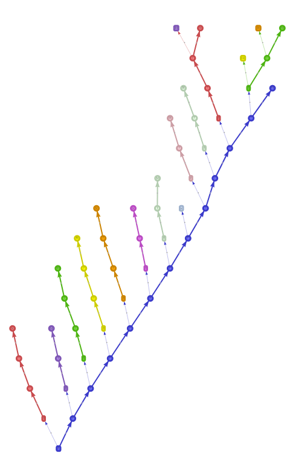
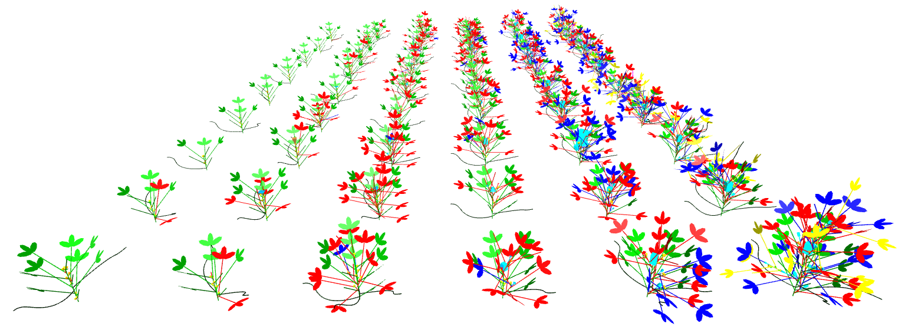

.. strawberry documentation master file, created by
   sphinx-quickstart on Mon Jun  7 09:50:01 2021.
   You can adapt this file completely to your liking, but it should at least
   contain the root `toctree` directive.

Welcome to strawberry's documentation!
======================================

The **Strawberry** package is an amazing tools for strawberry architectural analysis.
It enables the construction & vizualisation of 2D/3D architecture.
It is an extension of the software OpenAlea.

.. contents::

Installation
------------

.. toctree::

   ./install/index.rst

Quick start
----------------------

.. toctree::

   ./user/quick_start.rst

Gallery
-----------
.. toctree::

   ./user/gallery.rst

Documentation
-------------

Strawberry User Guide
'''''''''''''''''''''

.. toctree::

   ./user/index.rst

References
-----------

.. toctree::

   ./references/index.rst

Authors
-------

.. include:: ../../AUTHORS.rst

License
-------

**Strawberry** is released under a Cecill-C license.

.. note:: `Cecill-C <http://www.cecill.info/licences/
    Licence_CeCILL-C_V1-en.html>`_ license is a LGPL compatible license.
