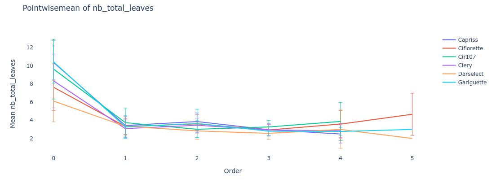
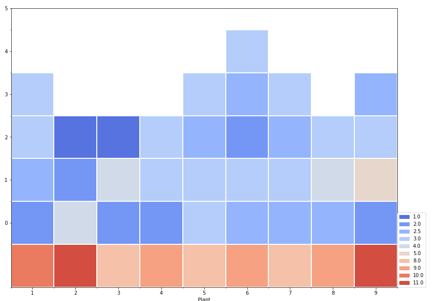
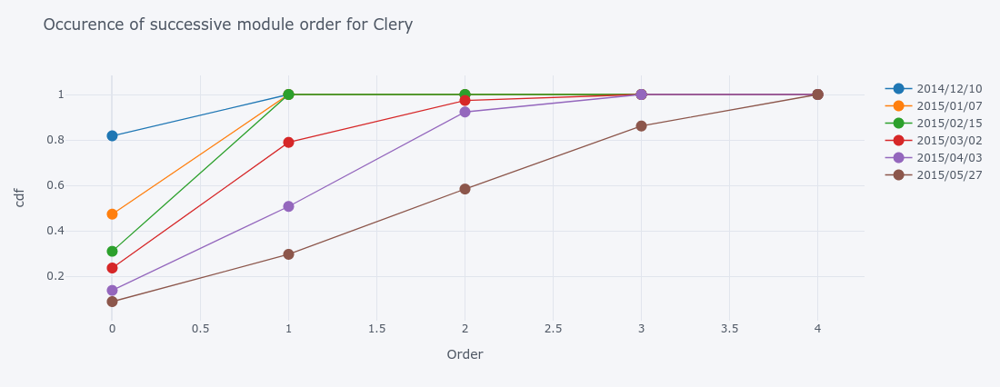
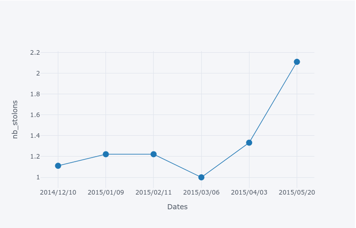
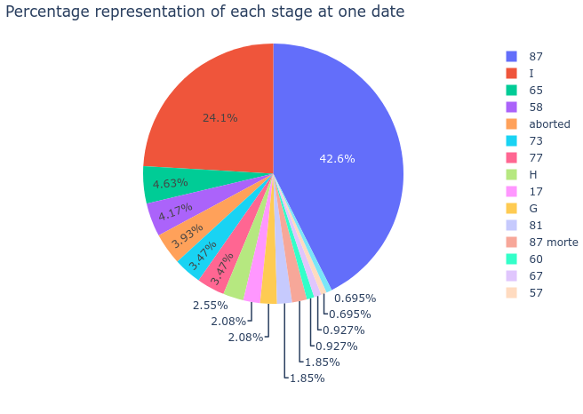

.. _strawberry_gallery:

Gallery
##############################

.. figure:: ./images/mtg_graph.png
   :width: 30%
   :target: https://nbviewer.jupyter.org/github/openalea-incubator/strawberry/blob/master/example/tutorials/1.import_and_read_MTG.ipynb

.. figure:: ./images/capriss_3d.png
   :width: 30%
   :target: https://nbviewer.jupyter.org/github/openalea-incubator/strawberry/blob/master/example/tutorials/2.Strawberry_architecture_representations.ipynb

   

   

   

   

   