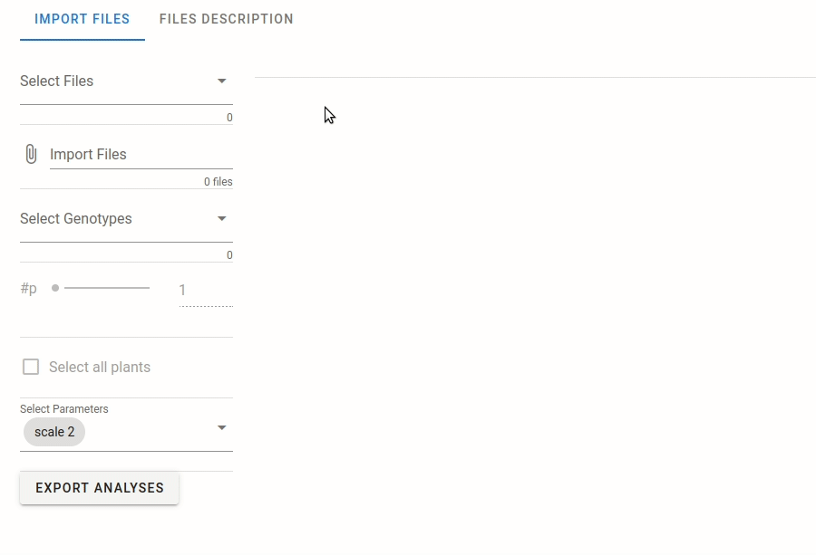
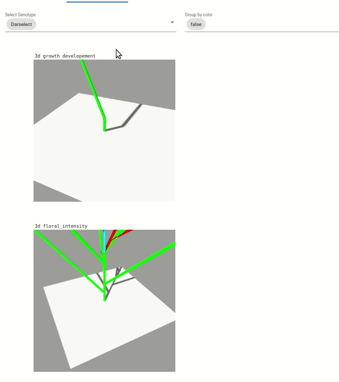
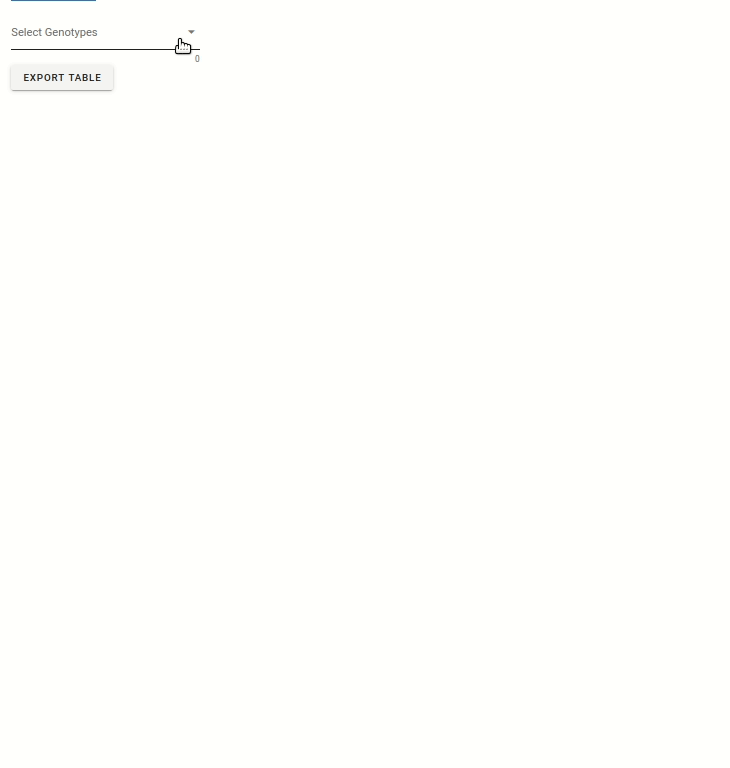
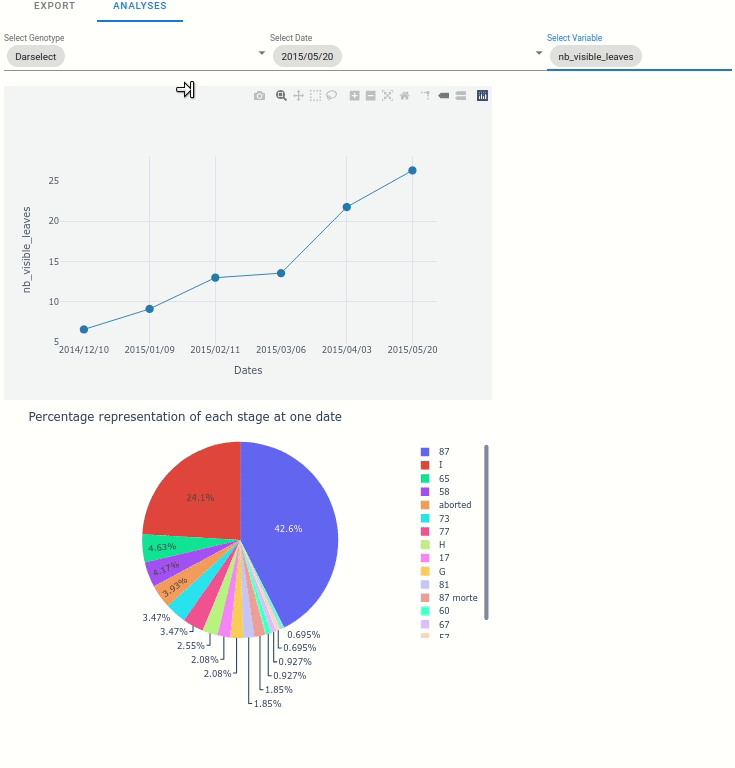
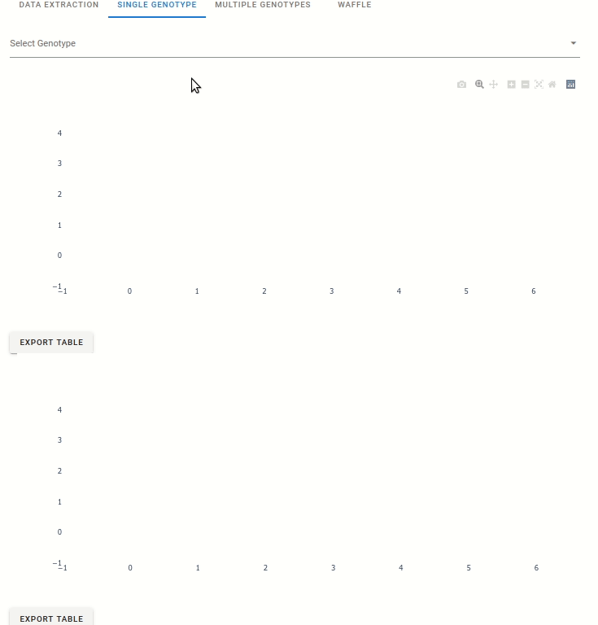
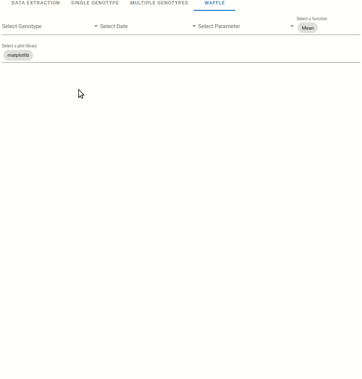
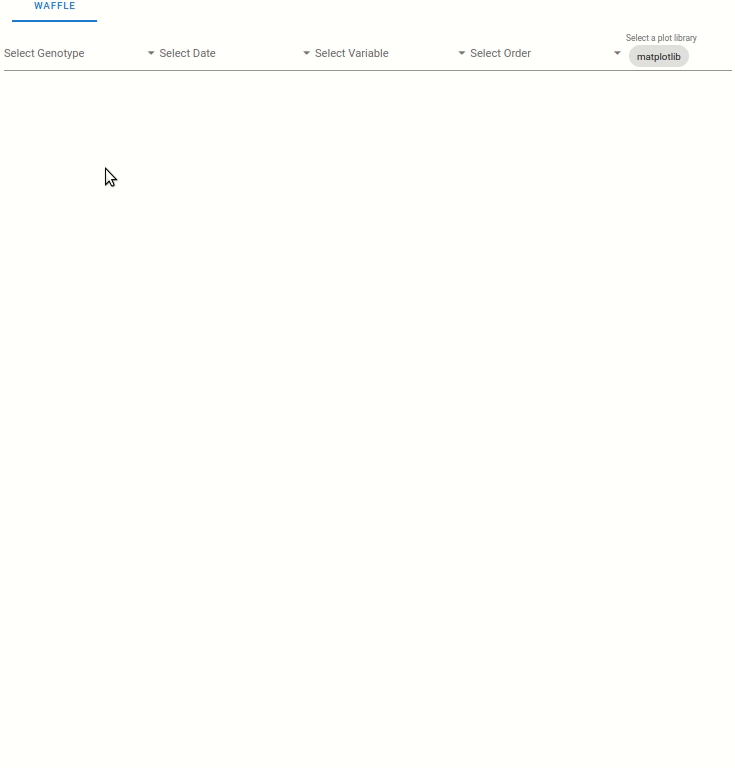

.. _strawberry_interactive_widgets:

Interactive usage through widgets
#####################################

Import & read MTG
*********************

The MTG files are imported for all widgets. The files needs to be in the "dashboard files" repository.

Display MTG informations
==============================

Once the files are imported, informations on the plants imported are automatically extracted. The metadata are grouped in three groups:

* Global metadata of the files (how many plants, which genotypes, ...)
* Quantitative data of the MTG (provided by the user in the MTG file, here PETLG, INFLOLG, ...). The min, max, mean and quartiles of the data are also computed.
* Qualitative data of the MTG. Their possible values are listed.

Display MTG
=============

The MTG of one selected plant can be displayed. The plant genotype and ID are selected,
then the MTG is displayed. Once displayed, the MTG will be automatically refreshed when it is changed with the widgets.

2D & 3D visualization
*******************************

2D
=======

3D
======

Two visualization are available:

* Une visualisation du développement végétatif des plantes. Le développement végétative est visible par une coloration des feuilles en fonction du développement des axes végétatif, coloration allant du vert au violet).
* Une visualisation sur l’intensité de floraison des plantes, visible par l’augmentation de la taille des boîtes bleu clair.

**Note:** The visualization are zoomed on one plant, but you can dezoom to see the whole scene.

Analyses at plant scale
*************************

Extract data
==============

Many information can be extacted from the MTG. 
These extraction can be done at the scale:

* of the plant.
* of the module.
* of the node.

Analyses
==========

At the plant scale, two plot can be automatically displayed:

* Any variable from the extracted data, function to the date.
* The percentage representation of each stage at one data (represented in pie plot)

Module scale
************************

Analyse single genotypes
=========================

For each genotype, the occurence of successive module order is displayed:

Multiple genotype analyses
===========================

A comparison of the genotype is automatically generated on the following criteria:

* pointwiseman of the total number of leaves
* pointwiseman of the total number of flowers
* pointwiseman of the total number of stolons
* Relative frequency of branch crown
* Relative frequency of extension crown

Waffle plot
===============

Node Scale analyses
*************************

Waffle plot
==============

